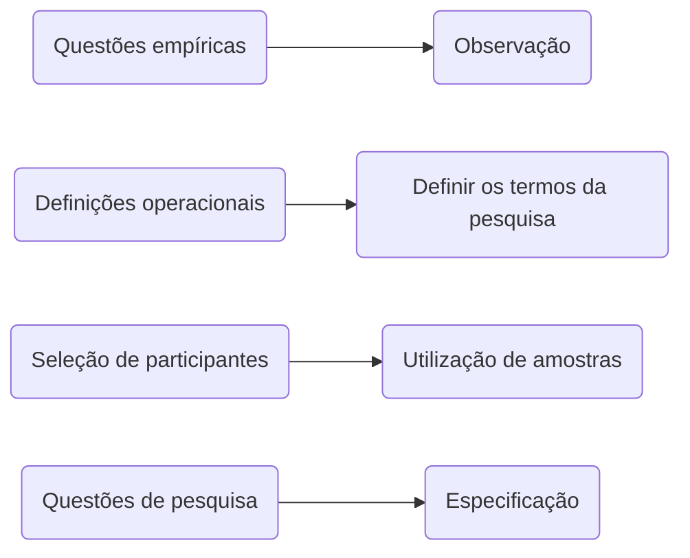

# Resumo das Apresentações (Slides)

Neste capítulo estarão contidos meus resumos dos slides dos professores.

## Apresentação nº 01

|Data|Tópicos Abordados|
|:--|:--|
|dd/mm/aaaa|-Slide "Introdução à Psicologia"|

### Definição de Psicologia

* A palavra psicologia, deriva se da junção de dois termos gregos *psiché* e *logos* estudo da mente ou da alma”.
* É a ciência que se concentra no comportamento e nos processos mentais

### Definição de Construto

* Segundo Cronbach e Meehl(1955) e Primi(2018), um construto é:
	* Um atributo das pessoas;
	* Não observável diretamente;
	* Que se postula existir ;
	* Que <u>se assume estar refletido</u> nos **comportamentos observados** **na testagem**;
* Assim, é um **conceito teórico** sobre um **atributo latente** que **explica os comportamentos** na **testagem**.

### Focalizando o geral

* Como cientistas
	* Os psicólogos estão rotineiramente tentando descobrir os princípios universais a partir de observações específicas que despertam a sua curiosidade;

### A Psicologia hoje

* Por sua definição, entende se a psicologia como uma disciplina única;
* Cada uma das subáreas em que se divide a Psicologia tem **características** e **exigências** **próprias** e **exclusivas**.

|Subárea | Descrição |
|:-------|:--------------|
|Genética comportamental |A genética comportamental estuda a herança de traços relacionados ao comportamento.|
|Neurociência comportamental |A neurociência comportamental examina as bases biológicas do comportamento.|
|Psicologia clínica |A psicologia clínica trata do estudo, do diagnóstico e do tratamento de transtornos psicológicos.|
|Neuropsicologia clínica |A neuropsicologia clínica une as áreas da biopsicologia e da psicologia clínica, focando a relação entre fatores biológicos e transtornos psicológicos.|
|Psicologia cognitiva |A psicologia cognitiva centra-se no estudo dos processos mentais superiores.|
|Psicólogo de aconselhamento |O aconselhamento psicológico aborda principalmente problemas educacionais, sociais e de adaptação profissional.|
|Psicologia transcultural |A psicologia intercultural investiga as semelhanças e diferenças no funcionamento psicológico nas várias culturas e nos grupos étnicos.|
|Psicologia do desenvolvimento |A psicologia do desenvolvimento examina como as pessoas crescem e mudam a partir do momento da concepção até a morte.|
|Psicologia educacional |A psicologia educacional ocupa-se do ensino e dos processos aprendizagem, tais como a relação entre motivação e desempenho na escola.|
|Psicologia ambiental |A psicologia ambiental considera a relação entre as pessoas e o ambiente físico.|
|Psicologia evolucionista |A psicologia evolucionista considera como o comportamento é influenciado pela herança genética de nossos antepassados.|
|Psicologia experimental |A psicologia experimental estuda os processos de sentir, perceber, aprender e pensar sobre o mundo.|
|Psicologia forense |A psicologia forense aborda questões legais, tais como determinar a precisão das memórias de testemunhas.|
|Psicologia da saúde |A psicologia da saúde explora a relação entre fatores psicológicos e enfermidades físicas, ou doenças.|
|Psicologia industrial/organizacional |A psicologia industrial/organizacional preocupa-se com a psicologia do local de trabalho.|
|Psicologia da personalidade |A psicologia da personalidade analisa a consistência no comportamento das pessoas ao longo do tempo e as características que diferenciam uma pessoa da outra.|
|Psicologia das mulheres |A psicologia das mulheres aborda questões como a discriminação contra mulheres e as causas da violência contra mulheres.|
|Psicologia escolar |A psicologia escolar é dedicada ao aconselhamento de crianças que têm problemas acadêmicos ou emocionais nas escolas primárias e secundárias.|
|Psicologia social |A psicologia social é o estudo de como os pensamentos, os sentimentos e as ações das pessoas são afetadas pelos outros.|
|Psicologia do esporte |A psicologia do esporte aplica a psicologia à atividade e ao exercício esportivo.|

> ****QUESTÃO DE PROVA****: Cite 03 subáreas da psicologia e sua atuação

|||
|:-----:|:-----:|
|</img> <b>Figura</b> - Número de psicólogos no Brasil  | </img> <b>Figura</b> - Número de Psicólogos na PB |

### Psiquiatria, Psicanálise e Psicologia

> ****QUESTÃO DE PROVA****: Psicologia, Psicanálise e Psiquiatria: O que eles apresentam
de semelhança entre si? Quais são suas diferenças?

* **Psiquiatria**
	* É uma **especialização da Medicina**
	* É voltada ao **tratamento do transtorno mental**.
* **Psicanálise**
	* Um ****método de investigação****;
	* Consiste essencialmente em **evidenciar o significado inconsciente** das **palavras**, das **ações** de uma pessoa
* **Psicologia**
	* É a **ciência** que estuda o **comportamento** e os **processos mentais**.

### Perspectivas Históricas

#### Aristóteles (328 a.C.)

* “Pai da Psicologia” séculos antes os primeiros filósofos lidavam com questões relacionadas o comportamento humano

#### Gustav Fechner

|||
|:-----:|:-----|
|</img>|   - Relação entre estímulo físico e sensação ( Lei de Weber-Fechner em 1860).  - Principal trabalho: Elementos da psicofísica (1860)  - Procedimentos experimentais e matemáticos.  - Questões:  Quanto deve brilhar uma estrela para ser vista?   Quão alto deve ser um ruído para ser ouvido?   Quão forte deve ser um toque para ser sentido?|

#### William James

|||
|:-----:|:-----|
|</img>|- Formação em fisiologista; - Laboratório para demonstração dos fatores fisiológicos que influenciam a psicologia; - Crítica a psicologia Wundtiana  - Consciência: Seu funcionamento e como a utilizar para adaptação ao meio  - Funcionalismo: Em vez de tratar a **estrutura da mente**, o **funcionalismo concentrou** se **no que a mente faz** e em **como o comportamento funciona**.|

#### Wilhelm Wundt

|||
|:-----:|:-----|
|</img>| - **O primeiro a separar a Psicologa** como parte da Filosofia - Origem da Psicologia - 1º Laboratório de pesquisa em Psicologia 1879 na Alemanha - Os processos elementares da consciência humana - **Estruturalismo**: Revelação dos ****componentes fundamentais**** da **percepção**, da **consciência**, do **pensamento**, das **emoções** e de **outros tipos de **estados** e **atividades** mentais** - **Introspecção**: Procedimento usado para estudar da mente, no qual se pede aos sujeitos que descrevam detalhadamente o que eles estão sentindo quando são expostos a um estímulo. É uma **autoanálise** da mente para **inspecionar** e **relatar** **pensamentos** e **sentimentos** pessoais. (SCHULTZ & SCHULTZ,2015)|

**Referências**

SHULTZ,  Duane  P.;  SHULTZ,  Sydney  Ellen  **História  da  psicologia moderna**  2014. 10. ed. São Paulo: Cengage Learning.

### Psicologia do Século XX

 
</img>

### Princípios-guia da Pesquisa

Segundo Skinner (1953) apud Davidoff (2001), são apontados seis princípios sobre o que significa **ciência**:

* **Precisão**:
	* Os psicólogos precisam ser precisos (definir **especificamente o que procuram faze**r).
* **Objetividade**
	* Tomar medidas que impeçam a influência do **ponto de vista particular** nos estudos.
* **Empirismo**
	* **Forma de conhecimento** através da **observação** **direta** e **indireta**.
	* O empirismo consiste em **uma teoria epistemológica** que indica que **todo o **conhecimento** é um **fruto da experiência****, e por isso, uma consequência dos sentidos. A experiência estabelece o valor, a origem e os limites do conhecimento.
* **Determinismo**
	* Refere-se à crença de que todos os ****eventos** tem **causas** naturais** (fatores internos e externos).
* **Parcimônia**
	* Um padrão sobre as explicações dos fenômenos, em que a **preferência se volta para **explicações simples**** que se ajustem aos fatos observados. 
	* Não ter pressa em manifestar conclusões que devem ser emitidas com precaução, cuidado e atenção. 
	* A palavra também significa "aquilo que é essencial ou suficiente para suprir determinada necessidade"
* **Ceticismo**
	* Idealmente, os psicólogos são críticos em relação ao seu trabalho e ao de outros pesquisadores.

#### Questões que os psicólogos levantam

## Apresentação nº 02

|Data|Tópicos Abordados|
|:--|:--|
|dd/mm/aaaa|-Slide "Metas de Pesquisa em Psicologia"|

### Etapas de uma pesquisa

 
</img> 
<b>Figura</b> - O Método Científico

* As visões do senso comum são frequentemente contraditórias;
* Uma das **PRIMEIRAS MISSÕES** para o campo da psicologia é **desenvolver suposições sobre o comportamento** e determinar **quais dessas suposições são **precisas****;
* Todos os cientistas, incluindo os psicólogos, enfrentam o desafio de ****propor questões apropriadas**** e ****respondê-las**** adequadamente utilizando o ****método científico****;
* O ****método científico****, para os psicólogos:
	* Abrange o processo de (1) identificar, (2) formular e (3) responder questões para chegar a uma compreensão sobre o mundo;
	* É uma abordagem usada para ****adquirir**** sistematicamente **conhecimento** e **compreensão** sobre:
		* o comportamento;
		* outros fenômenos de interesse;
	* Consiste em ****QUATRO PASSOS**** principais:
		* **PASSO 1** - Identificar ****questões de interesse**** (O QUE ?);
			* Provinientes de **comportamento** ou **fenômeno** que requer explicação;
			* Provinientes de **descobertas científicas anteriores**;
			* Provinientes de curiosidade, criatividade, insight, etc.
		* **PASSO 2** - Formular uma ****explicação**** (POR QUE ?);
			* Especificar uma teoria (Necessária no desenvolvimento de uma hipótese)
			* Desenvolver uma hipótese;			
		* **PASSO 3** - Realizar pesquisa destinada a ****apoiar**** ou ****refutar**** a explicação **utilizando um **método**** (COMO ?);
			* Formular uma **definição operacional** da hipótese;
				* A **definição operacional** é o como (passo a passo) o pesquisador vai colocar em prática o teste da hipótese)
			* Escolher um método de pesquisa;
			* Coletar dados;
			* Analisar dados;
		* **PASSO 4** - ****Comunicar**** descobertas;

 
</img> 
<b>Figura</b> - Slide 2 - Página 4

### Método Científico

* **Método Não Experimental ( Pesquisa Descritiva )**
	* Pesquisa de Arquivo
	* Observações Diretas
		* Observações de Laboratório
		* Observações de Campo
	* Pesquisa de Levantamento - Instrumentos de avaliação 
		* Questionários
		* Entrevistas
		* Testes psicológicos
	* Estudos de Caso
	* Pesquisa Correlacional

* **Exemplos:**
	* **Objetivo**: Será que desempenho profissional se relaciona com esperança, otimismo e criatividade?
	* **Hipótese** :O desempenho profissional correlaciona positivamente com esperança, otimismo e criatividade
	* **Resultados**: A autoavaliação do **desempenho profissional** se correlacionou positivamente com afetos **esperança**, **otimismo** e **criatividade**.

* **Método Experimental**
	* Pesquisa Experimental ( Estudo experimental )

### Método Científico: Método Não Experimental ( Pesquisa Descritiva )

Segundo Feldman (2015), é destinada a investigar sistematicamente ****uma pessoa****, ****um grupo**** ou ****padrões de comportamento****.

#### I ) PESQUISA DE ARQUIVO

 <b>Slide 2 - Aula 17.08.2022</b>

Não foi detalhado no slide. A professora fez explicações que estão contidas no item abaixo do livro de Introdução a Psicologia de Feldman (2015)^1^

>>>>>> ACRESCENTAR LINK PARA SECAO DO RESUMO DOS LIVROS

#### II ) OBSERVAÇÃO DIRETA ( Observação Naturalista )

 <b>Slide 2 - Aula 17.08.2022</b>

* LABORATÓRIO
	* Para observação direta, é a criação em laboratório de um ambiente padrão que estimule o comportamento de interesse e permita a coleta de informações aprimoradas.
	* **Limitações** da Pesquisa de Laboratório
		* Artificialidade;
		* Aplicação das descobertas de laboratório à vida real.
* CAMPO
	* Observação naturalista, que implica a observação do comportamento diretamente no seu ambiente natural, sendo mais realista.

>>>>>> ACRESCENTAR LINK PARA SECAO DO RESUMO DOS LIVROS

#### III )  PESQUISA DE LEVANTAMENTO

 <b>Slide 2 - Aula 17.08.2022</b>

* QUESTIONÁRIOS
	* Perguntas diretas na coleta de informações sobre o pensamento e o comportamento de um número suficiente de indivíduos.
* ENTREVISTAS
	* Similar aos questionários. Os autorrelatos são obtidos diretamente (presencial). 
	* Elas se dividem em:
		* Estruturadas;
		* Abertas; e 
		* Semi-estruturadas.
* TESTES PSICOLÓGICOS
	* São projetados para medir conceitos que não podem ser observados diretamente: inteligência, melancolia, traços de personalidade, crenças, sentimentos, etc.

|</img>|</img>|
|:---:|:---:|
|**Exemplo Questionário**|**Exemplo Entrevista**|

|</img>|</img>|</img>|
|:---:|:---:|:---:|
|**Exemplo Teste NEO PI-R**|**Exemplo Teste de Torrence**|**Exemplo Teste de Autoestima de Rosenberg**|
|Modelo que seja capaz de identificar as dimensões básicas da personalidade, que possa ser compreendido e reconhecido nas diferentes culturas e nacionalidades|Tem por objetivo avaliar algumas dimensões relacionadas ao processo e a personalidade criativa, por meio da produção criativa expressa em forma de desenho|Desenvolvida pelo sociólogo Dr. Morris Rosenberg, a escala de Rosenberg é uma medida de autoestima amplamente utilizada em pesquisas de ciências sociais. Ele usa uma escala de 0 a 30, em que uma pontuação inferior a 15 pode indicar baixa autoestima problemática. A escala consiste em dez afirmações que você poderia aplicar a você e que deve avaliar o quanto concorda com cada uma. Os itens devem ser respondidos rapidamente, sem pensar demais, sua primeira inclinação é o que você deve anotar.

#### IV ) ESTUDO DE CASO

 <b>Slide 2 - Aula 17.08.2022</b>

* Baseiam se na coleta de informações detalhadas sobre um mesmo indivíduo ou grupo, durante um longo período

|</img>|</img>|
|:---:|:---:|
|**Estudo de Caso Individual**|**Estudo de Caso de um Pequeno Grupo**|

>>>>>> ACRESCENTAR LINK PARA SECAO DO RESUMO DOS LIVROS

#### V ) PESQUISA CORRELACIONAL

 <b>Slide 2 - Aula 17.08.2022</b>

> ****ATENÇÃO PARA PROVA:**** **CORRELAÇÕES NÃO SIGNIFICAM CAUSA !!!**

*  A ****premissa básica**** é de que **duas variáveis** estão relacionadas.
* Variam em:
	* Intensidade (fraco, moderado ou forte)
	* Direção (positivo ou negativo)

* **VARIÁVEL**: É aquilo que varia. É fenômeno que assume mais de um valor.

 <b>Exemplo</b>

* **Objetivo**: Será que **desempenho profissional** se relaciona com **esperança**, **otimismo** e **criatividade** ?
* **Hipótese**: O desempenho profissional correlaciona positivamente com esperança, otimismo e criatividade
* **Resultados**: A autoavaliação do desempenho profissional se correlacionou positivamente com afetos esperança, otimismo e criatividade

 
</img> 
<b>Figura </b> - Exemplo de pesquisa correlacional

>>>>>> ACRESCENTAR LINK PARA SECAO DO RESUMO DOS LIVROS

## Apresentação nº 03

|Data|Tópicos Abordados|
|:--|:--|
|dd/mm/aaaa|-Slide "Psicanálise x Behaviorismo"|

* Embora os slides estejam disponíveis, ainda não tivemos tempo para elaborar o resumo deles. Vou disponibilizar em breve.

## Apresentação nº 04

|Data|Tópicos Abordados|
|:--|:--|
|dd/mm/aaaa|-Slide "Gestalt x Cognição"|

* Embora os slides estejam disponíveis, ainda não tivemos tempo para elaborar o resumo deles. Vou disponibilizar em breve.

## Apresentação nº 05

|Data|Tópicos Abordados|
|:--|:--|
|dd/mm/aaaa|-Slide "Abordagem Humanista"|

* Embora os slides estejam disponíveis, ainda não tivemos tempo para elaborar o resumo deles. Vou disponibilizar em breve.

<b>Referências</b>

<a class="bibliografia" name="FELDMAN">FELDMAN, Robert S. Pesquisa em Psicologia. *In:* Feldman, Robert S. **Introdução à Psicologia**. 10. ed. Porto Alegre: AMGH Editora, 2015, p. 26-39</a>

<a class="bibliografia" name="RIBEIRO-A">RIBEIRO, Maria Gabriela Costa. **Slide Introdução à Psicologia**. Introdução à Psicologia. Notas de aula, Faculdade Três Marias, Paraíba 2022.</a>

<a class="bibliografia" name="RIBEIRO-B">RIBEIRO, Maria Gabriela Costa. **Slide Metas de Pesquisa em Psicologia**. Introdução à Psicologia. Notas de aula, Faculdade Três Marias, Paraíba 2022.</a>

<a class="bibliografia" name="RIBEIRO-B">RIBEIRO, Maria Gabriela Costa Ribeiro. **Slide Psicanálise x Behaviorismo**. Introdução à Psicologia, Faculdade Três Marias, Paraíba 2022</a>

<a class="bibliografia" name="RIBEIRO-C">RIBEIRO, Maria Gabriela Costa Ribeiro. **Slide Gestalt x Cognição**. Introdução à Psicologia, Faculdade Três Marias, Paraíba 2022</a>

<a class="bibliografia" name="RIBEIRO-D">RIBEIRO, Maria Gabriela Costa Ribeiro. **Slide Abordagem Humanista**. Introdução à Psicologia, Faculdade Três Marias, Paraíba 2022</a>

<a class="bibliografia" name="SHULTZ">SHULTZ, Duane P.; SHULTZ, Sydney Ellen História da psicologia moderna 2014. 10. ed. São Paulo: Cengage Learning.</a>