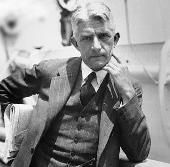
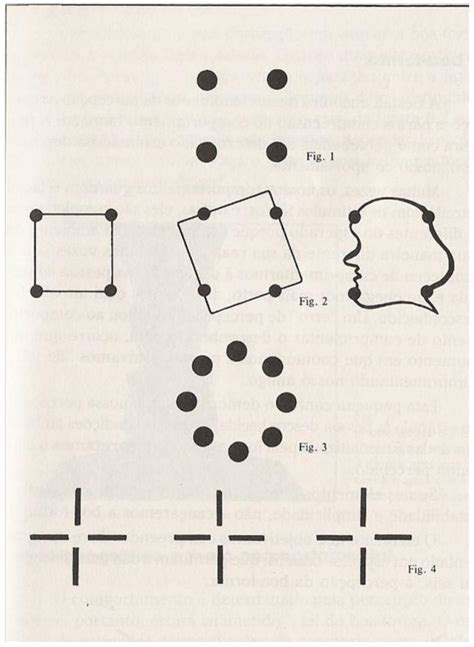

--- 
title: "Introdução à Psicologia"
author: "Daniel Claudino"
date: "`r Sys.Date()`"
output: pdf_document
documentclass: book
bibliography:
- referencias.bib
- packages.bib
cover-image: "figuras/capa-livro.png"
description: "Neste material, estão contidos os resumos de capítulos de livros, slides,
  notas de aula, apresentações, exercício respondidos em sala, atividades de revisão
  e questionários para as provas, além de outros materiais elaborados durante  da
  disciplina NOME-DA-DISCIPLINA.\n"
link-citations: yes
lang: "pt-BR"
site: bookdown::bookdown_site
always_allow_html: true
---

# Apresentação da Disciplina

<center><h2>INTRODUÇÃO À PSICOLOGIA</h2></center>

```{r echo=FALSE, fig.show="hold", out.width="50%", fig.align = "center", fig.cap="-"}
knitr::include_graphics("figuras/LIVRO-GENERICO.jpeg")
```

* Neste material, estão contidos:
  * Minhas notas de aula;
  * Notas de Aula de outros colegas disponibilizados para a turma
  * Resumos de capítulos de livros;
  * Resumos de apresentações(slides) da disciplina;
  * Resumos de outros colegas de sala disponibilizados para a turma;
  * Minhas apresentações(slides);
    * Audience Q&A (Permite que o público das apresentação envie perguntas para o apresntador)
    * Live Polls (Permite que o público das apresntações realize votações sobre os temas apresentados)
    * Quiz (Permite que o público das apresentações participe de competições integrando-se e assimilando melhor os temas apresentados)
  * Exercício elaborados pelos professores, respondidos ou não em sala;
  * Questionários elaborados por mim antes das provas;
  * Formulários de pesquisa (Google Forms) elaborados por mim para atendimento de necessidades dos dos meus colegas de sala, dos professores ou da disciplina;
  * Coletas de dados realizadas para atendimento de necessidades dos dos meus colegas de sala, dos professores ou da disciplina;
  * Planilhas elaboradas por mim elaboradas por mim para atendimento de necessidades dos dos meus colegas de sala, dos professores ou da disciplina;
  * Filmes recomendados;
  * Documentários recomendados;
  * Jogos de aprendizado criados (Kahoots / Site principal: kahoot.com / Login do jogador: kahoot.it)
  * Outros materiais elaborados e disponibilizados pelos professores e por mim.

## Professor(a)

* **Profª. Meª.** <a href="http://lattes.cnpq.br/0369824862534158">Maria Gabriela Costa Ribeiro</a>

## Objetivos da Disciplina

Possibilitar aos discentes do curso de Psicologia a compreensão sobre os principais temas no campo psicológico. Especificamente, objetiva entender os seguintes conceitos: a) ciência psicológica; b) áreas de atuação; c) as principais abordagens históricas; e, por último, d) novos campos de atuação, a exemplo da neurociência, psicologia positiva e os principais transtornos psicológicos.

## Ementa

Conceito de Psicologia, objeto e método. A Psicologia como ciência. O processo de construção do conhecimento psicológico. A Psicologia e o senso comum. A Psicologia e a sociedade. Campos de aplicação da Psicologia. Principais atividades do psicólogo e seus temas principais. Principais abordagens da Psicologia contemporânea. Novos campos de trabalho. Os grandes temas da Psicologia

## Conteúdo Programático

4.1 Introdução à Psicologia: principais conceitos e aspectos gerais
4.1.1 Origem, conceitos, objetivos e objeto de estudo
4.1.2 Diferença de ciência e senso comum
4.1.3 Psicologia como ciência e suas abordagens teóricas
4.1.4 Personalidade
4.2 Áreas de atuação do psicólogo
4.2.1 Educacional
4.2.2 Clínica
4.2.3 Organizacional e do Trabalho  
4.2.4 Avaliação Psicológica
4.2.5 Saúde e Hospitalar
4.2.6 Psicologia Social
4.3 Psicologia contemporânea: outros campos de trabalho
4.3.1 Transtornos Mentais
4.3.2 Psicologia Positiva, Ambiental, Esporte e Jurídica


## Metodologia Didática

A disciplina será desenvolvida por meio da ação conjunta professor e aluno, exigindo, para tanto, participação ativa nas aulas. Os procedimentos de ensino e aprendizagem adotados serão aulas expositivas e discussão de temas propostos, leitura e apresentação de textos, estudo individual ou em grupo, seminários e realização de práticas interdisciplinares.

## Recursos didáticos

Textos impressos, lousa, lápis, datashow e exercícios.

## Avaliação

|Avaliação|Data|Descrição
|:--|:--|:--|
|1º Avaliação|14/09/2022|Uma avaliação valendo 10,0 pontos. Serão 7 questões objetivas (alternativas de a-e) e três questões discursivas (abertas).|
|2º Avaliação|<br>**Data TAE:** 27 de outubro de 2022<br>**Data Jornal:** 09 de novembro|- A Psicologia é uma disciplina científica que possibilita a sua aplicação teórica e prática na explicação da realidade, a partir de diferentes notícias (e.g. televisão, redes sociais, jornais) de modo que, a compreensão em torno da área se torna fundamental para entender a relação do indivíduo, grupos e sociedade. No entanto, uma das dificuldades da ciência é transformar a linguagem e o conteúdo acadêmico acessível para o entendimento da população em geral. Desse modo, a atividade dessa unidade consiste no desenvolvimento desta habilidade: como explicar a psicologia para a população de forma acessível sem perder o conteúdo acadêmico? Para atingir esse objetivo, deverão elaborar um ou mais textos na estrutura de um jornal sobre o assunto discutidos na unidade 2.<br> - A nota total atribuída ao jornal valerá 8,0 (oito) pontos e deverá adotar a seguinte estrutura:<br>a) pontuar em forma de texto de 5 (cinco) a 10 (dez) pontos sobre o conteúdo da aula (2,5 pontos);<br>b) Escrever e destacar sobre qual assunto foi mais interessante (2,5 pontos);<br>c) Listar um ou dois assuntos que o discente considerou como uma curiosidade e que o docente não apresentou em sala. Neste ponto, deve apresentar alguma informação que esteja relacionado ao assunto e que avalia como pertinente. Assim, deve criar uma caixa intitulada: “Quero saber mais” (3,0 pontos) + Trabalho Acadêmico Efetivo (TAE)|
|3º Avaliação|07/12/2022|Simulado Integrado (7,0 pontos) + Avaliação qualitativa (3,0 pontos) - frequência (0 - 1 ponto), participação nas aulas (0 - 1 ponto) e cumprimento nos prazos (1,0 ponto).|

## Trabalho Acadêmico Efetivo (TAE) da disciplina

|TAE|Data|Descrição
|:--|:--|:--|
|Único|27/12/2022|Criação do podcast. O discente deverá selecionar uma notícia apresentada na mídia e relacionar qual área ou como o psicólogo poderia auxiliar no assunto em questão. O TAE será com o grupo de jornal. Usar o aplicativo ANCHOR. - Até 2,0 pontos<br>**Data TAE:** 27 de outubro de 2022<br>**Data Jornal:** 09 de novembro|

## Referências Bibliográficas

### Bibliografia Básica

DAVIDOFF, Linda L. Introdução à Psicologia. São Paulo: Makron Books, 2001.

SPINK, M. J. P. Psicologia social e saúde: práticas, saberes e sentidos. Petrópolis:Vozes, 2013.

MAISTO, Albert A.; MORRIS, Charles G. Introdução a Psicologia. 6 ed. São Paulo, Prentice Hall, 2004. [Livro Eletrônico]

### Bibliografia Complementar

BRIGAGÃO, J., NASCIMENTO, V. L. V., & SPINK, P. K. (2011). As interfaces entre psicologia e políticas públicas e a configuração de novos espaços de atuação. Sorocaba, (páginas, 199-215).

CASTRO, E. K., & BORNHOLDT, E. (2004). Psicologia da saúde x psicologia hospitalar: definições e possibilidades de inserção profissional. Psicologia Ciência e Profissão (páginas, 48-57).

COELHO, Wilson Ferreira. Psicologia do Desenvolvimento. São Paulo: Editora Pearson, 2014. [Livro Eletrônico]

CÓRIA-SABINI, Maria Aparecida. Psicologia do Desenvolvimento. 2 ed. São Paulo: Editora Ática, 2010. [Livro Eletrônico]

DIAS, A. C. G., PATIAS, N. D., & ABAID, J. L. W. ( 2014). Psicologia escolar e possibilidades na atuação do psicólogo: algumas reflexões. Revista Psicologia Escolar e Educacional (páginas 105-111).

FEIST, J., FEIST, G., & ROBERTS, T. A. (2015). Teorias da Personalidade.

FELDMAN, Robert S. Introdução à Psicologia. Porto Alegre: Editora AMGH,2015.

ILETTI, Nelson; ROSSATO, Solange Marques; ROSSATO, Geovanio. Psicologia do Desenvolvimento. São Paulo, Contexto, 2014. [Livro Eletrônico]

LIMA, C. F., & PIMENTEL, C. E. (2017). Livro: Revisitando a Psicologia Social. MISKOLCI, Richard. Teoria Queer: um aprendizado pelas diferenças. 2 ed. Belo Horizonte: Autêntica, 2015. [Livro Eletrônico]

PADILHA, S., NORONHA, A. P. P., & ZANCHET, C. F. (2007). Instrumentos de avaliação psicológica: uso e parecer de psicólogos. Avaliação psicológica (páginas, 69-79). 

SCHULTZ, D. & SCHULTZ, S. E. (2019). História da Psicologia moderna.

ZANELLI, J. C., BASTOS, A. V. B., & RODRIGUES, A. C. A. ( 2014). Psicologia, Organizações e Trabalho no Brasil. (Orgs).

## Controle de Versão

|Versão| Data / Hora | Colaborador | Descrição da Contribuição
|:--|:--|:--|:--|
| 0.1 | 16/10/2022 17h52 | [Daniel Claudino](https://wa.me/5583988853815) | Versão inicial do documento|


## Observação Importante

**<amarelo>NOTA</amarelo>**: Este material tem como finalidade auxiliar a fixação de assuntos estudados em sala de aula de acordo com o </amarelo>**plano de ensino desta disciplina**</amarelo>.

Ele <amarelo>**não deve ser**</amarelo> utilizado como <amarelo>**único material de estudo para a prova**</amarelo>, então:

1. Consulte os **slides da professora** na plataforma FTM;  
2. Faça **notas de aula** do que for tratado em sala de aula;  
3. Consulte nossas **notas de aula**;

> **Dúvidas**: <amarelo>Devem ser encaminhadas no grupo de whatsapp da disciplina.</amarelo>

<!--chapter:end:index.Rmd-->

# Resumo das Apresentações (Slides)

Neste capítulo estarão contidos meus resumos dos slides dos professores.

## Apresentação nº 01

|Data|Tópicos Abordados|
|:--|:--|
|dd/mm/aaaa|-Slide "Introdução à Psicologia"|


### Definição de Psicologia

* A palavra psicologia, deriva se da junção de dois termos gregos *psiché* e *logos* estudo da mente ou da alma”.
* É a ciência que se concentra no comportamento e nos processos mentais

### Definição de Construto

* Segundo Cronbach e Meehl(1955) e Primi(2018), um construto é:
	* Um atributo das pessoas;
	* Não observável diretamente;
	* Que se postula existir ;
	* Que <u>se assume estar refletido</u> nos **comportamentos observados** **na testagem**;
* Assim, é um **conceito teórico** sobre um **atributo latente** que **explica os comportamentos** na **testagem**.

### Focalizando o geral

* Como cientistas
	* Os psicólogos estão rotineiramente tentando descobrir os princípios universais a partir de observações específicas que despertam a sua curiosidade;

### A Psicologia hoje

* Por sua definição, entende se a psicologia como uma disciplina única;
* Cada uma das subáreas em que se divide a Psicologia tem **características** e **exigências** **próprias** e **exclusivas**.

|Subárea | Descrição |
|:-------|:--------------|
|Genética comportamental |A genética comportamental estuda a herança de traços relacionados ao comportamento.|
|Neurociência comportamental |A neurociência comportamental examina as bases biológicas do comportamento.|
|Psicologia clínica |A psicologia clínica trata do estudo, do diagnóstico e do tratamento de transtornos psicológicos.|
|Neuropsicologia clínica |A neuropsicologia clínica une as áreas da biopsicologia e da psicologia clínica, focando a relação entre fatores biológicos e transtornos psicológicos.|
|Psicologia cognitiva |A psicologia cognitiva centra-se no estudo dos processos mentais superiores.|
|Psicólogo de aconselhamento |O aconselhamento psicológico aborda principalmente problemas educacionais, sociais e de adaptação profissional.|
|Psicologia transcultural |A psicologia intercultural investiga as semelhanças e diferenças no funcionamento psicológico nas várias culturas e nos grupos étnicos.|
|Psicologia do desenvolvimento |A psicologia do desenvolvimento examina como as pessoas crescem e mudam a partir do momento da concepção até a morte.|
|Psicologia educacional |A psicologia educacional ocupa-se do ensino e dos processos aprendizagem, tais como a relação entre motivação e desempenho na escola.|
|Psicologia ambiental |A psicologia ambiental considera a relação entre as pessoas e o ambiente físico.|
|Psicologia evolucionista |A psicologia evolucionista considera como o comportamento é influenciado pela herança genética de nossos antepassados.|
|Psicologia experimental |A psicologia experimental estuda os processos de sentir, perceber, aprender e pensar sobre o mundo.|
|Psicologia forense |A psicologia forense aborda questões legais, tais como determinar a precisão das memórias de testemunhas.|
|Psicologia da saúde |A psicologia da saúde explora a relação entre fatores psicológicos e enfermidades físicas, ou doenças.|
|Psicologia industrial/organizacional |A psicologia industrial/organizacional preocupa-se com a psicologia do local de trabalho.|
|Psicologia da personalidade |A psicologia da personalidade analisa a consistência no comportamento das pessoas ao longo do tempo e as características que diferenciam uma pessoa da outra.|
|Psicologia das mulheres |A psicologia das mulheres aborda questões como a discriminação contra mulheres e as causas da violência contra mulheres.|
|Psicologia escolar |A psicologia escolar é dedicada ao aconselhamento de crianças que têm problemas acadêmicos ou emocionais nas escolas primárias e secundárias.|
|Psicologia social |A psicologia social é o estudo de como os pensamentos, os sentimentos e as ações das pessoas são afetadas pelos outros.|
|Psicologia do esporte |A psicologia do esporte aplica a psicologia à atividade e ao exercício esportivo.|

> ****QUESTÃO DE PROVA****: Cite 03 subáreas da psicologia e sua atuação

|||
|:-----:|:-----:|
|</img><br><b>Figura</b> - Número de psicólogos no Brasil<br> | </img><br><b>Figura</b> - Número de Psicólogos na PB<br>|

### Psiquiatria, Psicanálise e Psicologia

> ****QUESTÃO DE PROVA****: Psicologia, Psicanálise e Psiquiatria: O que eles apresentam
de semelhança entre si? Quais são suas diferenças?

* **Psiquiatria**
	* É uma **especialização da Medicina**
	* É voltada ao **tratamento do transtorno mental**.
* **Psicanálise**
	* Um ****método de investigação****;
	* Consiste essencialmente em **evidenciar o significado inconsciente** das **palavras**, das **ações** de uma pessoa
* **Psicologia**
	* É a **ciência** que estuda o **comportamento** e os **processos mentais**.

### Perspectivas Históricas

### Aristóteles (328 a.C.)

* “Pai da Psicologia” séculos antes os primeiros filósofos lidavam com questões relacionadas o comportamento humano

### Gustav Fechner

|||
|:-----:|:-----|
|</img>| <br> - Relação entre estímulo físico e sensação ( Lei de Weber-Fechner em 1860).<br> - Principal trabalho: Elementos da psicofísica (1860)<br> - Procedimentos experimentais e matemáticos.<br> - Questões:<br> Quanto deve brilhar uma estrela para ser vista? <br> Quão alto deve ser um ruído para ser ouvido? <br> Quão forte deve ser um toque para ser sentido?|

### William James

|||
|:-----:|:-----|
|</img>|- Formação em fisiologista;<br>- Laboratório para demonstração dos fatores fisiológicos que influenciam a psicologia;<br>- Crítica a psicologia Wundtiana <br>- Consciência: Seu funcionamento e como a utilizar para adaptação ao meio<br> - Funcionalismo: Em vez de tratar a **estrutura da mente**, o **funcionalismo concentrou** se **no que a mente faz** e em **como o comportamento funciona**.|

### Wilhelm Wundt

|||
|:-----:|:-----|
|</img>| - **O primeiro a separar a Psicologa** como parte da Filosofia<br>- Origem da Psicologia - 1º Laboratório de pesquisa em Psicologia 1879 na Alemanha<br>- Os processos elementares da consciência humana<br>- **Estruturalismo**: Revelação dos ****componentes fundamentais**** da **percepção**, da **consciência**, do **pensamento**, das **emoções** e de **outros tipos de **estados** e **atividades** mentais**<br>- **Introspecção**: Procedimento usado para estudar da mente, no qual se pede aos sujeitos que descrevam detalhadamente o que eles estão sentindo quando são expostos a um estímulo. É uma **autoanálise** da mente para **inspecionar** e **relatar** **pensamentos** e **sentimentos** pessoais. (SCHULTZ & SCHULTZ,2015)|

**Referências**

SHULTZ,  Duane  P.;  SHULTZ,  Sydney  Ellen  **História  da  psicologia moderna**  2014. 10. ed. São Paulo: Cengage Learning.

### Psicologia do Século XX

<p align="center"> 
</img>
</p>

### Princípios-guia da Pesquisa

Segundo Skinner (1953) apud Davidoff (2001), são apontados seis princípios sobre o que significa **ciência**:


### Questões que os psicólogos levantam

```{r Questoes, echo=FALSE, out.width="100%"}
options(tinytex.verbose = TRUE)
DiagrammeR::mermaid("
 graph LR
  A(Questões empíricas) --> B(Observação)
  C(Definições operacionais) --> D(Definir os termos da pesquisa)
  E(Seleção de participantes) --> F(Utilização de amostras)
  G(Questões de pesquisa) --> H(Especificação)
 ");
```

## Apresentação nº 02

|Data|Tópicos Abordados|
|:--|:--|
|dd/mm/aaaa|-Slide "Metas de Pesquisa em Psicologia"|


### Etapas de uma pesquisa

<p align="center"> 
</img><br>
<b>Figura</b> - O Método Científico
</p>

* As visões do senso comum são frequentemente contraditórias;
* Uma das **PRIMEIRAS MISSÕES** para o campo da psicologia é **desenvolver suposições sobre o comportamento** e determinar **quais dessas suposições são **precisas****;
* Todos os cientistas, incluindo os psicólogos, enfrentam o desafio de ****propor questões apropriadas**** e ****respondê-las**** adequadamente utilizando o ****método científico****;
* O ****método científico****, para os psicólogos:
	* Abrange o processo de (1) identificar, (2) formular e (3) responder questões para chegar a uma compreensão sobre o mundo;
	* É uma abordagem usada para ****adquirir**** sistematicamente **conhecimento** e **compreensão** sobre:
		* o comportamento;
		* outros fenômenos de interesse;
	* Consiste em ****QUATRO PASSOS**** principais:
		* **PASSO 1** - Identificar ****questões de interesse**** (O QUE ?);
			* Provinientes de **comportamento** ou **fenômeno** que requer explicação;
			* Provinientes de **descobertas científicas anteriores**;
			* Provinientes de curiosidade, criatividade, insight, etc.
		* **PASSO 2** - Formular uma ****explicação**** (POR QUE ?);
			* Especificar uma teoria (Necessária no desenvolvimento de uma hipótese)
			* Desenvolver uma hipótese;			
		* **PASSO 3** - Realizar pesquisa destinada a ****apoiar**** ou ****refutar**** a explicação **utilizando um **método**** (COMO ?);
			* Formular uma **definição operacional** da hipótese;
				* A **definição operacional** é o como (passo a passo) o pesquisador vai colocar em prática o teste da hipótese)
			* Escolher um método de pesquisa;
			* Coletar dados;
			* Analisar dados;
		* **PASSO 4** - ****Comunicar**** descobertas;

<p align="center"> 
</img><br>
<b>Figura</b> - Slide 2 - Página 4
</p>

### Método Científico

* **Método Não Experimental ( Pesquisa Descritiva )**
	* Pesquisa de Arquivo
	* Observações Diretas
		* Observações de Laboratório
		* Observações de Campo
	* Pesquisa de Levantamento - Instrumentos de avaliação 
		* Questionários
		* Entrevistas
		* Testes psicológicos
	* Estudos de Caso
	* Pesquisa Correlacional

* **Exemplos:**
	* **Objetivo**: Será que desempenho profissional se relaciona com esperança, otimismo e criatividade?
	* **Hipótese** :O desempenho profissional correlaciona positivamente com esperança, otimismo e criatividade
	* **Resultados**: A autoavaliação do **desempenho profissional** se correlacionou positivamente com afetos **esperança**, **otimismo** e **criatividade**.

* **Método Experimental**
	* Pesquisa Experimental ( Estudo experimental )

### Método Científico: Método Não Experimental ( Pesquisa Descritiva )

Segundo Feldman (2015), é destinada a investigar sistematicamente ****uma pessoa****, ****um grupo**** ou ****padrões de comportamento****.

### I ) PESQUISA DE ARQUIVO

<center> <b>Slide 2 - Aula 17.08.2022</b><center>

Não foi detalhado no slide. A professora fez explicações que estão contidas no item abaixo do livro de Introdução a Psicologia de Feldman (2015)^1^

>>>>>> ACRESCENTAR LINK PARA SECAO DO RESUMO DOS LIVROS

### II ) OBSERVAÇÃO DIRETA ( Observação Naturalista )

<center> <b>Slide 2 - Aula 17.08.2022</b><center>

* LABORATÓRIO
	* Para observação direta, é a criação em laboratório de um ambiente padrão que estimule o comportamento de interesse e permita a coleta de informações aprimoradas.
	* **Limitações** da Pesquisa de Laboratório
		* Artificialidade;
		* Aplicação das descobertas de laboratório à vida real.
* CAMPO
	* Observação naturalista, que implica a observação do comportamento diretamente no seu ambiente natural, sendo mais realista.

>>>>>> ACRESCENTAR LINK PARA SECAO DO RESUMO DOS LIVROS

### III )  PESQUISA DE LEVANTAMENTO

<center> <b>Slide 2 - Aula 17.08.2022</b><center>

* QUESTIONÁRIOS
	* Perguntas diretas na coleta de informações sobre o pensamento e o comportamento de um número suficiente de indivíduos.
* ENTREVISTAS
	* Similar aos questionários. Os autorrelatos são obtidos diretamente (presencial). 
	* Elas se dividem em:
		* Estruturadas;
		* Abertas; e 
		* Semi-estruturadas.
* TESTES PSICOLÓGICOS
	* São projetados para medir conceitos que não podem ser observados diretamente: inteligência, melancolia, traços de personalidade, crenças, sentimentos, etc.

|</img>|</img>|
|:---:|:---:|
|**Exemplo<br>Questionário**|**Exemplo<br>Entrevista**|

|</img>|</img>|</img>|
|:---:|:---:|:---:|
|**Exemplo<br>Teste NEO PI-R**|**Exemplo<br>Teste de Torrence**|**Exemplo<br>Teste de Autoestima de Rosenberg**|
|Modelo que seja capaz de identificar as dimensões básicas da personalidade, que possa ser compreendido e reconhecido nas diferentes culturas e nacionalidades|Tem por objetivo avaliar algumas dimensões relacionadas ao processo e a personalidade criativa, por meio da produção criativa expressa em forma de desenho|Desenvolvida pelo sociólogo Dr. Morris Rosenberg, a escala de Rosenberg é uma medida de autoestima amplamente utilizada em pesquisas de ciências sociais. Ele usa uma escala de 0 a 30, em que uma pontuação inferior a 15 pode indicar baixa autoestima problemática. A escala consiste em dez afirmações que você poderia aplicar a você e que deve avaliar o quanto concorda com cada uma. Os itens devem ser respondidos rapidamente, sem pensar demais, sua primeira inclinação é o que você deve anotar.

### IV ) ESTUDO DE CASO

<center> <b>Slide 2 - Aula 17.08.2022</b><center>

* Baseiam se na coleta de informações detalhadas sobre um mesmo indivíduo ou grupo, durante um longo período

|</img>|</img>|
|:---:|:---:|
|**Estudo de Caso<br>Individual**|**Estudo de Caso<br>de um Pequeno Grupo**|

>>>>>> ACRESCENTAR LINK PARA SECAO DO RESUMO DOS LIVROS

### V ) PESQUISA CORRELACIONAL

<center> <b>Slide 2 - Aula 17.08.2022</b><center>

> ****ATENÇÃO PARA PROVA:**** **CORRELAÇÕES NÃO SIGNIFICAM CAUSA !!!**

*  A ****premissa básica**** é de que **duas variáveis** estão relacionadas.
* Variam em:
	* Intensidade (fraco, moderado ou forte)
	* Direção (positivo ou negativo)

* **VARIÁVEL**: É aquilo que varia. É fenômeno que assume mais de um valor.

<center> <b>Exemplo</b></center>

* **Objetivo**: Será que **desempenho profissional** se relaciona com **esperança**, **otimismo** e **criatividade** ?
* **Hipótese**: O desempenho profissional correlaciona positivamente com esperança, otimismo e criatividade
* **Resultados**: A autoavaliação do desempenho profissional se correlacionou positivamente com afetos esperança, otimismo e criatividade

<p align="center"> 
</img><br>
<b>Figura </b> - Exemplo de pesquisa correlacional
</p>

>>>>>> ACRESCENTAR LINK PARA SECAO DO RESUMO DOS LIVROS

## Apresentação nº 03

|Data|Tópicos Abordados|
|:--|:--|
|dd/mm/aaaa|-Slide "Psicanálise x Behaviorismo"|

* Embora os slides estejam disponíveis, ainda não tivemos tempo para elaborar o resumo deles. Vou disponibilizar em breve.

## Apresentação nº 04

|Data|Tópicos Abordados|
|:--|:--|
|dd/mm/aaaa|-Slide "Gestalt x Cognição"|

* Embora os slides estejam disponíveis, ainda não tivemos tempo para elaborar o resumo deles. Vou disponibilizar em breve.

## Apresentação nº 05

|Data|Tópicos Abordados|
|:--|:--|
|dd/mm/aaaa|-Slide "Abordagem Humanista"|

* Embora os slides estejam disponíveis, ainda não tivemos tempo para elaborar o resumo deles. Vou disponibilizar em breve.

<center><b>Referências</b></center>

<a class="bibliografia" name="FELDMAN">FELDMAN, Robert S. Pesquisa em Psicologia. *In:* Feldman, Robert S. **Introdução à Psicologia**. 10. ed. Porto Alegre: AMGH Editora, 2015, p. 26-39</a>

<a class="bibliografia" name="RIBEIRO-A">RIBEIRO, Maria Gabriela Costa. **Slide Introdução à Psicologia**. Introdução à Psicologia. Notas de aula, Faculdade Três Marias, Paraíba 2022.</a>

<a class="bibliografia" name="RIBEIRO-B">RIBEIRO, Maria Gabriela Costa. **Slide Metas de Pesquisa em Psicologia**. Introdução à Psicologia. Notas de aula, Faculdade Três Marias, Paraíba 2022.</a>

<a class="bibliografia" name="RIBEIRO-B">RIBEIRO, Maria Gabriela Costa Ribeiro. **Slide Psicanálise x Behaviorismo**. Introdução à Psicologia, Faculdade Três Marias, Paraíba 2022</a>

<a class="bibliografia" name="RIBEIRO-C">RIBEIRO, Maria Gabriela Costa Ribeiro. **Slide Gestalt x Cognição**. Introdução à Psicologia, Faculdade Três Marias, Paraíba 2022</a>

<a class="bibliografia" name="RIBEIRO-D">RIBEIRO, Maria Gabriela Costa Ribeiro. **Slide Abordagem Humanista**. Introdução à Psicologia, Faculdade Três Marias, Paraíba 2022</a>

<a class="bibliografia" name="SHULTZ">SHULTZ, Duane P.; SHULTZ, Sydney Ellen História da psicologia moderna 2014. 10. ed. São Paulo: Cengage Learning.</a>

<!--chapter:end:01-resumo-apresentacoes-slides.Rmd-->

# Resumo de Capítulos de Livros

Neste capítulo estarão contidos meus resumos de capítulos de livros.

## Livro: **Psicologias Uma Introdução ao Estudo da Psicologia** (BOCH; FURTADO; TEIXEIRA, 2001)

```{r echo=FALSE, fig.show="hold", out.width="50%", fig.align = "center", fig.cap="Livro Psicologias: Uma Introdução ao Estudo da Psicologia. 13.ed. São Paulo: Saraiva, 2001"}
options(tinytex.verbose = TRUE);
knitr::include_graphics("figuras/LIVRO-PSICOLOGIAS-BOCH.jpg");
```

### Resumo do Capítulo 3 - O Behaviorismo

* Em breve, disponibilizaremos.

### Resumo do Capítulo 4 - A Gestalt

### A Psicologia da Forma: Introdução à Psicologia da Gestalt

* Para Bock (2001, p. 59) a Psicologia da Gestalt é uma das tendências teóricas mais **coerentes** e **coesas** da história da psicologia.
* O termo Gestalt é de origem alemã e tem significado aproximado ao de **forma** ou **configuração**, <amarelo>porém</amarelo> **NÃO É UTILIZADO** por não corresponder exatamente as seu real significado em psicologia.
* No final do século XIII, estudiosos procuravam compreender o **fenômeno psicológico** em seus <amarelo>aspectos naturais</amarelo>.
	* Principalmente no sentido da **mensurabilidade** ( A Psicofísica em voga ).

### Predecessores da Psiologia da Gestalt

* Estudiosos considerados os mais diretos predecessores/antecessores da Psisocologia Gestalt:
	* Ernst Mash (1838-1916), físico;
	* Christian von Ehrenfels (1859-1932), fisólofo e psicólogo
* Estudos desenvolvidos:
	* Estudos psicofísicos sobre as **sensações** de **espaço-forma** e **tempo-forma**
		* Dado Psicológico: Sensações
		* Dados Físico: espaço-forma e tempo-forma

### Fundadores da Psiologia da Gestalt

* Os fundadores da Psicologia da Gestalt construíram a **base de uma teoria psicológica**.

```{r echo=FALSE, fig.show="hold", out.width="30%", fig.align = "center", fig.cap="Fundadores da Gestalt: Max Wertheimer | Wolfgang Kohler | Kurt Koffka"}
knitr::include_graphics("figuras/MaxWertheimer.jpg");
;
knitr::include_graphics("figuras/KurtKoffka.jpg");
```

**Obs**: Clique em :speaker: para ouvir a pronúncia dos nomes dos cientístas acima.

* Estudos iniciais
	* Estudos da percepção e sensação do movimento;
	* Preocupação: Compreender **quais processos psicológicos** estavam envolvidos na **ilusão de ótica** quando o estímulo é percebido como uma **forma** diferente da que o sujeito tem na realidade.
		* Exemplo: Cinema; fotogramas estáticos; imagem formada na retina que demora um pouco para ser apagada; ilusão de óptica do movimento (sensação).

### A percepção

* É **ponto de partida** e **tema central** da Psicologia da Gestalt;
* Teoria Behaviorista
	* **Princípio Implícito**: Há uma relação de **causa** e **efeito** entre o **estímulo** e a **resposta**
* Para Gestaltistas há um questionamento desse **princípio implícito da teoria behaviorista**
	* Entre o **estímulo** e a **resposta** encontra-se o <amarelo>processo de percepção</amarelo>
	* <amarelo>O QUE</amarelo> o indivíduo percebe e <amarelo>COMO</amarelo> o indivíduo percebe <amarelo>são importantes para entender o COMPORTAMENTO</amarelo>

```{r echo=FALSE, out.width="100%"}
DiagrammeR::mermaid("
 graph LR
  OQ(O que)--A Pessoa Percebe-->CC(Entendimento do Comportamento)
  CM(Como)--A Pessoa Percebe-->CC
 ");
```
 

### Posição de Behavioristas x Gestaltistas diante do Objeto da Psicologia

* Ambos definem a psicologia como a <amarelo>ciência que estuda o COMPORTAMENTO</amarelo>
* Para os Behavioristas:
	* É mais profunda a preocupação com a **objetividade**;
	* O **estudo com comportamento** é feito através da **relação estímulo-resposta**;
	* Despreza os <amarelo>conteúdos da consciência</amarelo> pela impossibilidade de controlar cientificamente **essas variáveis**;
	* Procura isolar o **estímulo** que corresponderia à **resposta** desprezando  <amarelo>conteúdos da consciência</amarelo> pela impossibilidade de controlar cientificamente **essas variáveis**;
* Para os gestaltistas:
	* Há uma **crítica** a **abordagem behaviorista** acima;
	* Acreditam que existe um **contexto mais amplo**  que é importante no **estudo do comportamento**
		* Esse **contexto mais amplo** são as <amarelo>CONDIÇÕES</amarelo> que **afetam/alteram** nossa capacidade de <amarelo>PERCEBER</amarelo> o **estímulo**;
	* Entendem que estudar o comportamento isolado de um **contexto mais amplo** pode prejudicar o entendimento do comportamento pelo psicólogo;
	* O comportamento é estudado em seus aspectos mais globais levando em consideração  as <amarelo>CONDIÇÕES</amarelo> que **afetam/alteram** nossa capacidade de <amarelo>PERCEBER</amarelo> o **estímulo**

### O que Garante o Entendimento do que Eu Percebo ?

* Quando eu vejo
	* Uma parte de um objeto
* Ocorre uma tendência à
	* restauração do **equilíbrio da forma**
* Garantindo
		* O entendimento do que estou percebendo

### O Fenômeno da Percepção

* É norteado pela busca de
	* **fechamento** dos pontos que compõem uma figura;
	* **simetria** dos pontos que compõem uma figura;
	* **regularidade** dos pontos que compõem uma figura;
* **Rudolf Arnheim** afirma que o **sentido normal da visão** apreende um **padrão global**;

gestalt-Lei-basica-da-percepcao-visual.jpg

```{r echo=FALSE, fig.show="hold", out.width="60%", fig.align = "center", fig.cap="Lei básica da percepção visual para os psicólogos da Gestalt"}
;
```

* Observações a respeito da Figura:
	* **Figura 1**:
		* Percebemos como um **quadrado** e não como uma **figura inclinada** ou um **perfil** (Figura 2)
	* **Figura 3**: 
		* Após acrescentarmos quatro pontos, o padrão percebido na Figura 1 irá mudar e perceberemos **um círculo**
	* **Figura 4**:
		* É possível ver tanto **círculos brancos** quanto **quadrados brancos** nos centros das cruzes;

> Qualquer padrão de estímulo tende a ser visto de tal modo que a **estrutura resultante** é tão **simples** quanto as **condições dadas** permitem

### A boa-forma

* A Psicologia da Gestalt encontra as **condições** para a **compreensão do comportamento humano** nos **fenômenos da percepção**.
* Em relação aos nossos comportamentos:
	* Em alguns casos, **guardam estreita relação com os estímulos físicos**;
	* Em outros casos, **são completamente diferentes do esperado** porque "<amarelo>entendemos o ambiente</amarelo>" **de maneira diferente da sua realidade**.
	* Exemplo:
		* Cumprimentar uma pessoas e depois descobrir que cumprimentamos uma pessoa desconhecida (**Erro de Percepção**);
* Não há **boa forma** quando **nos elementos percebidos** não há:
	* Equilíbrio
	* Simetria
	* Estabilidade
	* Simplicidade
* **O elemento que objetivamos compreender** 
	* COMO DEVE SER APRESENTADO
		* Deve ser apresentado em **aspectos básicos** que **permitam a sua decodificação** (**percepção da boa forma**)

```{r echo=FALSE, fig.show="hold", out.width="70%", fig.align = "center", fig.cap="Observe a RETA: Elemento que desejamos compreender"}
knitr::include_graphics("figuras/gestalt-exemplo-boa-forma.jpg");
```

* (...)
  * COMO DEVEM SER DISTRIBUÍDOS OS ELEMENTOS QUE O COMPÕEM
		* Para garantir a **boa forma** devem ser apresentados com
			* Equilíbrio
			* Simetria
			* Estabilidade
			* Simplicidade
* A **tendência da nossa percepção** em buscar a **boa forma** permitirá a relação **figura-fundo**
* Quanto mais clara (simples, estável, simétrica e equilibrada) estiver a **boa-forma**
	* Mais clara será a **separação** entre **figura** e **fundo**;
* Quanto menos clara estiver a boa forma
	* Mais difícil será distinguir o que é figura e o que é fundo (<amarelo>Figura Ambígua</amarelo>);

### Meio Geográfico e Meio Comportamental

* O <u>comportamento</u> **É DETERMINADO** pela **PERCEPÇÃO DO ESTÍMULO**;
* O <u>comportamento</u> está/estará sujeito a **LEI DA BOA-FORMA**;
* O **CONJUNTO DE ESTÍMULOS** <u>determinantes do comportamento</u> é denominado **MEIO AMBIENTAL** ( ou apenas MEIO )
* Existem DOIS TIPOS DE MEIOS AMBIENTAIS
  * **Meio GEOGRÁFICO**
    * É o meio enquanto tal;
    * É o meio físico EM TERMOS OBJETIVOS;
  * **Meio COMPORTAMENTAL**
    * É o meio resultante de INTERAÇÃO (Indivíduo &#008660; Meio Físico)
    * Implica a **INTERPRETAÇÃO** desse meio através das **FORÇAS** que regem a **PERCEPÇÃO**;
      * Forças que regem a percepção:
        * Equilíbrio
        * Simetria
        * Estabilidade
        * Simplicidade
* Exemplo
  * Cumprimentar uma pessoa desconhecida
  * Se só tivéssemos o **MEIO GEOGRÁFICO**, essa seria a nossa ÚNICA POSSIBILIDADE de percepção;
  * A **SITUAÇÃO** levou-nos a uma **INTERPRETAÇÃO DIFERENTE DA REALIDADE** e ocorre a confusão com uma pessoa conhecida
    * DADOS DA SITUAÇÃO:
      * Encontro casual
      * Encontro em movimento
      * Impulso em manifestar uma reação ao encontro
  * No caso desse exemplo
    * A semelhança entre as duas pessoas foi **A CAUSA DO ENGANO(=COMPORTAMENTO)**
    * Houve uma tendência em ESTABELECER A UNIDADE DE SEMELHANÇAS entre as duas pessoas, MAIS QUE SUAS DIFERÊNÇAS.
* Essa **TENDÊNCIA A "JUNTAR" OS ELEMENTOS** é o que a Gestalt denomina de **FORÇA DE CAMPO PSICOLÓGICO;**
* Nessa **PARTICULAR INTERPRETAÇÃO DO MEIO** (= O MEIO AMBIENTAL)
  * O que PERCEBEMOS é "UMA REALIDADE":
    * Realidade **PARTICULAR**
    * Realidade **OBJETIVA**
    * Realidade **CRIADA POR NOSSA MENTE**

### Campo Psicológico 

* Campo psicológico é uma tendência que **garante** (1) a busca pela melhor forma possível **em situações que não estão muito claras**.

```{r echo=FALSE, out.width="100%"}
 DiagrammeR::mermaid("
  graph LR
   A(<b>CAMPO<br>PSICOLÓGICO</b><br>Um Processo)-->B(Uma </b>TENDÊNCIA</b>)
   B--Garante-->C(Busca da MELHOR FORMA<br>possível)
   B--Que Ocorre<br>Quando nos<br>Deparamos-->D(Com </b>SITUAÇÕES NÃO<br>MUITO CLARAS</b>)
 ");
```

### Princípios do Campo Psicológico

* O campo psicológico é um processo que ocorre de acordo com **PRINCÍPIOS**:

```{r echo=FALSE, out.width="100%"}
 DiagrammeR::mermaid("graph LR
   A(<b>CAMPO PSICOLÓGICO</b>)--Possui-->B(PRINCÍPIOS)
   B-->C(Proximidade)
   C-->F(Os ELEMENTOS mais próximos<br>tendem a ser AGRUPADOS)
   B-->D(Semelhança)
   D-->G(Os ELEMENTOS SEMELHANTES<br>são AGRUPADOS)
   B-->E(Fechamento)
   E-->H(Ocorre uma TENDÊNCIA<br>de COMPLETAR os<br>ELEMENTOS FALTANTES)
   ");
```

### Insight 

* Significa **COMPREENSÃO IMEDIATA**;
* Existe uma diferença em como duas correntes psicológicas concebem o ***processo de aprendizagem**:
  * **A Gestalt**
    * Acredita que a APRENDIZAGEM é uma RELAÇÃO entre o TODO e a PARTE;
  * **O Associativismo / Behaviorismo**
    * Acredita que a APRENDIZAGEM é uma relação de coisas MAIS SIMPLES para coisas MAIS COMPLEXAS;
* Na perspectiva da Geltalt, a APRENDIZAGEM é uma relação entre o TODO e a PARTE
  * Exemplo: É possível uma criança de 03 anos, que não sabe ler, distinguir a marca de um refrigerante e nomeá-lo corretamente.
    * Ela identificou e SEPAROU a PALAVA em sua TOTALIDADE, distinguindo a PALAVRA(figura) e o FUNDO;
    * A criança aprendeu a ler a PALAVRA não juntando as letras, mas DANDO SIGNIFICADO ao TODO;
* Nem sempre **AS SITUAÇÕES VIVIDAS** se apresentam DE FORMA CLARA de maneira a permitir uma PERCEPÇÃO IMEDIATA.
  * Essas situações DIFICULTAM O PROCESSO DE APRENDIZADO, porque não permitem uma clara definição da FIGURA-FUNDO, impedindo a relação PARTE/TODO

### Explicação do Fenômeno de INSIGHT

* Às vezes, estamos olhando para um **FIGURA** que **não tem sentido para nós**
* De repente, sem que tenhamos feito nenhum esforço especial, **A RELAÇÃO FIGURA-FUNDOSE ESTABELECE**.

### Teoria de Campo de **Kurt Lewin**

```{r echo=FALSE, fig.show="hold", out.width="40%", fig.align = "center", fig.cap="Kurt Lewin (1890-1947)"}
knitr::include_graphics("figuras/KurtLewin.jpg");
```

### Kurt Lewin (1890-1947)
  * Foi um psicólogo germano-estadunidense pioneiro da Psicologia Aplicada, Social e Organizacional nos Estados Unidos<sup><a href="#KURT-LEWIN">*</a></sup>.
  * Trabalhou 10 anos com os pioneiros da Gestalt: Max Wertheimer, Wolfgang Kohler e Kurt Koffka
  * Não era um Gestaltista, apesar dessa colaboração, já que ele seguiu um caminho teórico diferente desses pioneiros
  * Da colaboração com os pioneiros da Gestalt nasceu a **Teoria de Campo**
  * Lewin partiu da **teoria da Gestalt** para construir novos conhecimentos para a psicologia.
    * Ele abandonou a preocupação **psicofisiológica**
    * Ele buscou na **Física** a base metodológica de sua psicologia.

### O Conceito de **Espaço Vital** e de **Campo Psicológico** de Lewin

<center> <b>CAMPO VITAL</b> </center>

```{r echo=FALSE, out.width="100%"}
 DiagrammeR::mermaid("
   graph LR
   A(Pessoa)-->B((Relação com))
   B-->C(Ambiente)
");
```

* A **DEFINIÇÃO** de **ESPAÇO VITAL**: "A **totalidade dos fatos** que DETERMINAM O COMPORTAMENTO do indivíduo, <u>num certo momento</u>".
* Outro conceito definido por Lewin foi o de **campo psicológico**: "É o espaço vital considerado dinamicamente" que deve ser considerado <sup>(1)</sup><u>tal como ele se apresenta para o indivíduo</u>, <sup>(2)</sup><u>em um determinado momento</u>.
  * Leva-se em conta:
    * O indivíduo
    * O meio
    * A **totalidade dos fatos** <u>coexistentes</u> e <u>mutuamente interdependentes</u>
* O CAMPO PSICOLÓGICO **NÃO É** uma **realidade física**.
* O CAMPO PSICOLÓGICO **É** uma **realidade fenomênica**.
* Para Lewin, **NÃO SÃO APENAS** <u>fatos físicos</u> que produzem efetos sobre o **comportamento**
* O CAMPO PSICOLÓGICO deve ser representado:
  * **(1) tal como ele existe para o indivíduo**, 
  * **(2) num determinado momento**. 
  * Ele não existe de forma isolada e estática ( "... e não como ele é em si.").
* São **ESSENCIAIS** para CONSTRUÇÃO DO CAMPO PSICOLÓGICO:
  * Os objetivos CONSCIENTES;
  * Os objetivos INCONSCIENTES;
  * Os sonhos;
  * Os medos;
  * As amizades;
  * O AMBIENTE FÍSICO;

### A REALIDADE FENOMÊNICA EM KURT LEWIN

O que é essa realidade fenomênica ?

1. **A MANEIRA PARTICULAR COMO UM INDIVÍDUO INTERPRETA DETERMINADA SITUAÇÃO &#10149; MEIO COMPORTAMENTAL da GESTALT**
    * **Obs**: "A maneira particular como um indivíduo **INTERPRETA**" significa a maneira como cada indivíduo **PERCEBE** enquanto fenômeno psicofisiológico
2. As **CARACTERÍSTICAS DE PERSONALIDADE** do indivíduo;
3. Os **COMPONENTES EMOCIONAIS** ligados à situação **de vida** e **vivida** própria do indivíduo;
4. Os **COMPONENTES EMOCIONAIS** ligados **ao grupo** ao qual o indivíduo pertence;
5. As **SITUAÇÕES PASSADAS** que estejam ligadas ao acontecimento

```{r echo=FALSE, out.width="100%"}
 DiagrammeR::mermaid("graph LR
 A(<b>MANEIRA PARTICULAR</b> COMO <br><u>UM INDIVÍDUO</u> <b>INTERPRETA</b> <br><u>DETERMINADA SITUAÇÃO</u>)-->F
B(<b>CARACTERÍSTICAS DE<br>PERSONALIDADE</b><br>do indivíduo)-->F
C(<b>COMPONENTES EMOCIONAIS</b><br>ligados à <br>situação DE VIDA e VIVIDA<br> própria do indivíduo)-->F
D(<b>COMPONENTES EMOCIONAIS</b><br>ligados ao GRUPO<br>ao qual o indivíduo pertence)-->F
E(<b>SITUAÇÕES PASSADAS</b><br>que estejam ligadas<br>ao acontecimento)-->F(<b>ESPAÇO VITAL</b><br>''Uma realidade fenomênica'',<br>segundo <b>KURT LEWIN</b>)
F-->G(A <b>TOTALIDADE DOS FATOS</b> que<br>determinam o comportamento<br>do indivíduo <b>num determinado momento</b>)
");
```

### EXEMPLO: Campo Psicológico e Espaço Vital

1. **RELATO**:

> Um rapaz, ao chegar a sua casa, surpreende os pais num final de conversa e escuta o seguinte: “Ele chegou, é melhor não falarmos disso agora”. **Ele entende que** OS PAIS CONVERSAVAM SOBRE UM **ASSUNTO SÉRIO**, de que **ele não deveria tomar conhecimento**. **RESOLVE não fazer nenhum comentário sobre o assunto**. Dias depois, chegando novamente em casa, encontra seus pais na sala com dois homens em ternos escuros. Imediatamente, associa esses homens ao final da conversa escutada e entende que eles, de alguma forma, estariam relacionados às preocupações dos pais.

2. **COMPORTAMENTO DETERMINADO PELO CAMPO PCISOLÓGICO**:
* "**RESOLVE** não fazer comentários sobre o assunto";
* Ele procurou "**fingir que não havia escutado**";

3. **CONSIDERAÇÕES:**
  * Nessa estória, o **CAMPO PSICOLÓGICO** é representado pelas **"linhas de força"** que **<sup>(1/2)</sup>atraem a percepção** e **<sup>(2/2)</sup>lhe dão significado**;
  * O rapaz (indivíduo) interpretou a situação pelo seu **ASPECTO FENOMÊNICO** e não pelo que ocorria de fato;
  * A INTERPRETAÇÃO ganhou CONSISTÊNCIA com a visita de duas pessoas que ele não conhecia (TOTALIDADE DOS FATOS). Isso foi possível porque o rapaz havia MEMORIZADO A SITUAÇÃO ANTERIOR e a ela ASSOCIADO A SITUAÇÃO SEGUINTE (a nova situações ganhou significado quando ligada a situação anterior);
  * O ESPAÇO VITAL é a SITUAÇÃO MAIS IMEDIATA ( A que DETERMINOU O COMPORTAMENTO );
  * O entendimento do **ESPAÇO VITAL** <u>**depende diretamente**</u> do **CAMPO PSICOLÓGICO**.

<center> <b>A compreensão do que Determina o Comportamento, segundo Kurt Lewin</b> </center>

```{r echo=FALSE, out.width="100%"}
 DiagrammeR::mermaid("
   graph LR
   A(Compreensão do<br><b>CAMPO PSICOLÓGICO</b>)-->B(Compreensão do<br><b>ESPAÇO VITAL</b>)
   B-->C(Compreensão do que<br><b>DETERMINA O COMPORTAMENTO</b>)
");
```


### A Compreensão do CONCEITO DE GRUPO

* Praticamente todos os momentos de nossas vidas OCORREM dentro de GRUPOS;
* Para Lewin:
    * A **CARACTERÍSTICA** ESSENCIALMENTE DEFINIDORA DE **GRUPO ** é a **INTERDEPENDÊNCIA** de seus membros.
    * Um grupo não é a **SOMA DE CARACTERÍSTICAS** de seus membros;
    * Um grupo é **ALGO NOVO**, resultante dos **PROCESSOS QUE OCORREM** DENTRO DO GRUPO
    * A MUNDANÇA DE UM MEMBRO PODE ALTERAR COMPLETAMENTE A DINÂMICA DO GRUPO;
* Os estudos de Lewin:
    * Deram ÊNFASE aos **PEQUENOS GRUPOS**;
    * Sobre os GRANDES GRUPOS: Ele considerava que a Psicologia não tinha INSTRUMENTAL SUCICIENTE para entender o estudo das GRANDES MASSAS;


### O conceito de CAMPO PSICOLÓGICO e a PSICOLOGIA SOCIAL

* Lewin criou o conceito de CAMPO SOCIAL que é formado pelo GRUPO e pelo AMBIENTE;
* Umas das CARACTERÍSTICAS DO GRUPO é o CLIMA SOCIAL;
* Existe uma LIDERANÇA NO GRUPO
  * Tipos de LIDERANÇA:
    * Autocrática
    * Democrática
    * *Leissez-faire*
* Lewin pesquisou a DINÂMICA GRUPAL atrvés de um TRABALHO EXPERIMENTAL minucioso;
* As contribuições de Kurt Lewin:
  * Estão presentes até hoje;
  * Embasam:
    * OUTRAS TEORIAS que envolvem grupos;
    * TÉCNICAS de trabalho com grupos

## Resumo do Capítulo 5 - A Psicanálise

* Em breve, disponibilizaremos.

## Resumo do Capítulo 7 - A Psicologia do Desenvolvimento

* Em breve, disponibilizaremos.

## Livro: **Teorias da Personalidade** (FEIST; FEIST; ROBERTS, 2014)

```{r echo=FALSE, fig.show="hold", out.width="80%", fig.align = "center", fig.cap="Livro Teorias da Personalidade"}

```

## Resumo do Capítulo 9 - Maslow: Teoria-Holístico-Dinâmica

* Em breve, disponibilizaremos.

## Resumo do Capítulo 10 - Rogers: Teoria Centrada na Pessoa

* Em breve, disponibilizaremos.

## Livro: **Introdução à Psicologia** (FELDMAN, 2015)[*](#feldman)

<p align="center"> 
</img><br>
<b>Figura</b> Livro - FELDMAN, Robert S. **Introdução à Psicologia**. 10.ed. Porto Alegre: AMGH Editora, 2015</p>

### Capítulo 1 - Módulo 3 - Livro Introdução à Psicologia

<center><b>Capítulo 1 - Módulo 3 - Livro Introdução à Psicologia<sup>1<sup> </b></center>

* Na pesquisa de arquivo, dados existentes são usados para testar uma hipótese, tais como:
	* Documentos censitários;
	* Registros universitários;
	* Recortes de jornal; etc.
* **Vantagens**:
	* É um meio econômico de testar hipóteses que alguém já coletou os dados básicos.
* **Desvantagens** do uso de dados já existentes:
	* Os dados podem não estar dispostos em uma forma que permita o pesquisador testar uma hipótese plenamente.
	* As informações podem estar incompletas;
	* As informações podem ter sido coletadas arbitrariamente;
	* O que é mais comum: Os registros com as informações necessárias muitas vezes não existem;
		* Nesse caso, pode-se recorrer a outro método de pesquisa: **Observação naturalista**.

<center><b>Capítulo 1 - Módulo 3 - Livro Introdução à Psicologia<sup>1<sup> </b></center>

* O observador examina **um comportamento que ocorre naturalmente** e que **ele não interfere na situação**;
	* O pesquisados simplesmente registra o que acontece
	* O pesquisador não faz modificações na situação que está sendo observada;
		* Exemplo:
			* O pesquisador observa e registra o **tipo de ajuda prestada** em uma área urbana com alto índice de criminalidade.
	* Vantagem: Obtemos uma amostra do que as pessoas fazem em seu *habitat*;
	* <amarelo>INCONVENIENTES</amarelo>:
		* A **impossibilidade de controlar** qualquer um dos **fatores de interesse**;
		* Poucos casos cuja previsibilidade permita observar dificultando a formulação de conclusões;
		* É preciso esperar que as condições apropriadas (**fatores de interesse**) ocorram;
		* Caso os participantes saibam ou percebam que estão sendo vigiados eles podem:
			* Alterar as suas reações;
			* Produzir um comportamento que não é verdadeiramente representativo

>>>>>> ACRESCENTAR LINK PARA SECAO DO RESUMO DOS LIVROS

<center><b>Capítulo 1 - Módulo 3 - Livro Introdução à Psicologia<sup>1<sup> </b></center>

* É um método simples e direto de conhecer, através de uma pergunta direta, o que as pessoas:
	* Pensam
	* Sentem
	* Fazem
* Através desse método, uma **amostra** de pessoas é escolhida para representar um **grupo de interesse** mais amplo. (**Uma população**), buscando-se conhecer:
	* Sobre seu **comportamento**;
	* Sobre seus **pensamentos**;
	* Sobre suas **Atitudes**;
* Os pesquisadores conseguem <amarelo>deduzir</amarelo> com notável precisão como um grande grupo responderia;
	* Exemplos:
		* Pesquisadores que realizam **investigação sobre comportamento de ajuda**
			* Podem realizar uma pesquisa pedindo às pessoas que completem um **questionário** no qual elas indicam **sua relutância em prestar auxílio a alguém**;
		* Pesquisadores interessados em **aprender sobre práticas sexuais**
		* Podem realizar **levantamento** para **verificar quais práticas sexuais** **comuns** e quais **não são comuns**.
		* Finalidade: Mapear as mudanças de noções de moralidade sexual durante as últimas décadas.
* Desvantagens e armadilhas
	* É trabalhosa a **constituição de uma amostra estatísticamente representativa** (**amostra aleatória**) em que cada participante tenha a mesma chance (probabilidade) de ser incluído na amostra;
	* Se a amostra não for **estatísticamente representativa** da população de interesse, os resultados da pesquisa terão pouco significado;
	* Entrevistados podem não querer admitir:
		* Que tem comportamentos e/ou atitudes **socialmente indesejáveis**;
		* Que tem comportamento e/ou atitudes considerados por outras pessoas como **anormais**;
		* O que fazem em sua **intimidade**;
	* Entrevistados podem **nem ter a consciência de quais são suas verdadeiras atitudes** ou porque elas as mantêm.

<center><b>Capítulo 1 - Módulo 3 - Livro Introdução à Psicologia<sup>1<sup> </b></center>

* É uma investigação intensiva e em profundidade de **um único indivíduo** ou de **um pequeno grupo**.
* Muitas vezes incluem **testagem psicológica**
	* É um procedimento em que um conjunto cuidadosamente elaborado de **instrumentos** é usado para **compreender algum **aspecto da personalidade** daquele indivíduo ou grupo**.
* Objetivos da realização de estudos de caso:
	* Aprender sobre os poucos indivíduos que estão sendo examinados;
	* Usar conhecimentos adquiridos (a partir do estudo) para aperfeiçoar nossa compreensão das pessoas em geral.
* Comentários e curiosidades:
				* Sigmund Freud desenvolveu suas teorias por meio de **estudos de caso** de alguns de seus pacientes;
				* Estudos de casos de terroristas podem **ajudar a identificar indivíduos que são propensos à violência**;
* Desvantagens e inconvenientes:
	* Se os indivíduos examinados são excepcionais em algum aspecto, não é apropriado fazer generalizações para uma população mais ampla.
> Observação: Mesmo em sua excepcionalidade, indivíduos ou pequenos grupos de indivíduos podem abrir caminho para **teorias** e **tratamentos** novos para **transtornos psicológicos**.

<center><b>Capítulo 1 - Módulo 3 - Livro Introdução à Psicologia<sup>1<sup> </b></center>

De acordo com Feldman(2015, p. 31), os pesquisadores muitas vezes desejam determinar a relação entre duas variáveis.

* <amarelo>Variáveis</amarelo> são **comportamentos**, **eventos** ou **outras características** que podem <u>mudar</u> ou <u>variar</u> de alguma maneira. 
	* Exemplo: Uma pesquisa para verificar se a quantidade de estudo faz diferença nas notas em provas, as
variáveis seriam **tempo de estudo** e **escores** em provas.

Na pesquisa correlacional, dois conjuntos de variáveis são examinados para determinar se eles estão associados ou “correlacionados”. 

* A **força** e a **direção** da relação entre as duas variáveis são representadas por uma estatística matemática conhecida como <amarelo>correlação</amarelo> (ou, mais formalmente, como <amarelo>coeficiente de correlação</amarelo>), que pode variar de +1,0 a -1,0.
* Uma **correlação positiva** indica que, à medida que uma variável aumenta, podemos prever que o valor da outra variável também aumentará.
	*  Por exemplo, se previrmos que, quanto mais tempo os alunos passam estudando para uma prova, maiores serão suas notas e que, quanto menos eles estudam, menor serão suas pontuações nas provas, estamos esperando encontrar uma correlação positiva. (Valores mais altos da variável “quantidade de tempo de estudo” estariam associados a valores mais altos da variável “pontuação na prova”, enquanto menores valores da “quantidade de tempo de estudo” estariam associados a valores mais baixos da variável “pontuação na prova”.)
	* A correlação, então, seria indicada por um número positivo e, quanto mais forte for a associação entre estudar e pontuação nas provas, mais próximo de 1,0 será o número.
* Em contraste, uma **correlação negativa** demonstra que, à medida que o valor de uma variável aumenta, o valor de outra diminui. Por exemplo, podemos prever que, à medida que o número de horas passadas estudando aumenta, o número de horas passadas participando de festas diminui. Nesse caso, estamos esperando uma correlação negativa, que varia entre 0 e -1,0. 
	* Mais estudo está associado a menor participação em festas, enquanto menos estudo está associado a maior participação em festas. Quanto mais forte for a associação entre estudar e participar de festas, mais próxima será a correlação de -1,0. Por exemplo, uma correlação de -0,85 indicaria uma associação negativa forte entre participar de festas e estudar.
* Evidentemente, é bem possível que exista **pouca ou nenhuma relação** entre duas variáveis. 
	* Por exemplo, provavelmente **não esperaríamos encontrar uma relação** entre o **número de horas de estudo** e **altura**. A ausência de uma relação seria indicada por uma correlação próxima de 0. Por exemplo, se encontrássemos uma correlação de -0,02 ou 0,03, isso indicaria que existe praticamente nenhuma associação entre duas variáveis: saber o quanto alguém estuda nos diz nada sobre sua altura.
* Quando duas variáveis estão fortemente correlacionadas, somos tentados a presumir que uma variável causa a outra. Por exemplo, se descobrirmos que mais estudo está associado a notas mais altas, podemos supor que estudar mais causa notas mais altas. Embora esta não seja uma má suposição, ela continua sendo apenas uma suposição – porque descobrir que suas variáveis estão correlacionadas não significa que exista uma relação causal entre elas. 
	* A **correlação forte** sugere que saber o quanto uma pessoa estuda pode ajudar-nos a prever como aquela
pessoa vai se sair em uma prova, mas isso não significa que estudar causa o desempenho na prova. 
		* Em vez disso, por exemplo, as **pessoas que estão mais interessadas no assunto** poderiam estudar mais do que aquelas que estão menos interessadas; assim, a **quantidade de interesse**, e não o número de horas passadas estudando, preveria o desempenho em provas.
	* O simples fato de que **duas variáveis ocorrem juntas** **não significa que uma cause a outra**. Simplesmente fornecem uma medida da força da relação entre duas variáveis
		* Exemplos:
			* Suponha que você descobriu que o **número de lugares de prática religiosa** em uma grande amostra de cidades estava positivamente relacionado ao **número de pessoas detidas**, significando que, quanto mais lugares de prática religiosa, mais detenções havia em uma cidade. Isso significa que a presença de mais espaços de prática religiosa causou o maior número de detenções? Quase certamente não, é claro. **Nesse caso, a causa subjacente é o tamanho da cidade**: em cidades maiores, existem mais espaços de prática religiosa tanto como de mais detenções.
			* Crianças que assistem a muitos programas de televisão com alto nível de agressão são propensas a demonstrar um grau relativamente alto de comportamento agressivo e que aquelas que assistem menos a programas de televisão que retratam agressão são inclinadas a exibir um grau relativamente baixo desse comportamento (ver Fig. 2). Contudo, **não podemos dizer que a agressão é causada por ver televisão**, pois **muitas outras explicações são possíveis**. Pessoas que já são altamente agressivas poderiam escolher ver programas com um alto conteúdo agressivo porque elas são agressivas

* Desvantagem da pesquisa correlacional:
	* A **impossibilidade** de a pesquisa correlacional **demonstrar relações de causa e efeito** é uma desvantagem crucial para seu uso. Contudo, <amarelo>existe uma técnica alternativa que estabelece causalidade</amarelo>: **o experimento**.

* <amarelo>EXPERIMENTO</amarelo>: Investigação da relação entre duas (ou mais) variáveis alterando--se deliberadamente uma situação e observando-se os efeitos dessa alteração em outros aspectos da situação.

### Método Científico: Método Experimental

### Pesquisa Experimental
<center> <b>Slides</b></center>

* Os estudo experimental é o método para estabelecer explicações, de demonstrar a relação de causa e efeito.
* **HIPÓTESE**: É uma afirmação. Os experimentos iniciam se com uma hipótese , acerca dos eventos, conhecidos como variáveis.
* A essência de um Experimento:
	* Os pesquisadores deliberadamente manipulam a variável independente o evento cuja influência está sendo investigada
	* Eles pedem que variáveis estranhas ou irrelevantes afetem os resultados do estudo
	* Eles medem os efeitos da manipulação sobre a variável dependente
* Exemplo: 
	* **Objetivo**: Será que o perfume desencadeia vivências nostálgicas e aumenta afetos positivos, autoestima e conexão social?
	* **Hipótese**: Os participantes na condição experimental apresentará níveis mais elevados de afetos positivos, autoestima e apoio social
	* **Método**: Participaram 160 pessoas. Metade para a condição experimental (12 perfumes) e outra metade condição controle (sem exposição do perfume)
	* **Resultados**: Os participantes na condição experimental, apresentou mais
afetos positivos, autoestima e apoio social, comparado ao grupo controle

<center><b>Capítulo 1 - Módulo 3 - Livro Introdução à Psicologia<sup>1<sup> </b></center>

* Em um experimento formal, o pesquisador investiga a relação entre duas (ou mais) variáveis **alterando deliberadamente uma variável** em uma **situação controlada** e **observando os efeitos daquela mudança** em **outros aspectos da situação**. 
* Em um experimento, portanto, as <amarelo>condições</amarelo> são **criadas** e **controladas** pelo pesquisador, que deliberadamente faz uma alteração nessas condições a fim de observar os efeitos daquela mudança.
* A alteração que o pesquisador deliberadamente faz em um experimento é denominada <amarelo>manipulação experimental</amarelo>. Manipulações experimentais são <amarelo>usadas para detectar relações entre diferentes variáveis</amarelo> (Staub, 2011 apud Feldman, 2015).
* A <amarelo>realização de um experimento</amarelo> envolve **várias etapas**, mas o processo geralmente se **inicia** com o **desenvolvimento de uma ou mais hipóteses** a serem testadas pelo experimento.
	* Por exemplo, **Latané** e **Darley**, ao testar sua **teoria** acerca da **difusão da responsabilidade no comportamento de espectadores**, elaboraram a seguinte hipótese: quanto <u>maior</u> for o número de pessoas que testemunham uma situação de emergência, <u>menor</u> será a probabilidade de que alguma delas ajude a vítima. 
	* Eles então <amarelo>criaram um experimento</amarelo> para testar essa hipótese.
		* O **primeiro passo** foi formular uma <amarelo>definição operacional da hipótese</amarelo>, conceitualizando-a de um modo que ela pudesse ser testada. 
		* Latané e Darley tiveram de levar em conta o <amarelo>princípio fundamental da pesquisa experimental</amarelo> mencionado anteriormente: os experimentadores **devem manipular ao menos uma variável a fim de observar os efeitos da manipulação em outra variável**, enquanto outros fatores na situação são mantidos constantes. 
		* Entretanto, <amarelo>a manipulação não pode ser vista isoladamente</amarelo>; para que uma relação de causa e efeito seja estabelecida, os efeitos da manipulação devem ser comparados com os efeitos de nenhuma manipulação ou de outro tipo de manipulação.

### Grupos experimentais e grupos-controle

* A pesquisa experimental exige, portanto, que as respostas de ao menos dois grupos sejam comparadas.
* <amarelo>Um grupo</amarelo> receberá um tratamento especial – a manipulação implementada pelo experimentador – e <amarelo>outro grupo</amarelo> receberá um tratamento diferente ou nenhum tratamento.
* Qualquer grupo que recebe um tratamento é denominado </amarelo>grupo experimental</amarelo>
* Um grupo que não recebe tratamento é denominado <amarelo>grupo-controle</amarelo>
* Em alguns experimentos, existem vários grupos experimentais e de controle, cada um dos quais comparado com outro grupo.
* **Empregando** **grupos experimentais** e de **controle** em um experimento, os pesquisadores <amarelo>são capazes de descartar<amarelo> a **possibilidade de que alguma outra variável que não a manipulação experimental tenha produzido os resultados observados no experimento**.
* Sem um grupo-controle, <amarelo>não poderíamos ter certeza<amarelo> de que alguma outra variável, como, por exemplo, a temperatura no momento da execução do experimento, a cor de cabelo do experimentador ou mesmo a mera passagem do tempo, não estava causando as mudanças observadas.
	* Por exemplo:
		* Considere um pesquisador de medicina que acredita que inventou um medicamento que cura o resfriado. 
		* Para testar sua alegação, ele administra o remédio um dia a um grupo de 20 pessoas que estão resfriadas e descobre que 10 dias depois todas elas estão curadas.
		* Eureca? Mais devagar. Um observador que considere esse estudo falho poderia argumentar sensatamente que as pessoas teriam melhorado mesmo sem o medicamento.
		* O que o pesquisador evidentemente precisava era de um grupo-controle formado por pessoas resfriadas que não recebem o remédio e cuja saúde também é verificada 10 dias depois.
* Somente quando existe uma diferença significativa entre grupos experimental e de controle é que a eficácia do remédio pode ser avaliada. <amarelo>Ao usar grupos-controle</amarelo>, então, os pesquisadores podem isolar causas específicas para seus achados – e extrair inferências de causa e efeito.
* Voltando ao experimento de Latané e Darley:
	* Vemos que os pesquisadores recisavam traduzir sua hipótese para algo que pudesse ser testado. 
	* Para fazer isso, decidiram criar uma falsa situação de emergência que pareceria requerer a ajuda de um espectador. 
	* Como manipulação experimental, optaram por **variar o número de espectadores presentes**. 
	* Eles poderiam ter usado apenas **um grupo experimental**, por exemplo, de duas pessoas presentes, e **um grupo-controle** com apenas uma pessoa presente para fins de comparação. 
	* Em vez disso, optaram por um procedimento mais complexo envolvendo a **criação de grupos de três tamanhos** – compostos por **duas**, **três** e **seis** pessoas – <amarelo>que poderiam ser comparados um com o outro</amarelo>.

### Variáveis Independentes e Dependentes

* O projeto experimental de Latané e Darley agora incluía uma definição experimental do que é chamado de variável independente.
* <amarelo>A variável independente</amarelo> é a condição que é manipulada por um experimentador.
	* Você pode pensar a variável independente como sendo independente das ações daqueles que participam de um experimento; ela é controlada pelo experimentador.
	* No caso do experimento de Latané e Darley, a variável independente era o número de pessoas presentes, que foi manipulado pelos experimentadores.
* O próximo passo era decidir como eles determinariam o efeito que o número variável de espectadores tinha no comportamento das pessoas no experimento.
* <amarelo>Fundamental em todo experimento é a VARIÁVEL DEPENDENTE<amarelo>, aquela que é medida e que se espera que mude em função das alterações provocadas pelo experimentador manipulando a **variável independente**. 
* <amarelo>A variável dependente<amarelo> é dependente das ações dos participantes ou sujeitos – as pessoas que participam de um experimento. 
	* Latané e Darley tinham várias escolhas possíveis para sua medida dependente. 
	* Uma poderia ter sido uma simples verificação (sim/não) do comportamento de ajuda dos participantes.
	* Contudo, os investigadores também queriam uma análise mais precisa do comportamento de ajuda.
	* Consequentemente, também mediram a quantidade de tempo que levava para um participante prestar ajuda. Latané e Darley agora tinham todos os componentes necessários de um experimento.
* <amarelo>A variável independente</amarelo>, manipulada por eles, era o **número de espectadores presentes** em uma situação de emergência.
* <amarelo>A variável dependente</amarelo> era verificar se **os espectadores em cada um dos grupos prestavam ajuda** e a **quantidade de tempo** que eles levavam para isso.
* Consequentemente, como todos os experimentos, esse teve tanto uma variável independente
como uma variável dependente.
* **Todos os verdadeiros experimentos em psicologia** **encaixam-se nesse modelo simples**.

> TERMOS IMPORTANTES:
> > **Variável Independente**: Variável que **é manipulada** por um experimentador.
> > **Variável Dependente**: Variável que **é mensurada **e que **se espera que se modifique** como resultado de mudanças causadas pela manipulação da variável independente realizada pelo experimentador.

### Distribuição aleatória dos participantes

* Para tornar o experimento um teste válido da hipótese, Latané e Darley precisavam adicionar um passo final ao projeto experimental: designar corretamente os participantes a determinado grupo experimental.
* O significado desse passo torna-se claro quando examinamos vários procedimentos alternativos. Por exemplo, os experimentadores poderiam ter designado somente homens para o grupo com dois espectadores, apenas mulheres para o grupo com três espectadores e ambos (homens e mulheres) para o grupo com seis espectadores. Contudo, caso tivessem feito isso, as eventuais diferenças que encontraram no comportamento de ajuda não poderiam ser atribuídas com certeza unicamente ao tamanho do grupo, pois elas poderiam igualmente ter resultado da composição do grupo. Um procedimento mais sensato seria assegurar que cada grupo tivesse a mesma composição em termos de gênero; assim, os pesquisadores teriam podido fazer comparações entre os grupos com mais precisão.
* Os participantes em cada um dos grupos experimentais devem ser comparáveis, e é muito fácil criar grupos que sejam semelhantes em termos de gênero. No entanto, o problema torna-se um pouco mais traiçoeiro quando consideramos outras características dos participantes. Como podemos garantir que os participantes em cada grupo experimental serão igualmente inteligentes, extrovertidos, cooperativos, e assim por diante, quando a lista de características – qualquer uma poderia ser importante – é potencialmente infinita?
* A solução é um procedimento simples, mas elegante, chamado de designação aleatória à condição. 
* Os participantes são designados para diferentes grupos experimentais, ou “condições”, com base no acaso e somente no acaso. O experimentador poderia, por exemplo, fazer um sorteio com moeda para cada participante e designar um participante para um grupo quando desse “cara” e para outro grupo quando desse “coroa”. A vantagem dessa técnica é que existe uma chance idêntica de que as características dos participantes se distribuirão entre os diversos grupos. Quando um pesquisador emprega distribuição aleatória – o que na prática geralmente é realizado usando números aleatórios gerados por computador –, é provável que cada um dos grupos terá aproximadamente a mesma proporção de pessoas inteligentes, cooperativas, extrovertidas, do sexo masculino e feminino, e assim por diante.

<p align="center"> 
</img><br>
<b>Figura</b> - Efeitos da substância **propanolol** (figura 3)
</p>

* A **Figura 3** do livro de FELDMAN apresenta outro exemplo de um experimento. Como todos os experimentos, esse inclui um conjunto de elementos-chave, que você deve lembrar ao considerar se um estudo científico é realmente um experimento.
  * Uma variável independente, a variável que é manipulada pelo experimentador.
  * Uma variável dependente, a variável que é medida pelo experimentador e que se espera que mude como resultado da manipulação da variável independente.
  * Um procedimento que distribui aleatoriamente os participantes em diferentes grupos experimentais, ou “condições”, da variável dependente.
  * Uma hipótese que prevê o efeito que a variável independente terá na variável dependente. Somente se todos esses elementos estiverem presentes é que um estudo científico pode ser considerado um experimento verdadeiro em que relações de causa e efeito podem ser determinadas. (Para um resumo dos diferentes tipos de pesquisa que discutimos, ver **Fig. 4** do livro de FELDMAN .)

<p align="center"> 
</img><br>
<b>Figura</b> - Estratégias de pesquisa (figura 4)
</p>

### Outros tópicos não abordados

No capítulo 3 do livro de FELDMAN, ainda constam dois tópicos que não abordei aqui por terem baixa chance de serem explorados na prova o que não prejudica a compreenção da **Pesquisa Experimental** 

* Latané e Darley estavam certos?
* Indo além do estudo

## Livro: **Introdução à Psicologia** (DAVIDOFF, 2001)

<p align="center"> 
</img><br>
<b>Figura</b> - Livro <b>Introdução à Psicologia</b>  (DAVIDOFF, 2001)
</p>

### Capítulo XX

* A definir.

<center><h2>Referências Bibliográficas</h2></center>

<a class="bibliografia" name="BOCH-FURTADO-TEIXEIRA"> BOCH, Ana Mercês Bahia; FURTADO, Odair; TEIXEIRA, Maria de Lourdes Trassi. Psicologias: Uma Introdução ao Estudo da Psicologia. 13.ed. São Paulo: Saraiva, 2001.</a>

<a class="bibliografia" name="DAVIDOFF">DAVIDOFF, Linda L. **Introdução à Psicologia**. 3.ed. São Paulo:Pearson, 2001</a>

<a class="bibliografia" name="FEIST-FEIST-ROBERTS">FEIST, Jess; FEIST, Gregory J.; ROBERTS, Tomi-Ann. **Teorias da Personalidade**. 8.ed. Porto Alegre:AMGH, 2014</a>

<a class="bibliografia" name="FELDMAN">FELDMAN, Robert S. **Introdução à Psicologia**. 10.ed. Porto Alegre: AMGH Editora, 2015</a>

<a class="bibliografia" name="KURT-LEWIN">KURT LEWIN. In: WIKIPÉDIA: a enciclopédia livre. Wikimedia, 2022. Disponível em: <[https://en.wikipedia.org/wiki/Kurt_Lewin](https://en.wikipedia.org/wiki/Kurt_Lewin)>. Acesso em: 30 set. 2022.</a> 

<!--chapter:end:02-resumo-capitulo-livro.Rmd-->

# Notas de Aula

Neste capítulo estarão contidas todas as minhas notas de aula da disciplina.

## Nota de Aula 01 - ASSUNTOS DA AULA

|Data|Tópicos Abordados|
|:--|:--|
|dd/mm/aaaa|- Tópico 1<br>- Tópico 2<br>- Tópico 3|

### Seção Numerada 1

Para @BOCK2001, tornamo-nos pouco compreensíveis se não recorrermos a ....

### Seção não Numerada 1 {-}

Para @BOCK2001, tornamo-nos pouco compreensíveis se não recorrermos a ....

### Seção não Numerada 2 {-}

Para @BOCK2001, tornamo-nos pouco compreensíveis se não recorrermos a ....

### Seção Numerada 2

Para @BOCK2001, tornamo-nos pouco compreensíveis se não recorrermos a ....

### Seção não Numerada 1 {-}

Para @BOCK2001, tornamo-nos pouco compreensíveis se não recorrermos a ....

Para @DAVIDOFF2001, deve-se lembrar que....

### Seção não Numerada 2 {-}

Para @BOCK2001, tornamo-nos pouco compreensíveis se não recorrermos a ....

Para @DAVIDOFF2001, deve-se lembrar que....

### Seção não Numerada 2 {-}

Para @BOCK2001, tornamo-nos pouco compreensíveis se não recorrermos a ....

Para @DAVIDOFF2001, deve-se lembrar que....


## Notas de Aula 02 - ASSUNTOS DA AULA

|Data|Tópicos Abordados|
|:--|:--|
|dd/mm/aaaa|- Tópico 1<br>- Tópico 2<br>- Tópico 3|

### Seção Numerada 1

Para @BOCK2001, tornamo-nos pouco compreensíveis se não recorrermos a ....

### Seção não Numerada 1 {-}

Para @BOCK2001, tornamo-nos pouco compreensíveis se não recorrermos a ....

### Seção não Numerada 2 {-}

Para @BOCK2001, tornamo-nos pouco compreensíveis se não recorrermos a ....

### Seção Numerada 2

Para @BOCK2001, tornamo-nos pouco compreensíveis se não recorrermos a ....

### Seção não Numerada 1 {-}

Para @BOCK2001, tornamo-nos pouco compreensíveis se não recorrermos a ....

Para @DAVIDOFF2001, deve-se lembrar que....

### Seção não Numerada 2 {-}

Para @BOCK2001, tornamo-nos pouco compreensíveis se não recorrermos a ....

Para @DAVIDOFF2001, deve-se lembrar que....

### Seção não Numerada 2 {-}

Para @BOCK2001, tornamo-nos pouco compreensíveis se não recorrermos a ....

Para @DAVIDOFF2001, deve-se lembrar que....

## Nas próximas aulas

Veja, de acordo com o plano da disciplina, o que já foi estudado e o que ainda será ministrado nas próximas aulas:

Tópico 1
Tópico 2
Tórico 3

<!--chapter:end:03-minhas-notas-de-aula.Rmd-->

# Notas de Aula de Outros Alunos

Neste capítulo estarão contidas todas as notas de aula da disciplina elaboradas por outros alunos que autorizaram a sua publicação e disponibilização.

## Aula 01 - ASSUNTOS DA AULA

|Data|Tópicos Abordados|
|:--|:--|
|dd/mm/aaaa|- Tópico 1<br>- Tópico 2<br>- Tópico 3|

### Seção Numerada 1

Para @BOCK2001, tornamo-nos pouco compreensíveis se não recorrermos a ....

### Seção não Numerada 1 {-}

Para @BOCK2001, tornamo-nos pouco compreensíveis se não recorrermos a ....

### Seção não Numerada 2 {-}

Para @BOCK2001, tornamo-nos pouco compreensíveis se não recorrermos a ....

### Seção Numerada 2

Para @BOCK2001, tornamo-nos pouco compreensíveis se não recorrermos a ....

### Seção não Numerada 1 {-}

Para @BOCK2001, tornamo-nos pouco compreensíveis se não recorrermos a ....

Para @DAVIDOFF2001, deve-se lembrar que....

### Seção não Numerada 2 {-}

Para @BOCK2001, tornamo-nos pouco compreensíveis se não recorrermos a ....

Para @DAVIDOFF2001, deve-se lembrar que....

### Seção não Numerada 2 {-}

Para @BOCK2001, tornamo-nos pouco compreensíveis se não recorrermos a ....

Para @DAVIDOFF2001, deve-se lembrar que....


## Aula 02 - ASSUNTOS DA AULA

|Data|Tópicos Abordados|
|:--|:--|
|dd/mm/aaaa|- Tópico 1<br>- Tópico 2<br>- Tópico 3|

### Seção Numerada 1

Para @BOCK2001, tornamo-nos pouco compreensíveis se não recorrermos a ....

### Seção não Numerada 1 {-}

Para @BOCK2001, tornamo-nos pouco compreensíveis se não recorrermos a ....

### Seção não Numerada 2 {-}

Para @BOCK2001, tornamo-nos pouco compreensíveis se não recorrermos a ....

### Seção Numerada 2

Para @BOCK2001, tornamo-nos pouco compreensíveis se não recorrermos a ....

### Seção não Numerada 1 {-}

Para @BOCK2001, tornamo-nos pouco compreensíveis se não recorrermos a ....

Para @DAVIDOFF2001, deve-se lembrar que....

### Seção não Numerada 2 {-}

Para @BOCK2001, tornamo-nos pouco compreensíveis se não recorrermos a ....

Para @DAVIDOFF2001, deve-se lembrar que....

### Seção não Numerada 2 {-}

Para @BOCK2001, tornamo-nos pouco compreensíveis se não recorrermos a ....

Para @DAVIDOFF2001, deve-se lembrar que....

## Nas próximas aulas

Veja, de acordo com o plano da disciplina, o que já foi estudado e o que ainda será ministrado nas próximas aulas:

Tópico 1
Tópico 2
Tórico 3

<!--chapter:end:04-notas-de-aula-alunos.Rmd-->

# Resumos de Outros Alunos

Neste capítulo estarão contidas os resumos elaborados por colegas alunos do curso de psicologia que foram disponibililzados por eles. Os resumos receberam autorização para sua publicação e disponibilização aos demais colegas

## ASSUNTOS 01

|Data|Tópicos Abordados|
|:--|:--|
|dd/mm/aaaa|- Tópico 1<br>- Tópico 2<br>- Tópico 3|

### Seção Numerada 1

Para @BOCK2001, tornamo-nos pouco compreensíveis se não recorrermos a ....

### Seção não Numerada 1 {-}

Para @BOCK2001, tornamo-nos pouco compreensíveis se não recorrermos a ....

### Seção não Numerada 2 {-}

Para @BOCK2001, tornamo-nos pouco compreensíveis se não recorrermos a ....

### Seção Numerada 2

Para @BOCK2001, tornamo-nos pouco compreensíveis se não recorrermos a ....

### Seção não Numerada 1 {-}

Para @BOCK2001, tornamo-nos pouco compreensíveis se não recorrermos a ....

Para @DAVIDOFF2001, deve-se lembrar que....

### Seção não Numerada 2 {-}

Para @BOCK2001, tornamo-nos pouco compreensíveis se não recorrermos a ....

Para @DAVIDOFF2001, deve-se lembrar que....

### Seção não Numerada 2 {-}

Para @BOCK2001, tornamo-nos pouco compreensíveis se não recorrermos a ....

Para @DAVIDOFF2001, deve-se lembrar que....


## ASSUNTO 02

|Data|Tópicos Abordados|
|:--|:--|
|dd/mm/aaaa|- Tópico 1<br>- Tópico 2<br>- Tópico 3|

### Seção Numerada 1

Para @BOCK2001, tornamo-nos pouco compreensíveis se não recorrermos a ....

### Seção não Numerada 1 {-}

Para @BOCK2001, tornamo-nos pouco compreensíveis se não recorrermos a ....

### Seção não Numerada 2 {-}

Para @BOCK2001, tornamo-nos pouco compreensíveis se não recorrermos a ....

### Seção Numerada 2

Para @BOCK2001, tornamo-nos pouco compreensíveis se não recorrermos a ....

### Seção não Numerada 1 {-}

Para @BOCK2001, tornamo-nos pouco compreensíveis se não recorrermos a ....

Para @DAVIDOFF2001, deve-se lembrar que....

### Seção não Numerada 2 {-}

Para @BOCK2001, tornamo-nos pouco compreensíveis se não recorrermos a ....

Para @DAVIDOFF2001, deve-se lembrar que....

### Seção não Numerada 2 {-}

Para @BOCK2001, tornamo-nos pouco compreensíveis se não recorrermos a ....

Para @DAVIDOFF2001, deve-se lembrar que....

## Nas próximas aulas

Veja, de acordo com o plano da disciplina, o que já foi estudado e o que ainda será ministrado nas próximas aulas:

Tópico 1
Tópico 2
Tórico 3

<!--chapter:end:05-resumos-alunos.Rmd-->

# Resumos de Artigos, Monografias, Dissertações e Teses

Neste capítulo estarão contidos meus resumos sobre Artigos, Monografias, Dissertações e Teses.

## Aula 01 - ASSUNTOS DA AULA

|Data|Tópicos Abordados|
|:--|:--|
|dd/mm/aaaa|- Tópico 1<br>- Tópico 2<br>- Tópico 3|

### Seção Numerada 1

Para @BOCK2001, tornamo-nos pouco compreensíveis se não recorrermos a ....

### Seção não Numerada 1 {-}

Para @BOCK2001, tornamo-nos pouco compreensíveis se não recorrermos a ....

### Seção não Numerada 2 {-}

Para @BOCK2001, tornamo-nos pouco compreensíveis se não recorrermos a ....

### Seção Numerada 2

Para @BOCK2001, tornamo-nos pouco compreensíveis se não recorrermos a ....

### Seção não Numerada 1 {-}

Para @BOCK2001, tornamo-nos pouco compreensíveis se não recorrermos a ....

Para @DAVIDOFF2001, deve-se lembrar que....

### Seção não Numerada 2 {-}

Para @BOCK2001, tornamo-nos pouco compreensíveis se não recorrermos a ....

Para @DAVIDOFF2001, deve-se lembrar que....

### Seção não Numerada 2 {-}

Para @BOCK2001, tornamo-nos pouco compreensíveis se não recorrermos a ....

Para @DAVIDOFF2001, deve-se lembrar que....


## Aula 02 - ASSUNTOS DA AULA

* Data: dd/mm/aaaa

### Seção Numerada 1

Para @BOCK2001, tornamo-nos pouco compreensíveis se não recorrermos a ....

### Seção não Numerada 1 {-}

Para @BOCK2001, tornamo-nos pouco compreensíveis se não recorrermos a ....

### Seção não Numerada 2 {-}

Para @BOCK2001, tornamo-nos pouco compreensíveis se não recorrermos a ....

### Seção Numerada 2

Para @BOCK2001, tornamo-nos pouco compreensíveis se não recorrermos a ....

### Seção não Numerada 1 {-}

Para @BOCK2001, tornamo-nos pouco compreensíveis se não recorrermos a ....

Para @DAVIDOFF2001, deve-se lembrar que....

### Seção não Numerada 2 {-}

Para @BOCK2001, tornamo-nos pouco compreensíveis se não recorrermos a ....

Para @DAVIDOFF2001, deve-se lembrar que....

### Seção não Numerada 2 {-}

Para @BOCK2001, tornamo-nos pouco compreensíveis se não recorrermos a ....

Para @DAVIDOFF2001, deve-se lembrar que....

## Nas próximas aulas

Veja, de acordo com o plano da disciplina, o que já foi estudado e o que ainda será ministrado nas próximas aulas:

Tópico 1
Tópico 2
Tórico 3

<!--chapter:end:06-resumo-artigo-monog-disserta-tese.Rmd-->

# Exercícios

Neste capítulo estarão contidas todas as minhas notas de aula da disciplina.

## Aula 01 - ASSUNTOS DA AULA

|Data|Tópicos Abordados|
|:--|:--|
|dd/mm/aaaa|- Tópico 1<br>- Tópico 2<br>- Tópico 3|

### Seção Numerada 1

Para @BOCK2001, tornamo-nos pouco compreensíveis se não recorrermos a ....

### Seção não Numerada 1 {-}

Para @BOCK2001, tornamo-nos pouco compreensíveis se não recorrermos a ....

### Seção não Numerada 2 {-}

Para @BOCK2001, tornamo-nos pouco compreensíveis se não recorrermos a ....

### Seção Numerada 2

Para @BOCK2001, tornamo-nos pouco compreensíveis se não recorrermos a ....

### Seção não Numerada 1 {-}

Para @BOCK2001, tornamo-nos pouco compreensíveis se não recorrermos a ....

Para @DAVIDOFF2001, deve-se lembrar que....

### Seção não Numerada 2 {-}

Para @BOCK2001, tornamo-nos pouco compreensíveis se não recorrermos a ....

Para @DAVIDOFF2001, deve-se lembrar que....

### Seção não Numerada 2 {-}

Para @BOCK2001, tornamo-nos pouco compreensíveis se não recorrermos a ....

Para @DAVIDOFF2001, deve-se lembrar que....


## Aula 02 - ASSUNTOS DA AULA

* Data: dd/mm/aaaa

### Seção Numerada 1

Para @BOCK2001, tornamo-nos pouco compreensíveis se não recorrermos a ....

### Seção não Numerada 1 {-}

Para @BOCK2001, tornamo-nos pouco compreensíveis se não recorrermos a ....

### Seção não Numerada 2 {-}

Para @BOCK2001, tornamo-nos pouco compreensíveis se não recorrermos a ....

### Seção Numerada 2

Para @BOCK2001, tornamo-nos pouco compreensíveis se não recorrermos a ....

### Seção não Numerada 1 {-}

Para @BOCK2001, tornamo-nos pouco compreensíveis se não recorrermos a ....

Para @DAVIDOFF2001, deve-se lembrar que....

### Seção não Numerada 2 {-}

Para @BOCK2001, tornamo-nos pouco compreensíveis se não recorrermos a ....

Para @DAVIDOFF2001, deve-se lembrar que....

### Seção não Numerada 2 {-}

Para @BOCK2001, tornamo-nos pouco compreensíveis se não recorrermos a ....

Para @DAVIDOFF2001, deve-se lembrar que....

## Nas próximas aulas

Veja, de acordo com o plano da disciplina, o que já foi estudado e o que ainda será ministrado nas próximas aulas:

Tópico 1
Tópico 2
Tórico 3

<!--chapter:end:07-exercicios.Rmd-->

# Questionários para as Provas

Neste capítulo estarão contidas todos os questionários elaborados para as provas da disciplina.

## Aula 01 - ASSUNTOS DA AULA

|Data|Tópicos Abordados|
|:--|:--|
|dd/mm/aaaa|- Tópico 1<br>- Tópico 2<br>- Tópico 3|

### Seção Numerada 1

Para @BOCK2001, tornamo-nos pouco compreensíveis se não recorrermos a ....

### Seção não Numerada 1 {-}

Para @BOCK2001, tornamo-nos pouco compreensíveis se não recorrermos a ....

### Seção não Numerada 2 {-}

Para @BOCK2001, tornamo-nos pouco compreensíveis se não recorrermos a ....

### Seção Numerada 2

Para @BOCK2001, tornamo-nos pouco compreensíveis se não recorrermos a ....

### Seção não Numerada 1 {-}

Para @BOCK2001, tornamo-nos pouco compreensíveis se não recorrermos a ....

Para @DAVIDOFF2001, deve-se lembrar que....

### Seção não Numerada 2 {-}

Para @BOCK2001, tornamo-nos pouco compreensíveis se não recorrermos a ....

Para @DAVIDOFF2001, deve-se lembrar que....

### Seção não Numerada 2 {-}

Para @BOCK2001, tornamo-nos pouco compreensíveis se não recorrermos a ....

Para @DAVIDOFF2001, deve-se lembrar que....


## Aula 02 - ASSUNTOS DA AULA

* Data: dd/mm/aaaa

### Seção Numerada 1

Para @BOCK2001, tornamo-nos pouco compreensíveis se não recorrermos a ....

### Seção não Numerada 1 {-}

Para @BOCK2001, tornamo-nos pouco compreensíveis se não recorrermos a ....

### Seção não Numerada 2 {-}

Para @BOCK2001, tornamo-nos pouco compreensíveis se não recorrermos a ....

### Seção Numerada 2

Para @BOCK2001, tornamo-nos pouco compreensíveis se não recorrermos a ....

### Seção não Numerada 1 {-}

Para @BOCK2001, tornamo-nos pouco compreensíveis se não recorrermos a ....

Para @DAVIDOFF2001, deve-se lembrar que....

### Seção não Numerada 2 {-}

Para @BOCK2001, tornamo-nos pouco compreensíveis se não recorrermos a ....

Para @DAVIDOFF2001, deve-se lembrar que....

### Seção não Numerada 2 {-}

Para @BOCK2001, tornamo-nos pouco compreensíveis se não recorrermos a ....

Para @DAVIDOFF2001, deve-se lembrar que....

## Nas próximas aulas

Veja, de acordo com o plano da disciplina, o que já foi estudado e o que ainda será ministrado nas próximas aulas:

Tópico 1
Tópico 2
Tórico 3

<!--chapter:end:08-questionarios.Rmd-->

# Formulários, Coletas de Dados e Planilhas

Neste capítulo estarão relacionados todos os Formulários, Coletas de Dados e Planilhas elaborados durante a disciplina.

## Formulários

|Data|Tópicos Abordados|
|:--|:--|
|dd/mm/aaaa|- Tópico 1<br>- Tópico 2<br>- Tópico 3|

### Seção Numerada 1

Para @BOCK2001, tornamo-nos pouco compreensíveis se não recorrermos a ....

### Seção não Numerada 1 {-}

Para @BOCK2001, tornamo-nos pouco compreensíveis se não recorrermos a ....

### Seção não Numerada 2 {-}

Para @BOCK2001, tornamo-nos pouco compreensíveis se não recorrermos a ....

### Seção Numerada 2

Para @BOCK2001, tornamo-nos pouco compreensíveis se não recorrermos a ....

### Seção não Numerada 1 {-}

Para @BOCK2001, tornamo-nos pouco compreensíveis se não recorrermos a ....

Para @DAVIDOFF2001, deve-se lembrar que....

### Seção não Numerada 2 {-}

Para @BOCK2001, tornamo-nos pouco compreensíveis se não recorrermos a ....

Para @DAVIDOFF2001, deve-se lembrar que....

### Seção não Numerada 2 {-}

Para @BOCK2001, tornamo-nos pouco compreensíveis se não recorrermos a ....

Para @DAVIDOFF2001, deve-se lembrar que....

## Coletas de Dados

|Data|Tópicos Abordados|
|:--|:--|
|dd/mm/aaaa|- Tópico 1<br>- Tópico 2<br>- Tópico 3|

### Seção Numerada 1

Para @BOCK2001, tornamo-nos pouco compreensíveis se não recorrermos a ....

### Seção não Numerada 1 {-}

Para @BOCK2001, tornamo-nos pouco compreensíveis se não recorrermos a ....

### Seção não Numerada 2 {-}

Para @BOCK2001, tornamo-nos pouco compreensíveis se não recorrermos a ....

### Seção Numerada 2

Para @BOCK2001, tornamo-nos pouco compreensíveis se não recorrermos a ....

### Seção não Numerada 1 {-}

Para @BOCK2001, tornamo-nos pouco compreensíveis se não recorrermos a ....

Para @DAVIDOFF2001, deve-se lembrar que....

### Seção não Numerada 2 {-}

Para @BOCK2001, tornamo-nos pouco compreensíveis se não recorrermos a ....

Para @DAVIDOFF2001, deve-se lembrar que....

### Seção não Numerada 2 {-}

Para @BOCK2001, tornamo-nos pouco compreensíveis se não recorrermos a ....

Para @DAVIDOFF2001, deve-se lembrar que....

## Planilhas

|Data|Tópicos Abordados|
|:--|:--|
|dd/mm/aaaa|- Tópico 1<br>- Tópico 2<br>- Tópico 3|

### Seção Numerada 1

Para @BOCK2001, tornamo-nos pouco compreensíveis se não recorrermos a ....

### Seção não Numerada 1 {-}

Para @BOCK2001, tornamo-nos pouco compreensíveis se não recorrermos a ....

### Seção não Numerada 2 {-}

Para @BOCK2001, tornamo-nos pouco compreensíveis se não recorrermos a ....

### Seção Numerada 2

Para @BOCK2001, tornamo-nos pouco compreensíveis se não recorrermos a ....

### Seção não Numerada 1 {-}

Para @BOCK2001, tornamo-nos pouco compreensíveis se não recorrermos a ....

Para @DAVIDOFF2001, deve-se lembrar que....

### Seção não Numerada 2 {-}

Para @BOCK2001, tornamo-nos pouco compreensíveis se não recorrermos a ....

Para @DAVIDOFF2001, deve-se lembrar que....

### Seção não Numerada 2 {-}

Para @BOCK2001, tornamo-nos pouco compreensíveis se não recorrermos a ....

Para @DAVIDOFF2001, deve-se lembrar que....

<!--chapter:end:10-formulario-coleta-de-dados-planilhas.Rmd-->

# Filmes e Documentários

Neste capítulo estarão relacionados os filmes e documentários que abordam temas estudados na disciplina.

## Filmes

|Data|Tópicos Abordados|
|:--|:--|
|dd/mm/aaaa|- Tópico 1<br>- Tópico 2<br>- Tópico 3|

## Documentários

|Data|Tópicos Abordados|
|:--|:--|
|dd/mm/aaaa|- Tópico 1<br>- Tópico 2<br>- Tópico 3|

<!--chapter:end:11-filmes-documentarios.Rmd-->

# Jogos Kahoots

Neste capítulo estarão relacionados os jogos criados que possuem relação com temas estudados na disciplina.

|Data|Descrição|Link para o Kahoot|
|:--|:--|:--|
|dd/mm/aaaa|- Tópico 1<br>- Tópico 2<br>- Tópico 3| Clique aqui |
|dd/mm/aaaa|- Tópico 1<br>- Tópico 2<br>- Tópico 3| Clique aqui |

<!--chapter:end:12-jogos-kahoots.Rmd-->

# Outros Materiais

Neste capítulo estarão relacionados outros materiais que possuem relação com temas estudados na disciplina.

|Data|Descrição|
|:--|:--|
|dd/mm/aaaa|- Tópico 1<br>- Tópico 2<br>- Tópico 3|
|dd/mm/aaaa|- Tópico 1<br>- Tópico 2<br>- Tópico 3|

## Tópico 1

Lorem ipsum Lorem ipsum Lorem ipsum Lorem ipsum Lorem ipsum Lorem ipsum Lorem ipsum Lorem ipsum Lorem ipsum Lorem ipsum Lorem ipsum Lorem ipsum Lorem ipsum Lorem ipsum Lorem ipsum Lorem ipsum Lorem ipsum Lorem ipsum Lorem ipsum Lorem ipsum

## Tópico 2

Lorem ipsum Lorem ipsum Lorem ipsum Lorem ipsum Lorem ipsum Lorem ipsum Lorem ipsum Lorem ipsum Lorem ipsum Lorem ipsum Lorem ipsum Lorem ipsum Lorem ipsum Lorem ipsum Lorem ipsum Lorem ipsum Lorem ipsum Lorem ipsum Lorem ipsum Lorem ipsum

## Tópico 3

Lorem ipsum Lorem ipsum Lorem ipsum Lorem ipsum Lorem ipsum Lorem ipsum Lorem ipsum Lorem ipsum Lorem ipsum Lorem ipsum Lorem ipsum Lorem ipsum Lorem ipsum Lorem ipsum Lorem ipsum Lorem ipsum Lorem ipsum Lorem ipsum Lorem ipsum Lorem ipsum

<!--chapter:end:13-outros-materiais.Rmd-->

# Pergunta Feitas Frequentemente (FAQ) à Professora

### Pergunta 1 feita  professora

* **Resposta**: Resposta da professora

### Pergunta 2 feita  professora

* **Resposta**: Resposta da professora

<!--chapter:end:14-faq-disciplina.Rmd-->

# -

`r if (knitr::is_html_output()) '
# References {-}
'`
-

<!--chapter:end:99-references.Rmd-->

--- 
title: "Introdução à Psicologia"
author: "Daniel Claudino"
date: "`r Sys.Date()`"
output: pdf_document
documentclass: book
bibliography:
- referencias.bib
- packages.bib
cover-image: "figuras/capa-livro.png"
description: "Neste material, estão contidos os resumos de capítulos de livros, slides,
  notas de aula, apresentações, exercício respondidos em sala, atividades de revisão
  e questionários para as provas, além de outros materiais elaborados durante  da
  disciplina NOME-DA-DISCIPLINA.\n"
link-citations: yes
lang: "pt-BR"
site: bookdown::bookdown_site
---

# Apresentação da Disciplina

<center><h2>INTRODUÇÃO À PSICOLOGIA</h2></center>

```{r echo=FALSE, fig.show="hold", out.width="50%", fig.align = "center", fig.cap="-"}
knitr::include_graphics("figuras/LIVRO-GENERICO.jpeg")
```

```{r Modelo de Diagrama, echo=FALSE, out.width="40%"}
# DiagrammeR::grViz("
# digraph box_and_circles {
# # Powered by https://rich-iannone.github.io/DiagrammeR/
# 
# # Definir os nodos
# node [shape = oval, penwidth=2.0, fontname=Helvetica]
# A; B; C; D
# 
# # Estabelecer relação entre os nodos
# A->B
# 
# }
# ")
```
 
```{r Entendimento do Comportamento, echo=FALSE, out.width="100%"}
# DiagrammeR::mermaid("
#  graph LR
#   OQ(O que)--A Pessoa Percebe-->CC(Entendimento do Comportamento)
#   CM(Como)--A Pessoa Percebe-->CC
# ");
```

* Neste material, estão contidos:
  * Minhas notas de aula;
  * Notas de Aula de outros colegas disponibilizados para a turma
  * Resumos de capítulos de livros;
  * Resumos de apresentações(slides) da disciplina;
  * Resumos de outros colegas de sala disponibilizados para a turma;
  * Minhas apresentações(slides);
    * Audience Q&A (Permite que o público das apresentação envie perguntas para o apresntador)
    * Live Polls (Permite que o público das apresntações realize votações sobre os temas apresentados)
    * Quiz (Permite que o público das apresentações participe de competições integrando-se e assimilando melhor os temas apresentados)
  * Exercício elaborados pelos professores, respondidos ou não em sala;
  * Questionários elaborados por mim antes das provas;
  * Formulários de pesquisa (Google Forms) elaborados por mim para atendimento de necessidades dos dos meus colegas de sala, dos professores ou da disciplina;
  * Coletas de dados realizadas para atendimento de necessidades dos dos meus colegas de sala, dos professores ou da disciplina;
  * Planilhas elaboradas por mim elaboradas por mim para atendimento de necessidades dos dos meus colegas de sala, dos professores ou da disciplina;
  * Filmes recomendados;
  * Documentários recomendados;
  * Jogos de aprendizado criados (Kahoots / Site principal: kahoot.com / Login do jogador: kahoot.it)
  * Outros materiais elaborados e disponibilizados pelos professores e por mim.

## Professor(a)

* **Profª. Meª.** <a href="http://lattes.cnpq.br/0369824862534158">Maria Gabriela Costa Ribeiro</a>

## Objetivos da Disciplina

Possibilitar aos discentes do curso de Psicologia a compreensão sobre os principais temas no campo psicológico. Especificamente, objetiva entender os seguintes conceitos: a) ciência psicológica; b) áreas de atuação; c) as principais abordagens históricas; e, por último, d) novos campos de atuação, a exemplo da neurociência, psicologia positiva e os principais transtornos psicológicos.

## Ementa

Conceito de Psicologia, objeto e método. A Psicologia como ciência. O processo de construção do conhecimento psicológico. A Psicologia e o senso comum. A Psicologia e a sociedade. Campos de aplicação da Psicologia. Principais atividades do psicólogo e seus temas principais. Principais abordagens da Psicologia contemporânea. Novos campos de trabalho. Os grandes temas da Psicologia

## Conteúdo Programático

4.1 Introdução à Psicologia: principais conceitos e aspectos gerais
4.1.1 Origem, conceitos, objetivos e objeto de estudo
4.1.2 Diferença de ciência e senso comum
4.1.3 Psicologia como ciência e suas abordagens teóricas
4.1.4 Personalidade
4.2 Áreas de atuação do psicólogo
4.2.1 Educacional
4.2.2 Clínica
4.2.3 Organizacional e do Trabalho  
4.2.4 Avaliação Psicológica
4.2.5 Saúde e Hospitalar
4.2.6 Psicologia Social
4.3 Psicologia contemporânea: outros campos de trabalho
4.3.1 Transtornos Mentais
4.3.2 Psicologia Positiva, Ambiental, Esporte e Jurídica


## Metodologia Didática

A disciplina será desenvolvida por meio da ação conjunta professor e aluno, exigindo, para tanto, participação ativa nas aulas. Os procedimentos de ensino e aprendizagem adotados serão aulas expositivas e discussão de temas propostos, leitura e apresentação de textos, estudo individual ou em grupo, seminários e realização de práticas interdisciplinares.

## Recursos didáticos

Textos impressos, lousa, lápis, datashow e exercícios.

## Avaliação

|Avaliação|Data|Descrição
|:--|:--|:--|
|1º Avaliação|14/09/2022|Uma avaliação valendo 10,0 pontos. Serão 7 questões objetivas (alternativas de a-e) e três questões discursivas (abertas).|
|2º Avaliação|<br>**Data TAE:** 27 de outubro de 2022<br>**Data Jornal:** 09 de novembro|- A Psicologia é uma disciplina científica que possibilita a sua aplicação teórica e prática na explicação da realidade, a partir de diferentes notícias (e.g. televisão, redes sociais, jornais) de modo que, a compreensão em torno da área se torna fundamental para entender a relação do indivíduo, grupos e sociedade. No entanto, uma das dificuldades da ciência é transformar a linguagem e o conteúdo acadêmico acessível para o entendimento da população em geral. Desse modo, a atividade dessa unidade consiste no desenvolvimento desta habilidade: como explicar a psicologia para a população de forma acessível sem perder o conteúdo acadêmico? Para atingir esse objetivo, deverão elaborar um ou mais textos na estrutura de um jornal sobre o assunto discutidos na unidade 2.<br> - A nota total atribuída ao jornal valerá 8,0 (oito) pontos e deverá adotar a seguinte estrutura:<br>a) pontuar em forma de texto de 5 (cinco) a 10 (dez) pontos sobre o conteúdo da aula (2,5 pontos);<br>b) Escrever e destacar sobre qual assunto foi mais interessante (2,5 pontos);<br>c) Listar um ou dois assuntos que o discente considerou como uma curiosidade e que o docente não apresentou em sala. Neste ponto, deve apresentar alguma informação que esteja relacionado ao assunto e que avalia como pertinente. Assim, deve criar uma caixa intitulada: “Quero saber mais” (3,0 pontos) + Trabalho Acadêmico Efetivo (TAE)|
|3º Avaliação|07/12/2022|Simulado Integrado (7,0 pontos) + Avaliação qualitativa (3,0 pontos) - frequência (0 - 1 ponto), participação nas aulas (0 - 1 ponto) e cumprimento nos prazos (1,0 ponto).|

## Trabalho Acadêmico Efetivo (TAE) da disciplina

|TAE|Data|Descrição
|:--|:--|:--|
|Único|27/12/2022|Criação do podcast. O discente deverá selecionar uma notícia apresentada na mídia e relacionar qual área ou como o psicólogo poderia auxiliar no assunto em questão. O TAE será com o grupo de jornal. Usar o aplicativo ANCHOR. - Até 2,0 pontos<br>**Data TAE:** 27 de outubro de 2022<br>**Data Jornal:** 09 de novembro|

## Referências Bibliográficas

### Bibliografia Básica

DAVIDOFF, Linda L. Introdução à Psicologia. São Paulo: Makron Books, 2001.

SPINK, M. J. P. Psicologia social e saúde: práticas, saberes e sentidos. Petrópolis:Vozes, 2013.

MAISTO, Albert A.; MORRIS, Charles G. Introdução a Psicologia. 6 ed. São Paulo, Prentice Hall, 2004. [Livro Eletrônico]

### Bibliografia Complementar

BRIGAGÃO, J., NASCIMENTO, V. L. V., & SPINK, P. K. (2011). As interfaces entre psicologia e políticas públicas e a configuração de novos espaços de atuação. Sorocaba, (páginas, 199-215).

CASTRO, E. K., & BORNHOLDT, E. (2004). Psicologia da saúde x psicologia hospitalar: definições e possibilidades de inserção profissional. Psicologia Ciência e Profissão (páginas, 48-57).

COELHO, Wilson Ferreira. Psicologia do Desenvolvimento. São Paulo: Editora Pearson, 2014. [Livro Eletrônico]

CÓRIA-SABINI, Maria Aparecida. Psicologia do Desenvolvimento. 2 ed. São Paulo: Editora Ática, 2010. [Livro Eletrônico]

DIAS, A. C. G., PATIAS, N. D., & ABAID, J. L. W. ( 2014). Psicologia escolar e possibilidades na atuação do psicólogo: algumas reflexões. Revista Psicologia Escolar e Educacional (páginas 105-111).

FEIST, J., FEIST, G., & ROBERTS, T. A. (2015). Teorias da Personalidade.

FELDMAN, Robert S. Introdução à Psicologia. Porto Alegre: Editora AMGH,2015.

ILETTI, Nelson; ROSSATO, Solange Marques; ROSSATO, Geovanio. Psicologia do Desenvolvimento. São Paulo, Contexto, 2014. [Livro Eletrônico]

LIMA, C. F., & PIMENTEL, C. E. (2017). Livro: Revisitando a Psicologia Social. MISKOLCI, Richard. Teoria Queer: um aprendizado pelas diferenças. 2 ed. Belo Horizonte: Autêntica, 2015. [Livro Eletrônico]

PADILHA, S., NORONHA, A. P. P., & ZANCHET, C. F. (2007). Instrumentos de avaliação psicológica: uso e parecer de psicólogos. Avaliação psicológica (páginas, 69-79). 

SCHULTZ, D. & SCHULTZ, S. E. (2019). História da Psicologia moderna.

ZANELLI, J. C., BASTOS, A. V. B., & RODRIGUES, A. C. A. ( 2014). Psicologia, Organizações e Trabalho no Brasil. (Orgs).

## Controle de Versão

|Versão| Data / Hora | Colaborador | Descrição da Contribuição
|:--|:--|:--|:--|
| 0.1 | 16/10/2022 17h52 | [Daniel Claudino](https://wa.me/5583988853815) | Versão inicial do documento|


## Observação Importante

**<amarelo>NOTA</amarelo>**: Este material tem como finalidade auxiliar a fixação de assuntos estudados em sala de aula de acordo com o </amarelo>**plano de ensino desta disciplina**</amarelo>.

Ele <amarelo>**não deve ser**</amarelo> utilizado como <amarelo>**único material de estudo para a prova**</amarelo>, então:

1. Consulte os **slides da professora** na plataforma FTM;  
2. Faça **notas de aula** do que for tratado em sala de aula;  
3. Consulte nossas **notas de aula**;

> **Dúvidas**: <amarelo>Devem ser encaminhadas no grupo de whatsapp da disciplina.</amarelo>

<!--chapter:end:index.Rmd-->

# Resumo das Apresentações (Slides)

Neste capítulo estarão contidos meus resumos dos slides dos professores.

## Apresentação nº 01

|Data|Tópicos Abordados|
|:--|:--|
|dd/mm/aaaa|-Slide "Introdução à Psicologia"|


### Definição de Psicologia

* A palavra psicologia, deriva se da junção de dois termos gregos *psiché* e *logos* estudo da mente ou da alma”.
* É a ciência que se concentra no comportamento e nos processos mentais

### Definição de Construto

* Segundo Cronbach e Meehl(1955) e Primi(2018), um construto é:
	* Um atributo das pessoas;
	* Não observável diretamente;
	* Que se postula existir ;
	* Que <u>se assume estar refletido</u> nos **comportamentos observados** **na testagem**;
* Assim, é um **conceito teórico** sobre um **atributo latente** que **explica os comportamentos** na **testagem**.

### Focalizando o geral

* Como cientistas
	* Os psicólogos estão rotineiramente tentando descobrir os princípios universais a partir de observações específicas que despertam a sua curiosidade;

### A Psicologia hoje

* Por sua definição, entende se a psicologia como uma disciplina única;
* Cada uma das subáreas em que se divide a Psicologia tem **características** e **exigências** **próprias** e **exclusivas**.

|Subárea | Descrição |
|:-------|:--------------|
|Genética comportamental |A genética comportamental estuda a herança de traços relacionados ao comportamento.|
|Neurociência comportamental |A neurociência comportamental examina as bases biológicas do comportamento.|
|Psicologia clínica |A psicologia clínica trata do estudo, do diagnóstico e do tratamento de transtornos psicológicos.|
|Neuropsicologia clínica |A neuropsicologia clínica une as áreas da biopsicologia e da psicologia clínica, focando a relação entre fatores biológicos e transtornos psicológicos.|
|Psicologia cognitiva |A psicologia cognitiva centra-se no estudo dos processos mentais superiores.|
|Psicólogo de aconselhamento |O aconselhamento psicológico aborda principalmente problemas educacionais, sociais e de adaptação profissional.|
|Psicologia transcultural |A psicologia intercultural investiga as semelhanças e diferenças no funcionamento psicológico nas várias culturas e nos grupos étnicos.|
|Psicologia do desenvolvimento |A psicologia do desenvolvimento examina como as pessoas crescem e mudam a partir do momento da concepção até a morte.|
|Psicologia educacional |A psicologia educacional ocupa-se do ensino e dos processos aprendizagem, tais como a relação entre motivação e desempenho na escola.|
|Psicologia ambiental |A psicologia ambiental considera a relação entre as pessoas e o ambiente físico.|
|Psicologia evolucionista |A psicologia evolucionista considera como o comportamento é influenciado pela herança genética de nossos antepassados.|
|Psicologia experimental |A psicologia experimental estuda os processos de sentir, perceber, aprender e pensar sobre o mundo.|
|Psicologia forense |A psicologia forense aborda questões legais, tais como determinar a precisão das memórias de testemunhas.|
|Psicologia da saúde |A psicologia da saúde explora a relação entre fatores psicológicos e enfermidades físicas, ou doenças.|
|Psicologia industrial/organizacional |A psicologia industrial/organizacional preocupa-se com a psicologia do local de trabalho.|
|Psicologia da personalidade |A psicologia da personalidade analisa a consistência no comportamento das pessoas ao longo do tempo e as características que diferenciam uma pessoa da outra.|
|Psicologia das mulheres |A psicologia das mulheres aborda questões como a discriminação contra mulheres e as causas da violência contra mulheres.|
|Psicologia escolar |A psicologia escolar é dedicada ao aconselhamento de crianças que têm problemas acadêmicos ou emocionais nas escolas primárias e secundárias.|
|Psicologia social |A psicologia social é o estudo de como os pensamentos, os sentimentos e as ações das pessoas são afetadas pelos outros.|
|Psicologia do esporte |A psicologia do esporte aplica a psicologia à atividade e ao exercício esportivo.|

> ****QUESTÃO DE PROVA****: Cite 03 subáreas da psicologia e sua atuação

|||
|:-----:|:-----:|
|</img><br><b>Figura</b> - Número de psicólogos no Brasil<br> | </img><br><b>Figura</b> - Número de Psicólogos na PB<br>|

### Psiquiatria, Psicanálise e Psicologia

> ****QUESTÃO DE PROVA****: Psicologia, Psicanálise e Psiquiatria: O que eles apresentam
de semelhança entre si? Quais são suas diferenças?

* **Psiquiatria**
	* É uma **especialização da Medicina**
	* É voltada ao **tratamento do transtorno mental**.
* **Psicanálise**
	* Um ****método de investigação****;
	* Consiste essencialmente em **evidenciar o significado inconsciente** das **palavras**, das **ações** de uma pessoa
* **Psicologia**
	* É a **ciência** que estuda o **comportamento** e os **processos mentais**.

### Perspectivas Históricas

#### Aristóteles (328 a.C.)

* “Pai da Psicologia” séculos antes os primeiros filósofos lidavam com questões relacionadas o comportamento humano

#### Gustav Fechner

|||
|:-----:|:-----|
|</img>| <br> - Relação entre estímulo físico e sensação ( Lei de Weber-Fechner em 1860).<br> - Principal trabalho: Elementos da psicofísica (1860)<br> - Procedimentos experimentais e matemáticos.<br> - Questões:<br> Quanto deve brilhar uma estrela para ser vista? <br> Quão alto deve ser um ruído para ser ouvido? <br> Quão forte deve ser um toque para ser sentido?|

#### William James

|||
|:-----:|:-----|
|</img>|- Formação em fisiologista;<br>- Laboratório para demonstração dos fatores fisiológicos que influenciam a psicologia;<br>- Crítica a psicologia Wundtiana <br>- Consciência: Seu funcionamento e como a utilizar para adaptação ao meio<br> - Funcionalismo: Em vez de tratar a **estrutura da mente**, o **funcionalismo concentrou** se **no que a mente faz** e em **como o comportamento funciona**.|

#### Wilhelm Wundt

|||
|:-----:|:-----|
|</img>| - **O primeiro a separar a Psicologa** como parte da Filosofia<br>- Origem da Psicologia - 1º Laboratório de pesquisa em Psicologia 1879 na Alemanha<br>- Os processos elementares da consciência humana<br>- **Estruturalismo**: Revelação dos ****componentes fundamentais**** da **percepção**, da **consciência**, do **pensamento**, das **emoções** e de **outros tipos de **estados** e **atividades** mentais**<br>- **Introspecção**: Procedimento usado para estudar da mente, no qual se pede aos sujeitos que descrevam detalhadamente o que eles estão sentindo quando são expostos a um estímulo. É uma **autoanálise** da mente para **inspecionar** e **relatar** **pensamentos** e **sentimentos** pessoais. (SCHULTZ & SCHULTZ,2015)|

**Referências**

SHULTZ,  Duane  P.;  SHULTZ,  Sydney  Ellen  **História  da  psicologia moderna**  2014. 10. ed. São Paulo: Cengage Learning.

### Psicologia do Século XX

<p align="center"> 
</img>
</p>

### Princípios-guia da Pesquisa

Segundo Skinner (1953) apud Davidoff (2001), são apontados seis princípios sobre o que significa **ciência**:

* **Precisão**:
	* Os psicólogos precisam ser precisos (definir **especificamente o que procuram faze**r).
* **Objetividade**
	* Tomar medidas que impeçam a influência do **ponto de vista particular** nos estudos.
* **Empirismo**
	* **Forma de conhecimento** através da **observação** **direta** e **indireta**.
	* O empirismo consiste em **uma teoria epistemológica** que indica que **todo o **conhecimento** é um **fruto da experiência****, e por isso, uma consequência dos sentidos. A experiência estabelece o valor, a origem e os limites do conhecimento.
* **Determinismo**
	* Refere-se à crença de que todos os ****eventos** tem **causas** naturais** (fatores internos e externos).
* **Parcimônia**
	* Um padrão sobre as explicações dos fenômenos, em que a **preferência se volta para **explicações simples**** que se ajustem aos fatos observados. 
	* Não ter pressa em manifestar conclusões que devem ser emitidas com precaução, cuidado e atenção. 
	* A palavra também significa "aquilo que é essencial ou suficiente para suprir determinada necessidade"
* **Ceticismo**
	* Idealmente, os psicólogos são críticos em relação ao seu trabalho e ao de outros pesquisadores.

#### Questões que os psicólogos levantam


## Apresentação nº 02

|Data|Tópicos Abordados|
|:--|:--|
|dd/mm/aaaa|-Slide "Metas de Pesquisa em Psicologia"|


### Etapas de uma pesquisa

<p align="center"> 
</img><br>
<b>Figura</b> - O Método Científico
</p>

* As visões do senso comum são frequentemente contraditórias;
* Uma das **PRIMEIRAS MISSÕES** para o campo da psicologia é **desenvolver suposições sobre o comportamento** e determinar **quais dessas suposições são **precisas****;
* Todos os cientistas, incluindo os psicólogos, enfrentam o desafio de ****propor questões apropriadas**** e ****respondê-las**** adequadamente utilizando o ****método científico****;
* O ****método científico****, para os psicólogos:
	* Abrange o processo de (1) identificar, (2) formular e (3) responder questões para chegar a uma compreensão sobre o mundo;
	* É uma abordagem usada para ****adquirir**** sistematicamente **conhecimento** e **compreensão** sobre:
		* o comportamento;
		* outros fenômenos de interesse;
	* Consiste em ****QUATRO PASSOS**** principais:
		* **PASSO 1** - Identificar ****questões de interesse**** (O QUE ?);
			* Provinientes de **comportamento** ou **fenômeno** que requer explicação;
			* Provinientes de **descobertas científicas anteriores**;
			* Provinientes de curiosidade, criatividade, insight, etc.
		* **PASSO 2** - Formular uma ****explicação**** (POR QUE ?);
			* Especificar uma teoria (Necessária no desenvolvimento de uma hipótese)
			* Desenvolver uma hipótese;			
		* **PASSO 3** - Realizar pesquisa destinada a ****apoiar**** ou ****refutar**** a explicação **utilizando um **método**** (COMO ?);
			* Formular uma **definição operacional** da hipótese;
				* A **definição operacional** é o como (passo a passo) o pesquisador vai colocar em prática o teste da hipótese)
			* Escolher um método de pesquisa;
			* Coletar dados;
			* Analisar dados;
		* **PASSO 4** - ****Comunicar**** descobertas;

<p align="center"> 
</img><br>
<b>Figura</b> - Slide 2 - Página 4
</p>

### Método Científico

* **Método Não Experimental ( Pesquisa Descritiva )**
	* Pesquisa de Arquivo
	* Observações Diretas
		* Observações de Laboratório
		* Observações de Campo
	* Pesquisa de Levantamento - Instrumentos de avaliação 
		* Questionários
		* Entrevistas
		* Testes psicológicos
	* Estudos de Caso
	* Pesquisa Correlacional

* **Exemplos:**
	* **Objetivo**: Será que desempenho profissional se relaciona com esperança, otimismo e criatividade?
	* **Hipótese** :O desempenho profissional correlaciona positivamente com esperança, otimismo e criatividade
	* **Resultados**: A autoavaliação do **desempenho profissional** se correlacionou positivamente com afetos **esperança**, **otimismo** e **criatividade**.

* **Método Experimental**
	* Pesquisa Experimental ( Estudo experimental )

### Método Científico: Método Não Experimental ( Pesquisa Descritiva )

Segundo Feldman (2015), é destinada a investigar sistematicamente ****uma pessoa****, ****um grupo**** ou ****padrões de comportamento****.

#### I ) PESQUISA DE ARQUIVO

<center> <b>Slide 2 - Aula 17.08.2022</b><center>

Não foi detalhado no slide. A professora fez explicações que estão contidas no item abaixo do livro de Introdução a Psicologia de Feldman (2015)^1^

>>>>>> ACRESCENTAR LINK PARA SECAO DO RESUMO DOS LIVROS

#### II ) OBSERVAÇÃO DIRETA ( Observação Naturalista )

<center> <b>Slide 2 - Aula 17.08.2022</b><center>

* LABORATÓRIO
	* Para observação direta, é a criação em laboratório de um ambiente padrão que estimule o comportamento de interesse e permita a coleta de informações aprimoradas.
	* **Limitações** da Pesquisa de Laboratório
		* Artificialidade;
		* Aplicação das descobertas de laboratório à vida real.
* CAMPO
	* Observação naturalista, que implica a observação do comportamento diretamente no seu ambiente natural, sendo mais realista.

>>>>>> ACRESCENTAR LINK PARA SECAO DO RESUMO DOS LIVROS

#### III )  PESQUISA DE LEVANTAMENTO

<center> <b>Slide 2 - Aula 17.08.2022</b><center>

* QUESTIONÁRIOS
	* Perguntas diretas na coleta de informações sobre o pensamento e o comportamento de um número suficiente de indivíduos.
* ENTREVISTAS
	* Similar aos questionários. Os autorrelatos são obtidos diretamente (presencial). 
	* Elas se dividem em:
		* Estruturadas;
		* Abertas; e 
		* Semi-estruturadas.
* TESTES PSICOLÓGICOS
	* São projetados para medir conceitos que não podem ser observados diretamente: inteligência, melancolia, traços de personalidade, crenças, sentimentos, etc.

|</img>|</img>|
|:---:|:---:|
|**Exemplo<br>Questionário**|**Exemplo<br>Entrevista**|

|</img>|</img>|</img>|
|:---:|:---:|:---:|
|**Exemplo<br>Teste NEO PI-R**|**Exemplo<br>Teste de Torrence**|**Exemplo<br>Teste de Autoestima de Rosenberg**|
|Modelo que seja capaz de identificar as dimensões básicas da personalidade, que possa ser compreendido e reconhecido nas diferentes culturas e nacionalidades|Tem por objetivo avaliar algumas dimensões relacionadas ao processo e a personalidade criativa, por meio da produção criativa expressa em forma de desenho|Desenvolvida pelo sociólogo Dr. Morris Rosenberg, a escala de Rosenberg é uma medida de autoestima amplamente utilizada em pesquisas de ciências sociais. Ele usa uma escala de 0 a 30, em que uma pontuação inferior a 15 pode indicar baixa autoestima problemática. A escala consiste em dez afirmações que você poderia aplicar a você e que deve avaliar o quanto concorda com cada uma. Os itens devem ser respondidos rapidamente, sem pensar demais, sua primeira inclinação é o que você deve anotar.

#### IV ) ESTUDO DE CASO

<center> <b>Slide 2 - Aula 17.08.2022</b><center>

* Baseiam se na coleta de informações detalhadas sobre um mesmo indivíduo ou grupo, durante um longo período

|</img>|</img>|
|:---:|:---:|
|**Estudo de Caso<br>Individual**|**Estudo de Caso<br>de um Pequeno Grupo**|

>>>>>> ACRESCENTAR LINK PARA SECAO DO RESUMO DOS LIVROS

#### V ) PESQUISA CORRELACIONAL

<center> <b>Slide 2 - Aula 17.08.2022</b><center>

> ****ATENÇÃO PARA PROVA:**** **CORRELAÇÕES NÃO SIGNIFICAM CAUSA !!!**

*  A ****premissa básica**** é de que **duas variáveis** estão relacionadas.
* Variam em:
	* Intensidade (fraco, moderado ou forte)
	* Direção (positivo ou negativo)

* **VARIÁVEL**: É aquilo que varia. É fenômeno que assume mais de um valor.

<center> <b>Exemplo</b></center>

* **Objetivo**: Será que **desempenho profissional** se relaciona com **esperança**, **otimismo** e **criatividade** ?
* **Hipótese**: O desempenho profissional correlaciona positivamente com esperança, otimismo e criatividade
* **Resultados**: A autoavaliação do desempenho profissional se correlacionou positivamente com afetos esperança, otimismo e criatividade

<p align="center"> 
</img><br>
<b>Figura </b> - Exemplo de pesquisa correlacional
</p>

>>>>>> ACRESCENTAR LINK PARA SECAO DO RESUMO DOS LIVROS

## Apresentação nº 03

|Data|Tópicos Abordados|
|:--|:--|
|dd/mm/aaaa|-Slide "Psicanálise x Behaviorismo"|

* Embora os slides estejam disponíveis, ainda não tivemos tempo para elaborar o resumo deles. Vou disponibilizar em breve.

## Apresentação nº 04

|Data|Tópicos Abordados|
|:--|:--|
|dd/mm/aaaa|-Slide "Gestalt x Cognição"|

* Embora os slides estejam disponíveis, ainda não tivemos tempo para elaborar o resumo deles. Vou disponibilizar em breve.

## Apresentação nº 05

|Data|Tópicos Abordados|
|:--|:--|
|dd/mm/aaaa|-Slide "Abordagem Humanista"|

* Embora os slides estejam disponíveis, ainda não tivemos tempo para elaborar o resumo deles. Vou disponibilizar em breve.

<center><b>Referências</b></center>

<a class="bibliografia" name="FELDMAN">FELDMAN, Robert S. Pesquisa em Psicologia. *In:* Feldman, Robert S. **Introdução à Psicologia**. 10. ed. Porto Alegre: AMGH Editora, 2015, p. 26-39</a>

<a class="bibliografia" name="RIBEIRO-A">RIBEIRO, Maria Gabriela Costa. **Slide Introdução à Psicologia**. Introdução à Psicologia. Notas de aula, Faculdade Três Marias, Paraíba 2022.</a>

<a class="bibliografia" name="RIBEIRO-B">RIBEIRO, Maria Gabriela Costa. **Slide Metas de Pesquisa em Psicologia**. Introdução à Psicologia. Notas de aula, Faculdade Três Marias, Paraíba 2022.</a>

<a class="bibliografia" name="RIBEIRO-B">RIBEIRO, Maria Gabriela Costa Ribeiro. **Slide Psicanálise x Behaviorismo**. Introdução à Psicologia, Faculdade Três Marias, Paraíba 2022</a>

<a class="bibliografia" name="RIBEIRO-C">RIBEIRO, Maria Gabriela Costa Ribeiro. **Slide Gestalt x Cognição**. Introdução à Psicologia, Faculdade Três Marias, Paraíba 2022</a>

<a class="bibliografia" name="RIBEIRO-D">RIBEIRO, Maria Gabriela Costa Ribeiro. **Slide Abordagem Humanista**. Introdução à Psicologia, Faculdade Três Marias, Paraíba 2022</a>

<a class="bibliografia" name="SHULTZ">SHULTZ, Duane P.; SHULTZ, Sydney Ellen História da psicologia moderna 2014. 10. ed. São Paulo: Cengage Learning.</a>

<!--chapter:end:01-resumo-apresentacoes-slides.Rmd-->

# Resumo de Capítulos de Livros

Neste capítulo estarão contidos meus resumos de capítulos de livros.

## Livro: **Psicologias Uma Introdução ao Estudo da Psicologia** (BOCH; FURTADO; TEIXEIRA, 2001)

```{r echo=FALSE, fig.show="hold", out.width="50%", fig.align = "center", fig.cap="Livro Psicologias: Uma Introdução ao Estudo da Psicologia. 13.ed. São Paulo: Saraiva, 2001"}
knitr::include_graphics("figuras/LIVRO-PSICOLOGIAS-BOCH.jpg");
```

### Resumo do Capítulo 3 - O Behaviorismo

* Em breve, disponibilizaremos.

### Resumo do Capítulo 4 - A Gestalt

### A Psicologia da Forma: Introdução à Psicologia da Gestalt

* Para Bock (2001, p. 59) a Psicologia da Gestalt é uma das tendências teóricas mais **coerentes** e **coesas** da história da psicologia.
* O termo Gestalt é de origem alemã e tem significado aproximado ao de **forma** ou **configuração**, <amarelo>porém</amarelo> **NÃO É UTILIZADO** por não corresponder exatamente as seu real significado em psicologia.
* No final do século XIII, estudiosos procuravam compreender o **fenômeno psicológico** em seus <amarelo>aspectos naturais</amarelo>.
	* Principalmente no sentido da **mensurabilidade** ( A Psicofísica em voga ).

### Predecessores da Psiologia da Gestalt

* Estudiosos considerados os mais diretos predecessores/antecessores da Psisocologia Gestalt:
	* Ernst Mash (1838-1916), físico;
	* Christian von Ehrenfels (1859-1932), fisólofo e psicólogo
* Estudos desenvolvidos:
	* Estudos psicofísicos sobre as **sensações** de **espaço-forma** e **tempo-forma**
		* Dado Psicológico: Sensações
		* Dados Físico: espaço-forma e tempo-forma

### Fundadores da Psiologia da Gestalt

* Os fundadores da Psicologia da Gestalt construíram a **base de uma teoria psicológica**.

```{r echo=FALSE, fig.show="hold", out.width="30%", fig.align = "center", fig.cap="Fundadores da Gestalt: Max Wertheimer | Wolfgang Kohler | Kurt Koffka"}
knitr::include_graphics("figuras/MaxWertheimer.jpg");
;
knitr::include_graphics("figuras/KurtKoffka.jpg");
```

**Obs**: Clique em :speaker: para ouvir a pronúncia dos nomes dos cientístas acima.

* Estudos iniciais
	* Estudos da percepção e sensação do movimento;
	* Preocupação: Compreender **quais processos psicológicos** estavam envolvidos na **ilusão de ótica** quando o estímulo é percebido como uma **forma** diferente da que o sujeito tem na realidade.
		* Exemplo: Cinema; fotogramas estáticos; imagem formada na retina que demora um pouco para ser apagada; ilusão de óptica do movimento (sensação).

### A percepção

* É **ponto de partida** e **tema central** da Psicologia da Gestalt;
* Teoria Behaviorista
	* **Princípio Implícito**: Há uma relação de **causa** e **efeito** entre o **estímulo** e a **resposta**
* Para Gestaltistas há um questionamento desse **princípio implícito da teoria behaviorista**
	* Entre o **estímulo** e a **resposta** encontra-se o <amarelo>processo de percepção</amarelo>
	* <amarelo>O QUE</amarelo> o indivíduo percebe e <amarelo>COMO</amarelo> o indivíduo percebe <amarelo>são importantes para entender o COMPORTAMENTO</amarelo>

```{r Entendimento do Comportamento 2, echo=FALSE, out.width="100%"}
DiagrammeR::mermaid("
 graph LR
  OQ(O que)--A Pessoa Percebe-->CC(Entendimento do Comportamento)
  CM(Como)--A Pessoa Percebe-->CC
 ");
```
 

### Posição de Behavioristas x Gestaltistas diante do Objeto da Psicologia

* Ambos definem a psicologia como a <amarelo>ciência que estuda o COMPORTAMENTO</amarelo>
* Para os Behavioristas:
	* É mais profunda a preocupação com a **objetividade**;
	* O **estudo com comportamento** é feito através da **relação estímulo-resposta**;
	* Despreza os <amarelo>conteúdos da consciência</amarelo> pela impossibilidade de controlar cientificamente **essas variáveis**;
	* Procura isolar o **estímulo** que corresponderia à **resposta** desprezando  <amarelo>conteúdos da consciência</amarelo> pela impossibilidade de controlar cientificamente **essas variáveis**;
* Para os gestaltistas:
	* Há uma **crítica** a **abordagem behaviorista** acima;
	* Acreditam que existe um **contexto mais amplo**  que é importante no **estudo do comportamento**
		* Esse **contexto mais amplo** são as <amarelo>CONDIÇÕES</amarelo> que **afetam/alteram** nossa capacidade de <amarelo>PERCEBER</amarelo> o **estímulo**;
	* Entendem que estudar o comportamento isolado de um **contexto mais amplo** pode prejudicar o entendimento do comportamento pelo psicólogo;
	* O comportamento é estudado em seus aspectos mais globais levando em consideração  as <amarelo>CONDIÇÕES</amarelo> que **afetam/alteram** nossa capacidade de <amarelo>PERCEBER</amarelo> o **estímulo**

### O que Garante o Entendimento do que Eu Percebo ?

* Quando eu vejo
	* Uma parte de um objeto
* Ocorre uma tendência à
	* restauração do **equilíbrio da forma**
* Garantindo
		* O entendimento do que estou percebendo

### O Fenômeno da Percepção

* É norteado pela busca de
	* **fechamento** dos pontos que compõem uma figura;
	* **simetria** dos pontos que compõem uma figura;
	* **regularidade** dos pontos que compõem uma figura;
* **Rudolf Arnheim** afirma que o **sentido normal da visão** apreende um **padrão global**;

gestalt-Lei-basica-da-percepcao-visual.jpg

```{r echo=FALSE, fig.show="hold", out.width="60%", fig.align = "center", fig.cap="Lei básica da percepção visual para os psicólogos da Gestalt"}
;
```

* Observações a respeito da Figura:
	* **Figura 1**:
		* Percebemos como um **quadrado** e não como uma **figura inclinada** ou um **perfil** (Figura 2)
	* **Figura 3**: 
		* Após acrescentarmos quatro pontos, o padrão percebido na Figura 1 irá mudar e perceberemos **um círculo**
	* **Figura 4**:
		* É possível ver tanto **círculos brancos** quanto **quadrados brancos** nos centros das cruzes;

> Qualquer padrão de estímulo tende a ser visto de tal modo que a **estrutura resultante** é tão **simples** quanto as **condições dadas** permitem

### A boa-forma

* A Psicologia da Gestalt encontra as **condições** para a **compreensão do comportamento humano** nos **fenômenos da percepção**.
* Em relação aos nossos comportamentos:
	* Em alguns casos, **guardam estreita relação com os estímulos físicos**;
	* Em outros casos, **são completamente diferentes do esperado** porque "<amarelo>entendemos o ambiente</amarelo>" **de maneira diferente da sua realidade**.
	* Exemplo:
		* Cumprimentar uma pessoas e depois descobrir que cumprimentamos uma pessoa desconhecida (**Erro de Percepção**);
* Não há **boa forma** quando **nos elementos percebidos** não há:
	* Equilíbrio
	* Simetria
	* Estabilidade
	* Simplicidade
* **O elemento que objetivamos compreender** 
	* COMO DEVE SER APRESENTADO
		* Deve ser apresentado em **aspectos básicos** que **permitam a sua decodificação** (**percepção da boa forma**)

```{r echo=FALSE, fig.show="hold", out.width="70%", fig.align = "center", fig.cap="Observe a RETA: Elemento que desejamos compreender"}
knitr::include_graphics("figuras/gestalt-exemplo-boa-forma.jpg");
```

* (...)
  * COMO DEVEM SER DISTRIBUÍDOS OS ELEMENTOS QUE O COMPÕEM
		* Para garantir a **boa forma** devem ser apresentados com
			* Equilíbrio
			* Simetria
			* Estabilidade
			* Simplicidade
* A **tendência da nossa percepção** em buscar a **boa forma** permitirá a relação **figura-fundo**
* Quanto mais clara (simples, estável, simétrica e equilibrada) estiver a **boa-forma**
	* Mais clara será a **separação** entre **figura** e **fundo**;
* Quanto menos clara estiver a boa forma
	* Mais difícil será distinguir o que é figura e o que é fundo (<amarelo>Figura Ambígua</amarelo>);

### Meio Geográfico e Meio Comportamental

* O <u>comportamento</u> **É DETERMINADO** pela **PERCEPÇÃO DO ESTÍMULO**;
* O <u>comportamento</u> está/estará sujeito a **LEI DA BOA-FORMA**;
* O **CONJUNTO DE ESTÍMULOS** <u>determinantes do comportamento</u> é denominado **MEIO AMBIENTAL** ( ou apenas MEIO )
* Existem DOIS TIPOS DE MEIOS AMBIENTAIS
  * **Meio GEOGRÁFICO**
    * É o meio enquanto tal;
    * É o meio físico EM TERMOS OBJETIVOS;
  * **Meio COMPORTAMENTAL**
    * É o meio resultante de INTERAÇÃO (Indivíduo &#008660; Meio Físico)
    * Implica a **INTERPRETAÇÃO** desse meio através das **FORÇAS** que regem a **PERCEPÇÃO**;
      * Forças que regem a percepção:
        * Equilíbrio
        * Simetria
        * Estabilidade
        * Simplicidade
* Exemplo
  * Cumprimentar uma pessoa desconhecida
  * Se só tivéssemos o **MEIO GEOGRÁFICO**, essa seria a nossa ÚNICA POSSIBILIDADE de percepção;
  * A **SITUAÇÃO** levou-nos a uma **INTERPRETAÇÃO DIFERENTE DA REALIDADE** e ocorre a confusão com uma pessoa conhecida
    * DADOS DA SITUAÇÃO:
      * Encontro casual
      * Encontro em movimento
      * Impulso em manifestar uma reação ao encontro
  * No caso desse exemplo
    * A semelhança entre as duas pessoas foi **A CAUSA DO ENGANO(=COMPORTAMENTO)**
    * Houve uma tendência em ESTABELECER A UNIDADE DE SEMELHANÇAS entre as duas pessoas, MAIS QUE SUAS DIFERÊNÇAS.
* Essa **TENDÊNCIA A "JUNTAR" OS ELEMENTOS** é o que a Gestalt denomina de **FORÇA DE CAMPO PSICOLÓGICO;**
* Nessa **PARTICULAR INTERPRETAÇÃO DO MEIO** (= O MEIO AMBIENTAL)
  * O que PERCEBEMOS é "UMA REALIDADE":
    * Realidade **PARTICULAR**
    * Realidade **OBJETIVA**
    * Realidade **CRIADA POR NOSSA MENTE**

### Campo Psicológico 

* Campo psicológico é uma tendência que **garante** (1) a busca pela melhor forma possível **em situações que não estão muito claras**.

```{r Campo Psicologico, echo=FALSE, out.width="100%"}
 DiagrammeR::mermaid("
  graph LR
   A(<b>CAMPO<br>PSICOLÓGICO</b><br>Um Processo)-->B(Uma </b>TENDÊNCIA</b>)
   B--Garante-->C(Busca da MELHOR FORMA<br>possível)
   B--Que Ocorre<br>Quando nos<br>Deparamos-->D(Com </b>SITUAÇÕES NÃO<br>MUITO CLARAS</b>)
 ");
```

### Princípios do Campo Psicológico

* O campo psicológico é um processo que ocorre de acordo com **PRINCÍPIOS**:

```{r Principios do Campo Psicologico, echo=FALSE, out.width="100%"}
 DiagrammeR::mermaid("graph LR
   A(<b>CAMPO PSICOLÓGICO</b>)--Possui-->B(PRINCÍPIOS)
   B-->C(Proximidade)
   C-->F(Os ELEMENTOS mais próximos<br>tendem a ser AGRUPADOS)
   B-->D(Semelhança)
   D-->G(Os ELEMENTOS SEMELHANTES<br>são AGRUPADOS)
   B-->E(Fechamento)
   E-->H(Ocorre uma TENDÊNCIA<br>de COMPLETAR os<br>ELEMENTOS FALTANTES)
   ");
```

### Insight 

* Significa **COMPREENSÃO IMEDIATA**;
* Existe uma diferença em como duas correntes psicológicas concebem o ***processo de aprendizagem**:
  * **A Gestalt**
    * Acredita que a APRENDIZAGEM é uma RELAÇÃO entre o TODO e a PARTE;
  * **O Associativismo / Behaviorismo**
    * Acredita que a APRENDIZAGEM é uma relação de coisas MAIS SIMPLES para coisas MAIS COMPLEXAS;
* Na perspectiva da Geltalt, a APRENDIZAGEM é uma relação entre o TODO e a PARTE
  * Exemplo: É possível uma criança de 03 anos, que não sabe ler, distinguir a marca de um refrigerante e nomeá-lo corretamente.
    * Ela identificou e SEPAROU a PALAVA em sua TOTALIDADE, distinguindo a PALAVRA(figura) e o FUNDO;
    * A criança aprendeu a ler a PALAVRA não juntando as letras, mas DANDO SIGNIFICADO ao TODO;
* Nem sempre **AS SITUAÇÕES VIVIDAS** se apresentam DE FORMA CLARA de maneira a permitir uma PERCEPÇÃO IMEDIATA.
  * Essas situações DIFICULTAM O PROCESSO DE APRENDIZADO, porque não permitem uma clara definição da FIGURA-FUNDO, impedindo a relação PARTE/TODO

### Explicação do Fenômeno de INSIGHT

* Às vezes, estamos olhando para um **FIGURA** que **não tem sentido para nós**
* De repente, sem que tenhamos feito nenhum esforço especial, **A RELAÇÃO FIGURA-FUNDOSE ESTABELECE**.

### Teoria de Campo de **Kurt Lewin**

```{r echo=FALSE, fig.show="hold", out.width="40%", fig.align = "center", fig.cap="Kurt Lewin (1890-1947)"}
knitr::include_graphics("figuras/KurtLewin.jpg");
```

### Kurt Lewin (1890-1947)
  * Foi um psicólogo germano-estadunidense pioneiro da Psicologia Aplicada, Social e Organizacional nos Estados Unidos<sup><a href="#KURT-LEWIN">*</a></sup>.
  * Trabalhou 10 anos com os pioneiros da Gestalt: Max Wertheimer, Wolfgang Kohler e Kurt Koffka
  * Não era um Gestaltista, apesar dessa colaboração, já que ele seguiu um caminho teórico diferente desses pioneiros
  * Da colaboração com os pioneiros da Gestalt nasceu a **Teoria de Campo**
  * Lewin partiu da **teoria da Gestalt** para construir novos conhecimentos para a psicologia.
    * Ele abandonou a preocupação **psicofisiológica**
    * Ele buscou na **Física** a base metodológica de sua psicologia.

### O Conceito de **Espaço Vital** e de **Campo Psicológico** de Lewin

<center> <b>CAMPO VITAL</b> </center>

```{r Campo Vital, echo=FALSE, out.width="100%"}
 DiagrammeR::mermaid("
   graph LR
   A(Pessoa)-->B((Relação com))
   B-->C(Ambiente)
");
```

* A **DEFINIÇÃO** de **ESPAÇO VITAL**: "A **totalidade dos fatos** que DETERMINAM O COMPORTAMENTO do indivíduo, <u>num certo momento</u>".
* Outro conceito definido por Lewin foi o de **campo psicológico**: "É o espaço vital considerado dinamicamente" que deve ser considerado <sup>(1)</sup><u>tal como ele se apresenta para o indivíduo</u>, <sup>(2)</sup><u>em um determinado momento</u>.
  * Leva-se em conta:
    * O indivíduo
    * O meio
    * A **totalidade dos fatos** <u>coexistentes</u> e <u>mutuamente interdependentes</u>
* O CAMPO PSICOLÓGICO **NÃO É** uma **realidade física**.
* O CAMPO PSICOLÓGICO **É** uma **realidade fenomênica**.
* Para Lewin, **NÃO SÃO APENAS** <u>fatos físicos</u> que produzem efetos sobre o **comportamento**
* O CAMPO PSICOLÓGICO deve ser representado:
  * **(1) tal como ele existe para o indivíduo**, 
  * **(2) num determinado momento**. 
  * Ele não existe de forma isolada e estática ( "... e não como ele é em si.").
* São **ESSENCIAIS** para CONSTRUÇÃO DO CAMPO PSICOLÓGICO:
  * Os objetivos CONSCIENTES;
  * Os objetivos INCONSCIENTES;
  * Os sonhos;
  * Os medos;
  * As amizades;
  * O AMBIENTE FÍSICO;

### A REALIDADE FENOMÊNICA EM KURT LEWIN

O que é essa realidade fenomênica ?

1. **A MANEIRA PARTICULAR COMO UM INDIVÍDUO INTERPRETA DETERMINADA SITUAÇÃO &#10149; MEIO COMPORTAMENTAL da GESTALT**
    * **Obs**: "A maneira particular como um indivíduo **INTERPRETA**" significa a maneira como cada indivíduo **PERCEBE** enquanto fenômeno psicofisiológico
2. As **CARACTERÍSTICAS DE PERSONALIDADE** do indivíduo;
3. Os **COMPONENTES EMOCIONAIS** ligados à situação **de vida** e **vivida** própria do indivíduo;
4. Os **COMPONENTES EMOCIONAIS** ligados **ao grupo** ao qual o indivíduo pertence;
5. As **SITUAÇÕES PASSADAS** que estejam ligadas ao acontecimento

```{r Realidade Fenomenica de Kurt Lewin, echo=FALSE, out.width="100%"}
 DiagrammeR::mermaid("graph LR
 A(<b>MANEIRA PARTICULAR</b> COMO <br><u>UM INDIVÍDUO</u> <b>INTERPRETA</b> <br><u>DETERMINADA SITUAÇÃO</u>)-->F
B(<b>CARACTERÍSTICAS DE<br>PERSONALIDADE</b><br>do indivíduo)-->F
C(<b>COMPONENTES EMOCIONAIS</b><br>ligados à <br>situação DE VIDA e VIVIDA<br> própria do indivíduo)-->F
D(<b>COMPONENTES EMOCIONAIS</b><br>ligados ao GRUPO<br>ao qual o indivíduo pertence)-->F
E(<b>SITUAÇÕES PASSADAS</b><br>que estejam ligadas<br>ao acontecimento)-->F(<b>ESPAÇO VITAL</b><br>''Uma realidade fenomênica'',<br>segundo <b>KURT LEWIN</b>)
F-->G(A <b>TOTALIDADE DOS FATOS</b> que<br>determinam o comportamento<br>do indivíduo <b>num determinado momento</b>)
");
```

### EXEMPLO: Campo Psicológico e Espaço Vital

1. **RELATO**:

> Um rapaz, ao chegar a sua casa, surpreende os pais num final de conversa e escuta o seguinte: “Ele chegou, é melhor não falarmos disso agora”. **Ele entende que** OS PAIS CONVERSAVAM SOBRE UM **ASSUNTO SÉRIO**, de que **ele não deveria tomar conhecimento**. **RESOLVE não fazer nenhum comentário sobre o assunto**. Dias depois, chegando novamente em casa, encontra seus pais na sala com dois homens em ternos escuros. Imediatamente, associa esses homens ao final da conversa escutada e entende que eles, de alguma forma, estariam relacionados às preocupações dos pais.

2. **COMPORTAMENTO DETERMINADO PELO CAMPO PCISOLÓGICO**:
* "**RESOLVE** não fazer comentários sobre o assunto";
* Ele procurou "**fingir que não havia escutado**";

3. **CONSIDERAÇÕES:**
  * Nessa estória, o **CAMPO PSICOLÓGICO** é representado pelas **"linhas de força"** que **<sup>(1/2)</sup>atraem a percepção** e **<sup>(2/2)</sup>lhe dão significado**;
  * O rapaz (indivíduo) interpretou a situação pelo seu **ASPECTO FENOMÊNICO** e não pelo que ocorria de fato;
  * A INTERPRETAÇÃO ganhou CONSISTÊNCIA com a visita de duas pessoas que ele não conhecia (TOTALIDADE DOS FATOS). Isso foi possível porque o rapaz havia MEMORIZADO A SITUAÇÃO ANTERIOR e a ela ASSOCIADO A SITUAÇÃO SEGUINTE (a nova situações ganhou significado quando ligada a situação anterior);
  * O ESPAÇO VITAL é a SITUAÇÃO MAIS IMEDIATA ( A que DETERMINOU O COMPORTAMENTO );
  * O entendimento do **ESPAÇO VITAL** <u>**depende diretamente**</u> do **CAMPO PSICOLÓGICO**.

<center> <b>A compreensão do que Determina o Comportamento, segundo Kurt Lewin</b> </center>

```{r Compreensao do Campo Psicologico, echo=FALSE, out.width="100%"}
 DiagrammeR::mermaid("
   graph LR
   A(Compreensão do<br><b>CAMPO PSICOLÓGICO</b>)-->B(Compreensão do<br><b>ESPAÇO VITAL</b>)
   B-->C(Compreensão do que<br><b>DETERMINA O COMPORTAMENTO</b>)
");
```


### A Compreensão do CONCEITO DE GRUPO

* Praticamente todos os momentos de nossas vidas OCORREM dentro de GRUPOS;
* Para Lewin:
    * A **CARACTERÍSTICA** ESSENCIALMENTE DEFINIDORA DE **GRUPO ** é a **INTERDEPENDÊNCIA** de seus membros.
    * Um grupo não é a **SOMA DE CARACTERÍSTICAS** de seus membros;
    * Um grupo é **ALGO NOVO**, resultante dos **PROCESSOS QUE OCORREM** DENTRO DO GRUPO
    * A MUNDANÇA DE UM MEMBRO PODE ALTERAR COMPLETAMENTE A DINÂMICA DO GRUPO;
* Os estudos de Lewin:
    * Deram ÊNFASE aos **PEQUENOS GRUPOS**;
    * Sobre os GRANDES GRUPOS: Ele considerava que a Psicologia não tinha INSTRUMENTAL SUCICIENTE para entender o estudo das GRANDES MASSAS;


### O conceito de CAMPO PSICOLÓGICO e a PSICOLOGIA SOCIAL

* Lewin criou o conceito de CAMPO SOCIAL que é formado pelo GRUPO e pelo AMBIENTE;
* Umas das CARACTERÍSTICAS DO GRUPO é o CLIMA SOCIAL;
* Existe uma LIDERANÇA NO GRUPO
  * Tipos de LIDERANÇA:
    * Autocrática
    * Democrática
    * *Leissez-faire*
* Lewin pesquisou a DINÂMICA GRUPAL atrvés de um TRABALHO EXPERIMENTAL minucioso;
* As contribuições de Kurt Lewin:
  * Estão presentes até hoje;
  * Embasam:
    * OUTRAS TEORIAS que envolvem grupos;
    * TÉCNICAS de trabalho com grupos

## Resumo do Capítulo 5 - A Psicanálise

* Em breve, disponibilizaremos.

## Resumo do Capítulo 7 - A Psicologia do Desenvolvimento

* Em breve, disponibilizaremos.

## Livro: **Teorias da Personalidade** (FEIST; FEIST; ROBERTS, 2014)

```{r echo=FALSE, fig.show="hold", out.width="80%", fig.align = "center", fig.cap="Livro Teorias da Personalidade"}

```

## Resumo do Capítulo 9 - Maslow: Teoria-Holístico-Dinâmica

* Em breve, disponibilizaremos.

## Resumo do Capítulo 10 - Rogers: Teoria Centrada na Pessoa

* Em breve, disponibilizaremos.

## Livro: **Introdução à Psicologia** (FELDMAN, 2015)[*](#feldman)

<p align="center"> 
</img><br>
<b>Figura</b> Livro - FELDMAN, Robert S. **Introdução à Psicologia**. 10.ed. Porto Alegre: AMGH Editora, 2015</p>

### Capítulo 1 - Módulo 3 - Livro Introdução à Psicologia

<center><b>Capítulo 1 - Módulo 3 - Livro Introdução à Psicologia<sup>1<sup> </b></center>

* Na pesquisa de arquivo, dados existentes são usados para testar uma hipótese, tais como:
	* Documentos censitários;
	* Registros universitários;
	* Recortes de jornal; etc.
* **Vantagens**:
	* É um meio econômico de testar hipóteses que alguém já coletou os dados básicos.
* **Desvantagens** do uso de dados já existentes:
	* Os dados podem não estar dispostos em uma forma que permita o pesquisador testar uma hipótese plenamente.
	* As informações podem estar incompletas;
	* As informações podem ter sido coletadas arbitrariamente;
	* O que é mais comum: Os registros com as informações necessárias muitas vezes não existem;
		* Nesse caso, pode-se recorrer a outro método de pesquisa: **Observação naturalista**.

<center><b>Capítulo 1 - Módulo 3 - Livro Introdução à Psicologia<sup>1<sup> </b></center>

* O observador examina **um comportamento que ocorre naturalmente** e que **ele não interfere na situação**;
	* O pesquisados simplesmente registra o que acontece
	* O pesquisador não faz modificações na situação que está sendo observada;
		* Exemplo:
			* O pesquisador observa e registra o **tipo de ajuda prestada** em uma área urbana com alto índice de criminalidade.
	* Vantagem: Obtemos uma amostra do que as pessoas fazem em seu *habitat*;
	* <amarelo>INCONVENIENTES</amarelo>:
		* A **impossibilidade de controlar** qualquer um dos **fatores de interesse**;
		* Poucos casos cuja previsibilidade permita observar dificultando a formulação de conclusões;
		* É preciso esperar que as condições apropriadas (**fatores de interesse**) ocorram;
		* Caso os participantes saibam ou percebam que estão sendo vigiados eles podem:
			* Alterar as suas reações;
			* Produzir um comportamento que não é verdadeiramente representativo

>>>>>> ACRESCENTAR LINK PARA SECAO DO RESUMO DOS LIVROS

<center><b>Capítulo 1 - Módulo 3 - Livro Introdução à Psicologia<sup>1<sup> </b></center>

* É um método simples e direto de conhecer, através de uma pergunta direta, o que as pessoas:
	* Pensam
	* Sentem
	* Fazem
* Através desse método, uma **amostra** de pessoas é escolhida para representar um **grupo de interesse** mais amplo. (**Uma população**), buscando-se conhecer:
	* Sobre seu **comportamento**;
	* Sobre seus **pensamentos**;
	* Sobre suas **Atitudes**;
* Os pesquisadores conseguem <amarelo>deduzir</amarelo> com notável precisão como um grande grupo responderia;
	* Exemplos:
		* Pesquisadores que realizam **investigação sobre comportamento de ajuda**
			* Podem realizar uma pesquisa pedindo às pessoas que completem um **questionário** no qual elas indicam **sua relutância em prestar auxílio a alguém**;
		* Pesquisadores interessados em **aprender sobre práticas sexuais**
		* Podem realizar **levantamento** para **verificar quais práticas sexuais** **comuns** e quais **não são comuns**.
		* Finalidade: Mapear as mudanças de noções de moralidade sexual durante as últimas décadas.
* Desvantagens e armadilhas
	* É trabalhosa a **constituição de uma amostra estatísticamente representativa** (**amostra aleatória**) em que cada participante tenha a mesma chance (probabilidade) de ser incluído na amostra;
	* Se a amostra não for **estatísticamente representativa** da população de interesse, os resultados da pesquisa terão pouco significado;
	* Entrevistados podem não querer admitir:
		* Que tem comportamentos e/ou atitudes **socialmente indesejáveis**;
		* Que tem comportamento e/ou atitudes considerados por outras pessoas como **anormais**;
		* O que fazem em sua **intimidade**;
	* Entrevistados podem **nem ter a consciência de quais são suas verdadeiras atitudes** ou porque elas as mantêm.

<center><b>Capítulo 1 - Módulo 3 - Livro Introdução à Psicologia<sup>1<sup> </b></center>

* É uma investigação intensiva e em profundidade de **um único indivíduo** ou de **um pequeno grupo**.
* Muitas vezes incluem **testagem psicológica**
	* É um procedimento em que um conjunto cuidadosamente elaborado de **instrumentos** é usado para **compreender algum **aspecto da personalidade** daquele indivíduo ou grupo**.
* Objetivos da realização de estudos de caso:
	* Aprender sobre os poucos indivíduos que estão sendo examinados;
	* Usar conhecimentos adquiridos (a partir do estudo) para aperfeiçoar nossa compreensão das pessoas em geral.
* Comentários e curiosidades:
				* Sigmund Freud desenvolveu suas teorias por meio de **estudos de caso** de alguns de seus pacientes;
				* Estudos de casos de terroristas podem **ajudar a identificar indivíduos que são propensos à violência**;
* Desvantagens e inconvenientes:
	* Se os indivíduos examinados são excepcionais em algum aspecto, não é apropriado fazer generalizações para uma população mais ampla.
> Observação: Mesmo em sua excepcionalidade, indivíduos ou pequenos grupos de indivíduos podem abrir caminho para **teorias** e **tratamentos** novos para **transtornos psicológicos**.

<center><b>Capítulo 1 - Módulo 3 - Livro Introdução à Psicologia<sup>1<sup> </b></center>

De acordo com Feldman(2015, p. 31), os pesquisadores muitas vezes desejam determinar a relação entre duas variáveis.

* <amarelo>Variáveis</amarelo> são **comportamentos**, **eventos** ou **outras características** que podem <u>mudar</u> ou <u>variar</u> de alguma maneira. 
	* Exemplo: Uma pesquisa para verificar se a quantidade de estudo faz diferença nas notas em provas, as
variáveis seriam **tempo de estudo** e **escores** em provas.

Na pesquisa correlacional, dois conjuntos de variáveis são examinados para determinar se eles estão associados ou “correlacionados”. 

* A **força** e a **direção** da relação entre as duas variáveis são representadas por uma estatística matemática conhecida como <amarelo>correlação</amarelo> (ou, mais formalmente, como <amarelo>coeficiente de correlação</amarelo>), que pode variar de +1,0 a -1,0.
* Uma **correlação positiva** indica que, à medida que uma variável aumenta, podemos prever que o valor da outra variável também aumentará.
	*  Por exemplo, se previrmos que, quanto mais tempo os alunos passam estudando para uma prova, maiores serão suas notas e que, quanto menos eles estudam, menor serão suas pontuações nas provas, estamos esperando encontrar uma correlação positiva. (Valores mais altos da variável “quantidade de tempo de estudo” estariam associados a valores mais altos da variável “pontuação na prova”, enquanto menores valores da “quantidade de tempo de estudo” estariam associados a valores mais baixos da variável “pontuação na prova”.)
	* A correlação, então, seria indicada por um número positivo e, quanto mais forte for a associação entre estudar e pontuação nas provas, mais próximo de 1,0 será o número.
* Em contraste, uma **correlação negativa** demonstra que, à medida que o valor de uma variável aumenta, o valor de outra diminui. Por exemplo, podemos prever que, à medida que o número de horas passadas estudando aumenta, o número de horas passadas participando de festas diminui. Nesse caso, estamos esperando uma correlação negativa, que varia entre 0 e -1,0. 
	* Mais estudo está associado a menor participação em festas, enquanto menos estudo está associado a maior participação em festas. Quanto mais forte for a associação entre estudar e participar de festas, mais próxima será a correlação de -1,0. Por exemplo, uma correlação de -0,85 indicaria uma associação negativa forte entre participar de festas e estudar.
* Evidentemente, é bem possível que exista **pouca ou nenhuma relação** entre duas variáveis. 
	* Por exemplo, provavelmente **não esperaríamos encontrar uma relação** entre o **número de horas de estudo** e **altura**. A ausência de uma relação seria indicada por uma correlação próxima de 0. Por exemplo, se encontrássemos uma correlação de -0,02 ou 0,03, isso indicaria que existe praticamente nenhuma associação entre duas variáveis: saber o quanto alguém estuda nos diz nada sobre sua altura.
* Quando duas variáveis estão fortemente correlacionadas, somos tentados a presumir que uma variável causa a outra. Por exemplo, se descobrirmos que mais estudo está associado a notas mais altas, podemos supor que estudar mais causa notas mais altas. Embora esta não seja uma má suposição, ela continua sendo apenas uma suposição – porque descobrir que suas variáveis estão correlacionadas não significa que exista uma relação causal entre elas. 
	* A **correlação forte** sugere que saber o quanto uma pessoa estuda pode ajudar-nos a prever como aquela
pessoa vai se sair em uma prova, mas isso não significa que estudar causa o desempenho na prova. 
		* Em vez disso, por exemplo, as **pessoas que estão mais interessadas no assunto** poderiam estudar mais do que aquelas que estão menos interessadas; assim, a **quantidade de interesse**, e não o número de horas passadas estudando, preveria o desempenho em provas.
	* O simples fato de que **duas variáveis ocorrem juntas** **não significa que uma cause a outra**. Simplesmente fornecem uma medida da força da relação entre duas variáveis
		* Exemplos:
			* Suponha que você descobriu que o **número de lugares de prática religiosa** em uma grande amostra de cidades estava positivamente relacionado ao **número de pessoas detidas**, significando que, quanto mais lugares de prática religiosa, mais detenções havia em uma cidade. Isso significa que a presença de mais espaços de prática religiosa causou o maior número de detenções? Quase certamente não, é claro. **Nesse caso, a causa subjacente é o tamanho da cidade**: em cidades maiores, existem mais espaços de prática religiosa tanto como de mais detenções.
			* Crianças que assistem a muitos programas de televisão com alto nível de agressão são propensas a demonstrar um grau relativamente alto de comportamento agressivo e que aquelas que assistem menos a programas de televisão que retratam agressão são inclinadas a exibir um grau relativamente baixo desse comportamento (ver Fig. 2). Contudo, **não podemos dizer que a agressão é causada por ver televisão**, pois **muitas outras explicações são possíveis**. Pessoas que já são altamente agressivas poderiam escolher ver programas com um alto conteúdo agressivo porque elas são agressivas

* Desvantagem da pesquisa correlacional:
	* A **impossibilidade** de a pesquisa correlacional **demonstrar relações de causa e efeito** é uma desvantagem crucial para seu uso. Contudo, <amarelo>existe uma técnica alternativa que estabelece causalidade</amarelo>: **o experimento**.

* <amarelo>EXPERIMENTO</amarelo>: Investigação da relação entre duas (ou mais) variáveis alterando--se deliberadamente uma situação e observando-se os efeitos dessa alteração em outros aspectos da situação.

### Método Científico: Método Experimental

### Pesquisa Experimental
<center> <b>Slides</b></center>

* Os estudo experimental é o método para estabelecer explicações, de demonstrar a relação de causa e efeito.
* **HIPÓTESE**: É uma afirmação. Os experimentos iniciam se com uma hipótese , acerca dos eventos, conhecidos como variáveis.
* A essência de um Experimento:
	* Os pesquisadores deliberadamente manipulam a variável independente o evento cuja influência está sendo investigada
	* Eles pedem que variáveis estranhas ou irrelevantes afetem os resultados do estudo
	* Eles medem os efeitos da manipulação sobre a variável dependente
* Exemplo: 
	* **Objetivo**: Será que o perfume desencadeia vivências nostálgicas e aumenta afetos positivos, autoestima e conexão social?
	* **Hipótese**: Os participantes na condição experimental apresentará níveis mais elevados de afetos positivos, autoestima e apoio social
	* **Método**: Participaram 160 pessoas. Metade para a condição experimental (12 perfumes) e outra metade condição controle (sem exposição do perfume)
	* **Resultados**: Os participantes na condição experimental, apresentou mais
afetos positivos, autoestima e apoio social, comparado ao grupo controle

<center><b>Capítulo 1 - Módulo 3 - Livro Introdução à Psicologia<sup>1<sup> </b></center>

* Em um experimento formal, o pesquisador investiga a relação entre duas (ou mais) variáveis **alterando deliberadamente uma variável** em uma **situação controlada** e **observando os efeitos daquela mudança** em **outros aspectos da situação**. 
* Em um experimento, portanto, as <amarelo>condições</amarelo> são **criadas** e **controladas** pelo pesquisador, que deliberadamente faz uma alteração nessas condições a fim de observar os efeitos daquela mudança.
* A alteração que o pesquisador deliberadamente faz em um experimento é denominada <amarelo>manipulação experimental</amarelo>. Manipulações experimentais são <amarelo>usadas para detectar relações entre diferentes variáveis</amarelo> (Staub, 2011 apud Feldman, 2015).
* A <amarelo>realização de um experimento</amarelo> envolve **várias etapas**, mas o processo geralmente se **inicia** com o **desenvolvimento de uma ou mais hipóteses** a serem testadas pelo experimento.
	* Por exemplo, **Latané** e **Darley**, ao testar sua **teoria** acerca da **difusão da responsabilidade no comportamento de espectadores**, elaboraram a seguinte hipótese: quanto <u>maior</u> for o número de pessoas que testemunham uma situação de emergência, <u>menor</u> será a probabilidade de que alguma delas ajude a vítima. 
	* Eles então <amarelo>criaram um experimento</amarelo> para testar essa hipótese.
		* O **primeiro passo** foi formular uma <amarelo>definição operacional da hipótese</amarelo>, conceitualizando-a de um modo que ela pudesse ser testada. 
		* Latané e Darley tiveram de levar em conta o <amarelo>princípio fundamental da pesquisa experimental</amarelo> mencionado anteriormente: os experimentadores **devem manipular ao menos uma variável a fim de observar os efeitos da manipulação em outra variável**, enquanto outros fatores na situação são mantidos constantes. 
		* Entretanto, <amarelo>a manipulação não pode ser vista isoladamente</amarelo>; para que uma relação de causa e efeito seja estabelecida, os efeitos da manipulação devem ser comparados com os efeitos de nenhuma manipulação ou de outro tipo de manipulação.

### Grupos experimentais e grupos-controle

* A pesquisa experimental exige, portanto, que as respostas de ao menos dois grupos sejam comparadas.
* <amarelo>Um grupo</amarelo> receberá um tratamento especial – a manipulação implementada pelo experimentador – e <amarelo>outro grupo</amarelo> receberá um tratamento diferente ou nenhum tratamento.
* Qualquer grupo que recebe um tratamento é denominado </amarelo>grupo experimental</amarelo>
* Um grupo que não recebe tratamento é denominado <amarelo>grupo-controle</amarelo>
* Em alguns experimentos, existem vários grupos experimentais e de controle, cada um dos quais comparado com outro grupo.
* **Empregando** **grupos experimentais** e de **controle** em um experimento, os pesquisadores <amarelo>são capazes de descartar<amarelo> a **possibilidade de que alguma outra variável que não a manipulação experimental tenha produzido os resultados observados no experimento**.
* Sem um grupo-controle, <amarelo>não poderíamos ter certeza<amarelo> de que alguma outra variável, como, por exemplo, a temperatura no momento da execução do experimento, a cor de cabelo do experimentador ou mesmo a mera passagem do tempo, não estava causando as mudanças observadas.
	* Por exemplo:
		* Considere um pesquisador de medicina que acredita que inventou um medicamento que cura o resfriado. 
		* Para testar sua alegação, ele administra o remédio um dia a um grupo de 20 pessoas que estão resfriadas e descobre que 10 dias depois todas elas estão curadas.
		* Eureca? Mais devagar. Um observador que considere esse estudo falho poderia argumentar sensatamente que as pessoas teriam melhorado mesmo sem o medicamento.
		* O que o pesquisador evidentemente precisava era de um grupo-controle formado por pessoas resfriadas que não recebem o remédio e cuja saúde também é verificada 10 dias depois.
* Somente quando existe uma diferença significativa entre grupos experimental e de controle é que a eficácia do remédio pode ser avaliada. <amarelo>Ao usar grupos-controle</amarelo>, então, os pesquisadores podem isolar causas específicas para seus achados – e extrair inferências de causa e efeito.
* Voltando ao experimento de Latané e Darley:
	* Vemos que os pesquisadores recisavam traduzir sua hipótese para algo que pudesse ser testado. 
	* Para fazer isso, decidiram criar uma falsa situação de emergência que pareceria requerer a ajuda de um espectador. 
	* Como manipulação experimental, optaram por **variar o número de espectadores presentes**. 
	* Eles poderiam ter usado apenas **um grupo experimental**, por exemplo, de duas pessoas presentes, e **um grupo-controle** com apenas uma pessoa presente para fins de comparação. 
	* Em vez disso, optaram por um procedimento mais complexo envolvendo a **criação de grupos de três tamanhos** – compostos por **duas**, **três** e **seis** pessoas – <amarelo>que poderiam ser comparados um com o outro</amarelo>.

### Variáveis Independentes e Dependentes

* O projeto experimental de Latané e Darley agora incluía uma definição experimental do que é chamado de variável independente.
* <amarelo>A variável independente</amarelo> é a condição que é manipulada por um experimentador.
	* Você pode pensar a variável independente como sendo independente das ações daqueles que participam de um experimento; ela é controlada pelo experimentador.
	* No caso do experimento de Latané e Darley, a variável independente era o número de pessoas presentes, que foi manipulado pelos experimentadores.
* O próximo passo era decidir como eles determinariam o efeito que o número variável de espectadores tinha no comportamento das pessoas no experimento.
* <amarelo>Fundamental em todo experimento é a VARIÁVEL DEPENDENTE<amarelo>, aquela que é medida e que se espera que mude em função das alterações provocadas pelo experimentador manipulando a **variável independente**. 
* <amarelo>A variável dependente<amarelo> é dependente das ações dos participantes ou sujeitos – as pessoas que participam de um experimento. 
	* Latané e Darley tinham várias escolhas possíveis para sua medida dependente. 
	* Uma poderia ter sido uma simples verificação (sim/não) do comportamento de ajuda dos participantes.
	* Contudo, os investigadores também queriam uma análise mais precisa do comportamento de ajuda.
	* Consequentemente, também mediram a quantidade de tempo que levava para um participante prestar ajuda. Latané e Darley agora tinham todos os componentes necessários de um experimento.
* <amarelo>A variável independente</amarelo>, manipulada por eles, era o **número de espectadores presentes** em uma situação de emergência.
* <amarelo>A variável dependente</amarelo> era verificar se **os espectadores em cada um dos grupos prestavam ajuda** e a **quantidade de tempo** que eles levavam para isso.
* Consequentemente, como todos os experimentos, esse teve tanto uma variável independente
como uma variável dependente.
* **Todos os verdadeiros experimentos em psicologia** **encaixam-se nesse modelo simples**.

> TERMOS IMPORTANTES:
> > **Variável Independente**: Variável que **é manipulada** por um experimentador.
> > **Variável Dependente**: Variável que **é mensurada **e que **se espera que se modifique** como resultado de mudanças causadas pela manipulação da variável independente realizada pelo experimentador.

### Distribuição aleatória dos participantes

* Para tornar o experimento um teste válido da hipótese, Latané e Darley precisavam adicionar um passo final ao projeto experimental: designar corretamente os participantes a determinado grupo experimental.
* O significado desse passo torna-se claro quando examinamos vários procedimentos alternativos. Por exemplo, os experimentadores poderiam ter designado somente homens para o grupo com dois espectadores, apenas mulheres para o grupo com três espectadores e ambos (homens e mulheres) para o grupo com seis espectadores. Contudo, caso tivessem feito isso, as eventuais diferenças que encontraram no comportamento de ajuda não poderiam ser atribuídas com certeza unicamente ao tamanho do grupo, pois elas poderiam igualmente ter resultado da composição do grupo. Um procedimento mais sensato seria assegurar que cada grupo tivesse a mesma composição em termos de gênero; assim, os pesquisadores teriam podido fazer comparações entre os grupos com mais precisão.
* Os participantes em cada um dos grupos experimentais devem ser comparáveis, e é muito fácil criar grupos que sejam semelhantes em termos de gênero. No entanto, o problema torna-se um pouco mais traiçoeiro quando consideramos outras características dos participantes. Como podemos garantir que os participantes em cada grupo experimental serão igualmente inteligentes, extrovertidos, cooperativos, e assim por diante, quando a lista de características – qualquer uma poderia ser importante – é potencialmente infinita?
* A solução é um procedimento simples, mas elegante, chamado de designação aleatória à condição. 
* Os participantes são designados para diferentes grupos experimentais, ou “condições”, com base no acaso e somente no acaso. O experimentador poderia, por exemplo, fazer um sorteio com moeda para cada participante e designar um participante para um grupo quando desse “cara” e para outro grupo quando desse “coroa”. A vantagem dessa técnica é que existe uma chance idêntica de que as características dos participantes se distribuirão entre os diversos grupos. Quando um pesquisador emprega distribuição aleatória – o que na prática geralmente é realizado usando números aleatórios gerados por computador –, é provável que cada um dos grupos terá aproximadamente a mesma proporção de pessoas inteligentes, cooperativas, extrovertidas, do sexo masculino e feminino, e assim por diante.

<p align="center"> 
</img><br>
<b>Figura</b> - Efeitos da substância **propanolol** (figura 3)
</p>

* A **Figura 3** do livro de FELDMAN apresenta outro exemplo de um experimento. Como todos os experimentos, esse inclui um conjunto de elementos-chave, que você deve lembrar ao considerar se um estudo científico é realmente um experimento.
  * Uma variável independente, a variável que é manipulada pelo experimentador.
  * Uma variável dependente, a variável que é medida pelo experimentador e que se espera que mude como resultado da manipulação da variável independente.
  * Um procedimento que distribui aleatoriamente os participantes em diferentes grupos experimentais, ou “condições”, da variável dependente.
  * Uma hipótese que prevê o efeito que a variável independente terá na variável dependente. Somente se todos esses elementos estiverem presentes é que um estudo científico pode ser considerado um experimento verdadeiro em que relações de causa e efeito podem ser determinadas. (Para um resumo dos diferentes tipos de pesquisa que discutimos, ver **Fig. 4** do livro de FELDMAN .)

<p align="center"> 
</img><br>
<b>Figura</b> - Estratégias de pesquisa (figura 4)
</p>

### Outros tópicos não abordados

No capítulo 3 do livro de FELDMAN, ainda constam dois tópicos que não abordei aqui por terem baixa chance de serem explorados na prova o que não prejudica a compreenção da **Pesquisa Experimental** 

* Latané e Darley estavam certos?
* Indo além do estudo

## Livro: **Introdução à Psicologia** (DAVIDOFF, 2001)

<p align="center"> 
</img><br>
<b>Figura</b> - Livro <b>Introdução à Psicologia</b>  (DAVIDOFF, 2001)
</p>

### Capítulo XX

* A definir.

<center><h2>Referências Bibliográficas</h2></center>

<a class="bibliografia" name="BOCH-FURTADO-TEIXEIRA"> BOCH, Ana Mercês Bahia; FURTADO, Odair; TEIXEIRA, Maria de Lourdes Trassi. Psicologias: Uma Introdução ao Estudo da Psicologia. 13.ed. São Paulo: Saraiva, 2001.</a>

<a class="bibliografia" name="DAVIDOFF">DAVIDOFF, Linda L. **Introdução à Psicologia**. 3.ed. São Paulo:Pearson, 2001</a>

<a class="bibliografia" name="FEIST-FEIST-ROBERTS">FEIST, Jess; FEIST, Gregory J.; ROBERTS, Tomi-Ann. **Teorias da Personalidade**. 8.ed. Porto Alegre:AMGH, 2014</a>

<a class="bibliografia" name="FELDMAN">FELDMAN, Robert S. **Introdução à Psicologia**. 10.ed. Porto Alegre: AMGH Editora, 2015</a>

<a class="bibliografia" name="KURT-LEWIN">KURT LEWIN. In: WIKIPÉDIA: a enciclopédia livre. Wikimedia, 2022. Disponível em: <[https://en.wikipedia.org/wiki/Kurt_Lewin](https://en.wikipedia.org/wiki/Kurt_Lewin)>. Acesso em: 30 set. 2022.</a> 

<!--chapter:end:02-resumo-capitulo-livro.Rmd-->

# Notas de Aula

Neste capítulo estarão contidas todas as minhas notas de aula da disciplina.

## Nota de Aula 01 - ASSUNTOS DA AULA

|Data|Tópicos Abordados|
|:--|:--|
|dd/mm/aaaa|- Tópico 1<br>- Tópico 2<br>- Tópico 3|

### Seção Numerada 1

Para @BOCK2001, tornamo-nos pouco compreensíveis se não recorrermos a ....

### Seção não Numerada 1 {-}

Para @BOCK2001, tornamo-nos pouco compreensíveis se não recorrermos a ....

### Seção não Numerada 2 {-}

Para @BOCK2001, tornamo-nos pouco compreensíveis se não recorrermos a ....

### Seção Numerada 2

Para @BOCK2001, tornamo-nos pouco compreensíveis se não recorrermos a ....

### Seção não Numerada 1 {-}

Para @BOCK2001, tornamo-nos pouco compreensíveis se não recorrermos a ....

Para @DAVIDOFF2001, deve-se lembrar que....

### Seção não Numerada 2 {-}

Para @BOCK2001, tornamo-nos pouco compreensíveis se não recorrermos a ....

Para @DAVIDOFF2001, deve-se lembrar que....

### Seção não Numerada 2 {-}

Para @BOCK2001, tornamo-nos pouco compreensíveis se não recorrermos a ....

Para @DAVIDOFF2001, deve-se lembrar que....


## Notas de Aula 02 - ASSUNTOS DA AULA

|Data|Tópicos Abordados|
|:--|:--|
|dd/mm/aaaa|- Tópico 1<br>- Tópico 2<br>- Tópico 3|

### Seção Numerada 1

Para @BOCK2001, tornamo-nos pouco compreensíveis se não recorrermos a ....

### Seção não Numerada 1 {-}

Para @BOCK2001, tornamo-nos pouco compreensíveis se não recorrermos a ....

### Seção não Numerada 2 {-}

Para @BOCK2001, tornamo-nos pouco compreensíveis se não recorrermos a ....

### Seção Numerada 2

Para @BOCK2001, tornamo-nos pouco compreensíveis se não recorrermos a ....

### Seção não Numerada 1 {-}

Para @BOCK2001, tornamo-nos pouco compreensíveis se não recorrermos a ....

Para @DAVIDOFF2001, deve-se lembrar que....

### Seção não Numerada 2 {-}

Para @BOCK2001, tornamo-nos pouco compreensíveis se não recorrermos a ....

Para @DAVIDOFF2001, deve-se lembrar que....

### Seção não Numerada 2 {-}

Para @BOCK2001, tornamo-nos pouco compreensíveis se não recorrermos a ....

Para @DAVIDOFF2001, deve-se lembrar que....

## Nas próximas aulas

Veja, de acordo com o plano da disciplina, o que já foi estudado e o que ainda será ministrado nas próximas aulas:

Tópico 1
Tópico 2
Tórico 3

<!--chapter:end:03-minhas-notas-de-aula.Rmd-->

# Notas de Aula de Outros Alunos

Neste capítulo estarão contidas todas as notas de aula da disciplina elaboradas por outros alunos que autorizaram a sua publicação e disponibilização.

## Aula 01 - ASSUNTOS DA AULA

|Data|Tópicos Abordados|
|:--|:--|
|dd/mm/aaaa|- Tópico 1<br>- Tópico 2<br>- Tópico 3|

### Seção Numerada 1

Para @BOCK2001, tornamo-nos pouco compreensíveis se não recorrermos a ....

### Seção não Numerada 1 {-}

Para @BOCK2001, tornamo-nos pouco compreensíveis se não recorrermos a ....

### Seção não Numerada 2 {-}

Para @BOCK2001, tornamo-nos pouco compreensíveis se não recorrermos a ....

### Seção Numerada 2

Para @BOCK2001, tornamo-nos pouco compreensíveis se não recorrermos a ....

### Seção não Numerada 1 {-}

Para @BOCK2001, tornamo-nos pouco compreensíveis se não recorrermos a ....

Para @DAVIDOFF2001, deve-se lembrar que....

### Seção não Numerada 2 {-}

Para @BOCK2001, tornamo-nos pouco compreensíveis se não recorrermos a ....

Para @DAVIDOFF2001, deve-se lembrar que....

### Seção não Numerada 2 {-}

Para @BOCK2001, tornamo-nos pouco compreensíveis se não recorrermos a ....

Para @DAVIDOFF2001, deve-se lembrar que....


## Aula 02 - ASSUNTOS DA AULA

|Data|Tópicos Abordados|
|:--|:--|
|dd/mm/aaaa|- Tópico 1<br>- Tópico 2<br>- Tópico 3|

### Seção Numerada 1

Para @BOCK2001, tornamo-nos pouco compreensíveis se não recorrermos a ....

### Seção não Numerada 1 {-}

Para @BOCK2001, tornamo-nos pouco compreensíveis se não recorrermos a ....

### Seção não Numerada 2 {-}

Para @BOCK2001, tornamo-nos pouco compreensíveis se não recorrermos a ....

### Seção Numerada 2

Para @BOCK2001, tornamo-nos pouco compreensíveis se não recorrermos a ....

### Seção não Numerada 1 {-}

Para @BOCK2001, tornamo-nos pouco compreensíveis se não recorrermos a ....

Para @DAVIDOFF2001, deve-se lembrar que....

### Seção não Numerada 2 {-}

Para @BOCK2001, tornamo-nos pouco compreensíveis se não recorrermos a ....

Para @DAVIDOFF2001, deve-se lembrar que....

### Seção não Numerada 2 {-}

Para @BOCK2001, tornamo-nos pouco compreensíveis se não recorrermos a ....

Para @DAVIDOFF2001, deve-se lembrar que....

## Nas próximas aulas

Veja, de acordo com o plano da disciplina, o que já foi estudado e o que ainda será ministrado nas próximas aulas:

Tópico 1
Tópico 2
Tórico 3

<!--chapter:end:04-notas-de-aula-alunos.Rmd-->

# Resumos de Outros Alunos

Neste capítulo estarão contidas os resumos elaborados por colegas alunos do curso de psicologia que foram disponibililzados por eles. Os resumos receberam autorização para sua publicação e disponibilização aos demais colegas

## ASSUNTOS 01

|Data|Tópicos Abordados|
|:--|:--|
|dd/mm/aaaa|- Tópico 1<br>- Tópico 2<br>- Tópico 3|

### Seção Numerada 1

Para @BOCK2001, tornamo-nos pouco compreensíveis se não recorrermos a ....

### Seção não Numerada 1 {-}

Para @BOCK2001, tornamo-nos pouco compreensíveis se não recorrermos a ....

### Seção não Numerada 2 {-}

Para @BOCK2001, tornamo-nos pouco compreensíveis se não recorrermos a ....

### Seção Numerada 2

Para @BOCK2001, tornamo-nos pouco compreensíveis se não recorrermos a ....

### Seção não Numerada 1 {-}

Para @BOCK2001, tornamo-nos pouco compreensíveis se não recorrermos a ....

Para @DAVIDOFF2001, deve-se lembrar que....

### Seção não Numerada 2 {-}

Para @BOCK2001, tornamo-nos pouco compreensíveis se não recorrermos a ....

Para @DAVIDOFF2001, deve-se lembrar que....

### Seção não Numerada 2 {-}

Para @BOCK2001, tornamo-nos pouco compreensíveis se não recorrermos a ....

Para @DAVIDOFF2001, deve-se lembrar que....


## ASSUNTO 02

|Data|Tópicos Abordados|
|:--|:--|
|dd/mm/aaaa|- Tópico 1<br>- Tópico 2<br>- Tópico 3|

### Seção Numerada 1

Para @BOCK2001, tornamo-nos pouco compreensíveis se não recorrermos a ....

### Seção não Numerada 1 {-}

Para @BOCK2001, tornamo-nos pouco compreensíveis se não recorrermos a ....

### Seção não Numerada 2 {-}

Para @BOCK2001, tornamo-nos pouco compreensíveis se não recorrermos a ....

### Seção Numerada 2

Para @BOCK2001, tornamo-nos pouco compreensíveis se não recorrermos a ....

### Seção não Numerada 1 {-}

Para @BOCK2001, tornamo-nos pouco compreensíveis se não recorrermos a ....

Para @DAVIDOFF2001, deve-se lembrar que....

### Seção não Numerada 2 {-}

Para @BOCK2001, tornamo-nos pouco compreensíveis se não recorrermos a ....

Para @DAVIDOFF2001, deve-se lembrar que....

### Seção não Numerada 2 {-}

Para @BOCK2001, tornamo-nos pouco compreensíveis se não recorrermos a ....

Para @DAVIDOFF2001, deve-se lembrar que....

## Nas próximas aulas

Veja, de acordo com o plano da disciplina, o que já foi estudado e o que ainda será ministrado nas próximas aulas:

Tópico 1
Tópico 2
Tórico 3

<!--chapter:end:05-resumos-alunos.Rmd-->

# Resumos de Artigos, Monografias, Dissertações e Teses

Neste capítulo estarão contidos meus resumos sobre Artigos, Monografias, Dissertações e Teses.

## Aula 01 - ASSUNTOS DA AULA

|Data|Tópicos Abordados|
|:--|:--|
|dd/mm/aaaa|- Tópico 1<br>- Tópico 2<br>- Tópico 3|

### Seção Numerada 1

Para @BOCK2001, tornamo-nos pouco compreensíveis se não recorrermos a ....

### Seção não Numerada 1 {-}

Para @BOCK2001, tornamo-nos pouco compreensíveis se não recorrermos a ....

### Seção não Numerada 2 {-}

Para @BOCK2001, tornamo-nos pouco compreensíveis se não recorrermos a ....

### Seção Numerada 2

Para @BOCK2001, tornamo-nos pouco compreensíveis se não recorrermos a ....

### Seção não Numerada 1 {-}

Para @BOCK2001, tornamo-nos pouco compreensíveis se não recorrermos a ....

Para @DAVIDOFF2001, deve-se lembrar que....

### Seção não Numerada 2 {-}

Para @BOCK2001, tornamo-nos pouco compreensíveis se não recorrermos a ....

Para @DAVIDOFF2001, deve-se lembrar que....

### Seção não Numerada 2 {-}

Para @BOCK2001, tornamo-nos pouco compreensíveis se não recorrermos a ....

Para @DAVIDOFF2001, deve-se lembrar que....


## Aula 02 - ASSUNTOS DA AULA

* Data: dd/mm/aaaa

### Seção Numerada 1

Para @BOCK2001, tornamo-nos pouco compreensíveis se não recorrermos a ....

### Seção não Numerada 1 {-}

Para @BOCK2001, tornamo-nos pouco compreensíveis se não recorrermos a ....

### Seção não Numerada 2 {-}

Para @BOCK2001, tornamo-nos pouco compreensíveis se não recorrermos a ....

### Seção Numerada 2

Para @BOCK2001, tornamo-nos pouco compreensíveis se não recorrermos a ....

### Seção não Numerada 1 {-}

Para @BOCK2001, tornamo-nos pouco compreensíveis se não recorrermos a ....

Para @DAVIDOFF2001, deve-se lembrar que....

### Seção não Numerada 2 {-}

Para @BOCK2001, tornamo-nos pouco compreensíveis se não recorrermos a ....

Para @DAVIDOFF2001, deve-se lembrar que....

### Seção não Numerada 2 {-}

Para @BOCK2001, tornamo-nos pouco compreensíveis se não recorrermos a ....

Para @DAVIDOFF2001, deve-se lembrar que....

## Nas próximas aulas

Veja, de acordo com o plano da disciplina, o que já foi estudado e o que ainda será ministrado nas próximas aulas:

Tópico 1
Tópico 2
Tórico 3

<!--chapter:end:06-resumo-artigo-monog-disserta-tese.Rmd-->

# Exercícios

Neste capítulo estarão contidas todas as minhas notas de aula da disciplina.

## Aula 01 - ASSUNTOS DA AULA

|Data|Tópicos Abordados|
|:--|:--|
|dd/mm/aaaa|- Tópico 1<br>- Tópico 2<br>- Tópico 3|

### Seção Numerada 1

Para @BOCK2001, tornamo-nos pouco compreensíveis se não recorrermos a ....

### Seção não Numerada 1 {-}

Para @BOCK2001, tornamo-nos pouco compreensíveis se não recorrermos a ....

### Seção não Numerada 2 {-}

Para @BOCK2001, tornamo-nos pouco compreensíveis se não recorrermos a ....

### Seção Numerada 2

Para @BOCK2001, tornamo-nos pouco compreensíveis se não recorrermos a ....

### Seção não Numerada 1 {-}

Para @BOCK2001, tornamo-nos pouco compreensíveis se não recorrermos a ....

Para @DAVIDOFF2001, deve-se lembrar que....

### Seção não Numerada 2 {-}

Para @BOCK2001, tornamo-nos pouco compreensíveis se não recorrermos a ....

Para @DAVIDOFF2001, deve-se lembrar que....

### Seção não Numerada 2 {-}

Para @BOCK2001, tornamo-nos pouco compreensíveis se não recorrermos a ....

Para @DAVIDOFF2001, deve-se lembrar que....


## Aula 02 - ASSUNTOS DA AULA

* Data: dd/mm/aaaa

### Seção Numerada 1

Para @BOCK2001, tornamo-nos pouco compreensíveis se não recorrermos a ....

### Seção não Numerada 1 {-}

Para @BOCK2001, tornamo-nos pouco compreensíveis se não recorrermos a ....

### Seção não Numerada 2 {-}

Para @BOCK2001, tornamo-nos pouco compreensíveis se não recorrermos a ....

### Seção Numerada 2

Para @BOCK2001, tornamo-nos pouco compreensíveis se não recorrermos a ....

### Seção não Numerada 1 {-}

Para @BOCK2001, tornamo-nos pouco compreensíveis se não recorrermos a ....

Para @DAVIDOFF2001, deve-se lembrar que....

### Seção não Numerada 2 {-}

Para @BOCK2001, tornamo-nos pouco compreensíveis se não recorrermos a ....

Para @DAVIDOFF2001, deve-se lembrar que....

### Seção não Numerada 2 {-}

Para @BOCK2001, tornamo-nos pouco compreensíveis se não recorrermos a ....

Para @DAVIDOFF2001, deve-se lembrar que....

## Nas próximas aulas

Veja, de acordo com o plano da disciplina, o que já foi estudado e o que ainda será ministrado nas próximas aulas:

Tópico 1
Tópico 2
Tórico 3

<!--chapter:end:07-exercicios.Rmd-->

# Questionários para as Provas

Neste capítulo estarão contidas todos os questionários elaborados para as provas da disciplina.

## Aula 01 - ASSUNTOS DA AULA

|Data|Tópicos Abordados|
|:--|:--|
|dd/mm/aaaa|- Tópico 1<br>- Tópico 2<br>- Tópico 3|

### Seção Numerada 1

Para @BOCK2001, tornamo-nos pouco compreensíveis se não recorrermos a ....

### Seção não Numerada 1 {-}

Para @BOCK2001, tornamo-nos pouco compreensíveis se não recorrermos a ....

### Seção não Numerada 2 {-}

Para @BOCK2001, tornamo-nos pouco compreensíveis se não recorrermos a ....

### Seção Numerada 2

Para @BOCK2001, tornamo-nos pouco compreensíveis se não recorrermos a ....

### Seção não Numerada 1 {-}

Para @BOCK2001, tornamo-nos pouco compreensíveis se não recorrermos a ....

Para @DAVIDOFF2001, deve-se lembrar que....

### Seção não Numerada 2 {-}

Para @BOCK2001, tornamo-nos pouco compreensíveis se não recorrermos a ....

Para @DAVIDOFF2001, deve-se lembrar que....

### Seção não Numerada 2 {-}

Para @BOCK2001, tornamo-nos pouco compreensíveis se não recorrermos a ....

Para @DAVIDOFF2001, deve-se lembrar que....


## Aula 02 - ASSUNTOS DA AULA

* Data: dd/mm/aaaa

### Seção Numerada 1

Para @BOCK2001, tornamo-nos pouco compreensíveis se não recorrermos a ....

### Seção não Numerada 1 {-}

Para @BOCK2001, tornamo-nos pouco compreensíveis se não recorrermos a ....

### Seção não Numerada 2 {-}

Para @BOCK2001, tornamo-nos pouco compreensíveis se não recorrermos a ....

### Seção Numerada 2

Para @BOCK2001, tornamo-nos pouco compreensíveis se não recorrermos a ....

### Seção não Numerada 1 {-}

Para @BOCK2001, tornamo-nos pouco compreensíveis se não recorrermos a ....

Para @DAVIDOFF2001, deve-se lembrar que....

### Seção não Numerada 2 {-}

Para @BOCK2001, tornamo-nos pouco compreensíveis se não recorrermos a ....

Para @DAVIDOFF2001, deve-se lembrar que....

### Seção não Numerada 2 {-}

Para @BOCK2001, tornamo-nos pouco compreensíveis se não recorrermos a ....

Para @DAVIDOFF2001, deve-se lembrar que....

## Nas próximas aulas

Veja, de acordo com o plano da disciplina, o que já foi estudado e o que ainda será ministrado nas próximas aulas:

Tópico 1
Tópico 2
Tórico 3

<!--chapter:end:08-questionarios.Rmd-->

# Formulários, Coletas de Dados e Planilhas

Neste capítulo estarão relacionados todos os Formulários, Coletas de Dados e Planilhas elaborados durante a disciplina.

## Formulários

|Data|Tópicos Abordados|
|:--|:--|
|dd/mm/aaaa|- Tópico 1<br>- Tópico 2<br>- Tópico 3|

### Seção Numerada 1

Para @BOCK2001, tornamo-nos pouco compreensíveis se não recorrermos a ....

### Seção não Numerada 1 {-}

Para @BOCK2001, tornamo-nos pouco compreensíveis se não recorrermos a ....

### Seção não Numerada 2 {-}

Para @BOCK2001, tornamo-nos pouco compreensíveis se não recorrermos a ....

### Seção Numerada 2

Para @BOCK2001, tornamo-nos pouco compreensíveis se não recorrermos a ....

### Seção não Numerada 1 {-}

Para @BOCK2001, tornamo-nos pouco compreensíveis se não recorrermos a ....

Para @DAVIDOFF2001, deve-se lembrar que....

### Seção não Numerada 2 {-}

Para @BOCK2001, tornamo-nos pouco compreensíveis se não recorrermos a ....

Para @DAVIDOFF2001, deve-se lembrar que....

### Seção não Numerada 2 {-}

Para @BOCK2001, tornamo-nos pouco compreensíveis se não recorrermos a ....

Para @DAVIDOFF2001, deve-se lembrar que....

## Coletas de Dados

|Data|Tópicos Abordados|
|:--|:--|
|dd/mm/aaaa|- Tópico 1<br>- Tópico 2<br>- Tópico 3|

### Seção Numerada 1

Para @BOCK2001, tornamo-nos pouco compreensíveis se não recorrermos a ....

### Seção não Numerada 1 {-}

Para @BOCK2001, tornamo-nos pouco compreensíveis se não recorrermos a ....

### Seção não Numerada 2 {-}

Para @BOCK2001, tornamo-nos pouco compreensíveis se não recorrermos a ....

### Seção Numerada 2

Para @BOCK2001, tornamo-nos pouco compreensíveis se não recorrermos a ....

### Seção não Numerada 1 {-}

Para @BOCK2001, tornamo-nos pouco compreensíveis se não recorrermos a ....

Para @DAVIDOFF2001, deve-se lembrar que....

### Seção não Numerada 2 {-}

Para @BOCK2001, tornamo-nos pouco compreensíveis se não recorrermos a ....

Para @DAVIDOFF2001, deve-se lembrar que....

### Seção não Numerada 2 {-}

Para @BOCK2001, tornamo-nos pouco compreensíveis se não recorrermos a ....

Para @DAVIDOFF2001, deve-se lembrar que....

## Planilhas

|Data|Tópicos Abordados|
|:--|:--|
|dd/mm/aaaa|- Tópico 1<br>- Tópico 2<br>- Tópico 3|

### Seção Numerada 1

Para @BOCK2001, tornamo-nos pouco compreensíveis se não recorrermos a ....

### Seção não Numerada 1 {-}

Para @BOCK2001, tornamo-nos pouco compreensíveis se não recorrermos a ....

### Seção não Numerada 2 {-}

Para @BOCK2001, tornamo-nos pouco compreensíveis se não recorrermos a ....

### Seção Numerada 2

Para @BOCK2001, tornamo-nos pouco compreensíveis se não recorrermos a ....

### Seção não Numerada 1 {-}

Para @BOCK2001, tornamo-nos pouco compreensíveis se não recorrermos a ....

Para @DAVIDOFF2001, deve-se lembrar que....

### Seção não Numerada 2 {-}

Para @BOCK2001, tornamo-nos pouco compreensíveis se não recorrermos a ....

Para @DAVIDOFF2001, deve-se lembrar que....

### Seção não Numerada 2 {-}

Para @BOCK2001, tornamo-nos pouco compreensíveis se não recorrermos a ....

Para @DAVIDOFF2001, deve-se lembrar que....

<!--chapter:end:10-formulario-coleta-de-dados-planilhas.Rmd-->

# Filmes e Documentários

Neste capítulo estarão relacionados os filmes e documentários que abordam temas estudados na disciplina.

## Filmes

|Data|Tópicos Abordados|
|:--|:--|
|dd/mm/aaaa|- Tópico 1<br>- Tópico 2<br>- Tópico 3|

## Documentários

|Data|Tópicos Abordados|
|:--|:--|
|dd/mm/aaaa|- Tópico 1<br>- Tópico 2<br>- Tópico 3|

<!--chapter:end:11-filmes-documentarios.Rmd-->

# Jogos Kahoots

Neste capítulo estarão relacionados os jogos criados que possuem relação com temas estudados na disciplina.

|Data|Descrição|Link para o Kahoot|
|:--|:--|:--|
|dd/mm/aaaa|- Tópico 1<br>- Tópico 2<br>- Tópico 3| Clique aqui |
|dd/mm/aaaa|- Tópico 1<br>- Tópico 2<br>- Tópico 3| Clique aqui |

<!--chapter:end:12-jogos-kahoots.Rmd-->

# Outros Materiais

Neste capítulo estarão relacionados outros materiais que possuem relação com temas estudados na disciplina.

|Data|Descrição|
|:--|:--|
|dd/mm/aaaa|- Tópico 1<br>- Tópico 2<br>- Tópico 3|
|dd/mm/aaaa|- Tópico 1<br>- Tópico 2<br>- Tópico 3|

## Tópico 1

Lorem ipsum Lorem ipsum Lorem ipsum Lorem ipsum Lorem ipsum Lorem ipsum Lorem ipsum Lorem ipsum Lorem ipsum Lorem ipsum Lorem ipsum Lorem ipsum Lorem ipsum Lorem ipsum Lorem ipsum Lorem ipsum Lorem ipsum Lorem ipsum Lorem ipsum Lorem ipsum

## Tópico 2

Lorem ipsum Lorem ipsum Lorem ipsum Lorem ipsum Lorem ipsum Lorem ipsum Lorem ipsum Lorem ipsum Lorem ipsum Lorem ipsum Lorem ipsum Lorem ipsum Lorem ipsum Lorem ipsum Lorem ipsum Lorem ipsum Lorem ipsum Lorem ipsum Lorem ipsum Lorem ipsum

## Tópico 3

Lorem ipsum Lorem ipsum Lorem ipsum Lorem ipsum Lorem ipsum Lorem ipsum Lorem ipsum Lorem ipsum Lorem ipsum Lorem ipsum Lorem ipsum Lorem ipsum Lorem ipsum Lorem ipsum Lorem ipsum Lorem ipsum Lorem ipsum Lorem ipsum Lorem ipsum Lorem ipsum

<!--chapter:end:13-outros-materiais.Rmd-->

# Pergunta Feitas Frequentemente (FAQ) à Professora

### Pergunta 1 feita  professora

* **Resposta**: Resposta da professora

### Pergunta 2 feita  professora

* **Resposta**: Resposta da professora

<!--chapter:end:14-faq-disciplina.Rmd-->

`r if (knitr::is_html_output()) '
# References {-}
'`
-

<!--chapter:end:99-references.Rmd-->


<!--chapter:end:Meu-Bookdown-da-Disciplina-Introducao-a-Psicologia.Rmd-->

