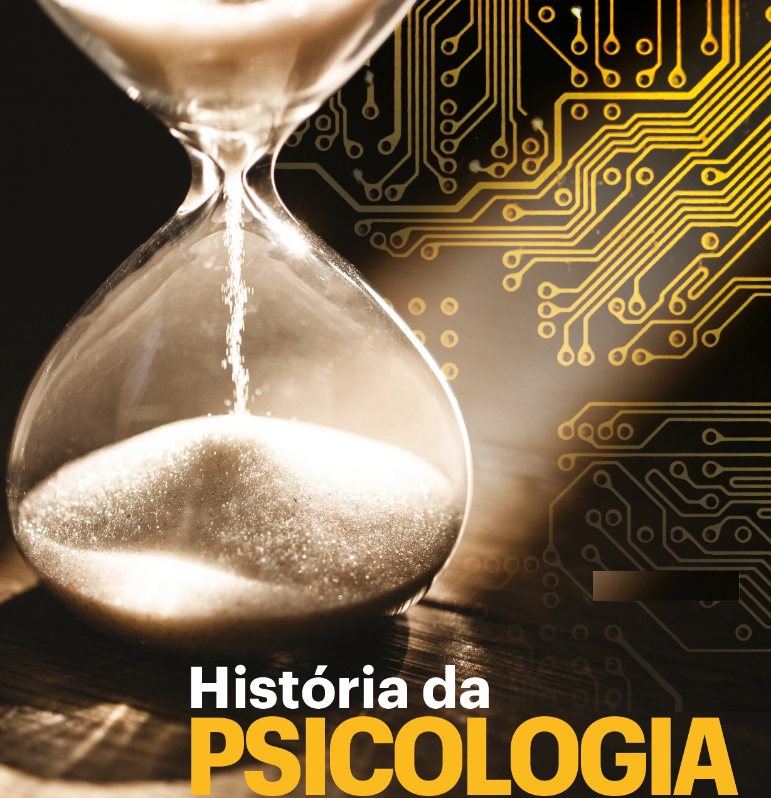

--- 
title: "Template Book - Disciplina"
author: "Daniel Claudino"
date: "`r Sys.Date()`"
site: bookdown::bookdown_site
documentclass: book
bibliography: ["referencias.bib", "packages.bib"]
# url: your book url like https://bookdown.org/yihui/bookdown
cover-image: figuras/capa-livro.png
description: |
  Neste material, estão contidos os resumos de capítulos de livros, slides, notas de aula, apresentações, exercício respondidos em sala, atividades de revisão e questionários para as provas, além de outros materiais elaborados durante  da disciplina NOME-DA-DISCIPLINA.
link-citations: yes
lang: "pt-BR"
#github-repo: rstudio/bookdown-demo
---

# Apresentação da Disciplina

<center><h2>NOME DA DISCIPLINA</h2></center>

```{r echo=FALSE, out.width="50%", fig.align = "center", fig.cap="Capa"}

```

* Neste material, estão contidos:
  * Minhas notas de aula;
  * Notas de Aula de outros colegas disponibilizados para a turma
  * Resumos de capítulos de livros;
  * Resumos de apresentações(slides) da disciplina;
  * Resumos de outros colegas de sala disponibilizados para a turma;
  * Minhas apresentações(slides);
    * Audience Q&A (Permite que o público das apresentação envie perguntas para o apresntador)
    * Live Polls (Permite que o público das apresntações realize votações sobre os temas apresentados)
    * Quiz (Permite que o público das apresentações participe de competições integrando-se e assimilando melhor os temas apresentados)
  * Exercício elaborados pelos professores, respondidos ou não em sala;
  * Questionários elaborados por mim antes das provas;
  * Formulários de pesquisa (Google Forms) elaborados por mim para atendimento de necessidades dos dos meus colegas de sala, dos professores ou da disciplina;
  * Coletas de dados realizadas para atendimento de necessidades dos dos meus colegas de sala, dos professores ou da disciplina;
  * Planilhas elaboradas por mim elaboradas por mim para atendimento de necessidades dos dos meus colegas de sala, dos professores ou da disciplina;
  * Filmes recomendados;
  * Documentários recomendados;
  * Jogos de aprendizado criados (Kahoots / Site principal: kahoot.com / Login do jogador: kahoot.it)
  * Outros materiais elaborados e disponibilizados pelos professores e por mim.

## Professor(a)

* **Profª. Meª.** <a href="http://lattes.cnpq.br/0369824862534158">Nome-do-professor</a>

## Objetivos da Disciplina

>Exemplo: A disciplina tem como objetivo proporcionar ao aluno os conhecimentos em relação à História da Psicologia através de suas raízes filosóficas e fisiológicas, bem como a compreensão das diversas escolas e suas epistemologias. Também pretende-se oportunizar o entendimento das diversas complexidades que envolvem as teorias psicológicas e seus respectivos autores.

## Ementa

> Exemplo: A origem da Psicologia. Suas raízes filosóficas e fisiológicas, pensamento grego e teorias da idade média, moderna e renascentista. A Psicologia no seu desenvolvimento histórico. As grandes escolas da Psicologia. A Psicologia no contexto brasileiro atual.

## Conteúdo Programático

> Exemplo: O primeiro módulo contemplará os estudo das raízes filosóficas e fisiológicas da Psicologia, trazendo o pensamento grego e suas implicações, as teorias vigentes na idade média, moderna e o renascimento e o desenvolvimento da Psicologia científica e experimental.

> No segundo módulo será abordado as grandes escolas da Psicologia: Estruturalismo, Funcionalismo, Behaviorismo, Gestalt, Psicanálise, Psicodrama, Fenomenologia e Existencialismo.

> Por fim, o terceiro módulo será composto pela análise histórica da Psicologia no
contexto brasileiro e a sua situação atual.

> 4.1 Como tudo começou: As Raízes filosóficas e fisiológicas da Psicologia  
4.1.1 Senso comum ou ciência? A Psicologia não é repetir mais do mesmo  
4.1.2 Psicologia científica e não mística  
4.1.3 A evolução do pensamento histórico da Psicologia  
4.1.4 Raízes filosóficas Grega  
4.1.5 Raízes filosóficas Romana  
4.1.6 Raízes filosóficas da Idade Média  
4.1.7 Raízes filosóficas do Renascimento  
4.2 Vários caminhos a percorrer: As Grandes Escolas da Psicologia  
4.2.1 Wundt para além da filosofia: o início da psicologia clínica  
4.2.2 O Estruturalismo e Funcionalismo  
4.2.3 O comportamento humano pode ser controlado: O Behaviorismo  
4.2.4 Por uma Psicologia Plena: Rogers e o Humanismo  
4.2.5 Um outro Eu que desconheço: A Psicanálise e o inconsciente  
4.2.6 E depois de Freud, o que mudou?  
4.3 Psicólogo para quê? A Psicologia atual e seus desafios  
4.3.1 A Psicologia no Brasil  

## Metodologia Didática

> A disciplina será desenvolvida por meio da ação conjunta professor e aluno, exigindo, para tanto, participação ativa nas aulas. Os procedimentos de ensino e aprendizagem adotados serão aulas expositivas e discussão de temas propostos, leitura e apresentação de textos, estudo individual ou em grupo, seminários e realização de práticas interdisciplinares.

## Avaliação

|Avaliação|Data|Descrição
|:--|:--|:--|
|1º Avaliação|dd/mm/aaaa|Prova (7 objetivas + 3 abertas)|
|1º Avaliação|dd/mm/aaaa|“Mude minha opinião” + TAE)|
|1º Avaliação|dd/mm/aaaa|Simulado + Avaliação Qualitativa|

## Trabalho Acadêmico Efetivo (TAE) da disciplina

|TAE|Data|Descrição
|:--|:--|:--|
|Único|dd/mm/aaaa|Criação do podcast. O discente deverá selecionar uma notícia apresentada na mídia e relacionar qual área ou como o psicólogo poderia auxiliar no assunto em questão.<br>O TAE será com o grupo de jornal.<br>Usar o aplicativo ANCHOR. - Até 2,0 pontos.<br>**Data TAE:** 27 de outubro de 2022<br>**Data Jornal:** 09 de novembro|

## Referências Bibliográficas

### Referências Básicas

BOCK, A. M. B. (2008). Psicologias: uma introdução ao estudo de psicologia. 14ª Ed.
São Paulo: Saraiva, 2008.

HOTHERSALL, D. (2019). História da Psicologia (4th edição). Grupo A.

SCHULTZ, D. P., & SCHULTZ, S. E. (2019). História da Psicologia Moderna – Tradução da 11a
edição norte‐americana (4th edição). Cengage Learning Brasil.

### Referências Complementares

Psicologia do Desenvolvimento. São Paulo, Contexto, 2014. [Livro Eletrônico] LIMA, C. F., & PIMENTEL, C. E. (2017). Livro: Revisitando a Psicologia Social.

MISKOLCI, Richard. Teoria Queer: um aprendizado pelas diferenças. 2 ed. Belo Horizonte: Autêntica, 2015. [Livro Eletrônico

PADILHA, S., NORONHA, A. P. P., & ZANCHET, C. F. (2007). Instrumentos de avaliação psicológica: uso e parecer de psicólogos. Avaliação psicológica (páginas, 69-79). SCHULTZ, D. & SCHULTZ, S. E. (2019). História da Psicologia moderna.

ZANELLI, J. C., BASTOS, A. V. B., & RODRIGUES, A. C. A. ( 2014). Psicologia, Organizações e Trabalho no Brasil. (Orgs).

## Controle de Versão

|Versão| Data / Hora | Colaborador | Descrição da Contribuição
|:--|:--|:--|:--|
| 0.1 | 19/09/2022 11h00 | [Daniel Claudino](https://wa.me/5583988853815) | Versão inicial do documento|
| 0.2 | 05/10/2022 23h30 | [Daniel Claudino](https://wa.me/5583988853815) | Acréscimo de informação no documento |

## Observação Importante

**<amarelo>NOTA</amarelo>**: Este material tem como finalidade auxiliar a fixação de assuntos estudados em sala de aula de acordo com o </amarelo>**plano de ensino desta disciplina**</amarelo>.

Ele <amarelo>**não deve ser**</amarelo> utilizado como <amarelo>**único material de estudo para a prova**</amarelo>, então:

1. Consulte os **slides da professora** na plataforma FTM;  
2. Faça **notas de aula** do que for tratado em sala de aula;  
3. Consulte nossas **notas de aula**;

> **Dúvidas**: <amarelo>Devem ser encaminhadas no grupo de whatsapp da disciplina.</amarelo>