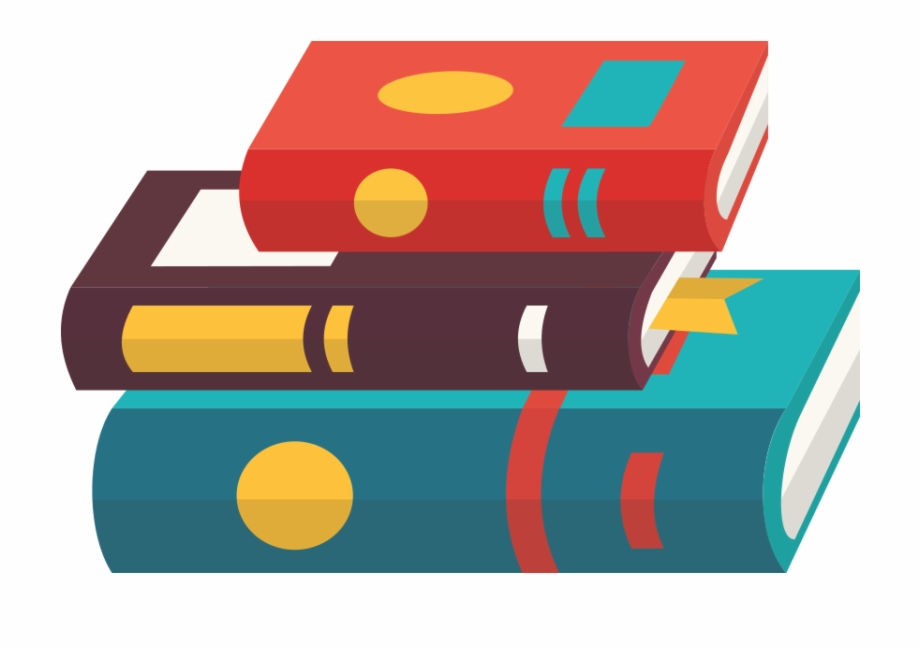

--- 
title: "Introdução à Psicologia"
author: "Daniel Claudino"
date: "`r Sys.Date()`"
output: pdf_document
documentclass: book
bibliography:
- referencias.bib
- packages.bib
cover-image: "figuras/capa-livro.png"
description: "Neste material, estão contidos os resumos de capítulos de livros, slides,
  notas de aula, apresentações, exercício respondidos em sala, atividades de revisão
  e questionários para as provas, além de outros materiais elaborados durante  da
  disciplina NOME-DA-DISCIPLINA.\n"
link-citations: yes
lang: "pt-BR"
site: bookdown::bookdown_site
always_allow_html: true
---

# Apresentação da Disciplina

<center><h2>INTRODUÇÃO À PSICOLOGIA</h2></center>

```{r echo=FALSE, fig.show="hold", out.width="50%", fig.align = "center", fig.cap="-"}

```

* Neste material, estão contidos:
  * Minhas notas de aula;
  * Notas de Aula de outros colegas disponibilizados para a turma
  * Resumos de capítulos de livros;
  * Resumos de apresentações(slides) da disciplina;
  * Resumos de outros colegas de sala disponibilizados para a turma;
  * Minhas apresentações(slides);
    * Audience Q&A (Permite que o público das apresentação envie perguntas para o apresntador)
    * Live Polls (Permite que o público das apresntações realize votações sobre os temas apresentados)
    * Quiz (Permite que o público das apresentações participe de competições integrando-se e assimilando melhor os temas apresentados)
  * Exercício elaborados pelos professores, respondidos ou não em sala;
  * Questionários elaborados por mim antes das provas;
  * Formulários de pesquisa (Google Forms) elaborados por mim para atendimento de necessidades dos dos meus colegas de sala, dos professores ou da disciplina;
  * Coletas de dados realizadas para atendimento de necessidades dos dos meus colegas de sala, dos professores ou da disciplina;
  * Planilhas elaboradas por mim elaboradas por mim para atendimento de necessidades dos dos meus colegas de sala, dos professores ou da disciplina;
  * Filmes recomendados;
  * Documentários recomendados;
  * Jogos de aprendizado criados (Kahoots / Site principal: kahoot.com / Login do jogador: kahoot.it)
  * Outros materiais elaborados e disponibilizados pelos professores e por mim.

## Professor(a)

* **Profª. Meª.** <a href="http://lattes.cnpq.br/0369824862534158">Maria Gabriela Costa Ribeiro</a>

## Objetivos da Disciplina

Possibilitar aos discentes do curso de Psicologia a compreensão sobre os principais temas no campo psicológico. Especificamente, objetiva entender os seguintes conceitos: a) ciência psicológica; b) áreas de atuação; c) as principais abordagens históricas; e, por último, d) novos campos de atuação, a exemplo da neurociência, psicologia positiva e os principais transtornos psicológicos.

## Ementa

Conceito de Psicologia, objeto e método. A Psicologia como ciência. O processo de construção do conhecimento psicológico. A Psicologia e o senso comum. A Psicologia e a sociedade. Campos de aplicação da Psicologia. Principais atividades do psicólogo e seus temas principais. Principais abordagens da Psicologia contemporânea. Novos campos de trabalho. Os grandes temas da Psicologia

## Conteúdo Programático

4.1 Introdução à Psicologia: principais conceitos e aspectos gerais
4.1.1 Origem, conceitos, objetivos e objeto de estudo
4.1.2 Diferença de ciência e senso comum
4.1.3 Psicologia como ciência e suas abordagens teóricas
4.1.4 Personalidade
4.2 Áreas de atuação do psicólogo
4.2.1 Educacional
4.2.2 Clínica
4.2.3 Organizacional e do Trabalho  
4.2.4 Avaliação Psicológica
4.2.5 Saúde e Hospitalar
4.2.6 Psicologia Social
4.3 Psicologia contemporânea: outros campos de trabalho
4.3.1 Transtornos Mentais
4.3.2 Psicologia Positiva, Ambiental, Esporte e Jurídica


## Metodologia Didática

A disciplina será desenvolvida por meio da ação conjunta professor e aluno, exigindo, para tanto, participação ativa nas aulas. Os procedimentos de ensino e aprendizagem adotados serão aulas expositivas e discussão de temas propostos, leitura e apresentação de textos, estudo individual ou em grupo, seminários e realização de práticas interdisciplinares.

## Recursos didáticos

Textos impressos, lousa, lápis, datashow e exercícios.

## Avaliação

|Avaliação|Data|Descrição
|:--|:--|:--|
|1º Avaliação|14/09/2022|Uma avaliação valendo 10,0 pontos. Serão 7 questões objetivas (alternativas de a-e) e três questões discursivas (abertas).|
|2º Avaliação|<br>**Data TAE:** 27 de outubro de 2022<br>**Data Jornal:** 09 de novembro|- A Psicologia é uma disciplina científica que possibilita a sua aplicação teórica e prática na explicação da realidade, a partir de diferentes notícias (e.g. televisão, redes sociais, jornais) de modo que, a compreensão em torno da área se torna fundamental para entender a relação do indivíduo, grupos e sociedade. No entanto, uma das dificuldades da ciência é transformar a linguagem e o conteúdo acadêmico acessível para o entendimento da população em geral. Desse modo, a atividade dessa unidade consiste no desenvolvimento desta habilidade: como explicar a psicologia para a população de forma acessível sem perder o conteúdo acadêmico? Para atingir esse objetivo, deverão elaborar um ou mais textos na estrutura de um jornal sobre o assunto discutidos na unidade 2.<br> - A nota total atribuída ao jornal valerá 8,0 (oito) pontos e deverá adotar a seguinte estrutura:<br>a) pontuar em forma de texto de 5 (cinco) a 10 (dez) pontos sobre o conteúdo da aula (2,5 pontos);<br>b) Escrever e destacar sobre qual assunto foi mais interessante (2,5 pontos);<br>c) Listar um ou dois assuntos que o discente considerou como uma curiosidade e que o docente não apresentou em sala. Neste ponto, deve apresentar alguma informação que esteja relacionado ao assunto e que avalia como pertinente. Assim, deve criar uma caixa intitulada: “Quero saber mais” (3,0 pontos) + Trabalho Acadêmico Efetivo (TAE)|
|3º Avaliação|07/12/2022|Simulado Integrado (7,0 pontos) + Avaliação qualitativa (3,0 pontos) - frequência (0 - 1 ponto), participação nas aulas (0 - 1 ponto) e cumprimento nos prazos (1,0 ponto).|

## Trabalho Acadêmico Efetivo (TAE) da disciplina

|TAE|Data|Descrição
|:--|:--|:--|
|Único|27/12/2022|Criação do podcast. O discente deverá selecionar uma notícia apresentada na mídia e relacionar qual área ou como o psicólogo poderia auxiliar no assunto em questão. O TAE será com o grupo de jornal. Usar o aplicativo ANCHOR. - Até 2,0 pontos<br>**Data TAE:** 27 de outubro de 2022<br>**Data Jornal:** 09 de novembro|

## Referências Bibliográficas

### Bibliografia Básica

DAVIDOFF, Linda L. Introdução à Psicologia. São Paulo: Makron Books, 2001.

SPINK, M. J. P. Psicologia social e saúde: práticas, saberes e sentidos. Petrópolis:Vozes, 2013.

MAISTO, Albert A.; MORRIS, Charles G. Introdução a Psicologia. 6 ed. São Paulo, Prentice Hall, 2004. [Livro Eletrônico]

### Bibliografia Complementar

BRIGAGÃO, J., NASCIMENTO, V. L. V., & SPINK, P. K. (2011). As interfaces entre psicologia e políticas públicas e a configuração de novos espaços de atuação. Sorocaba, (páginas, 199-215).

CASTRO, E. K., & BORNHOLDT, E. (2004). Psicologia da saúde x psicologia hospitalar: definições e possibilidades de inserção profissional. Psicologia Ciência e Profissão (páginas, 48-57).

COELHO, Wilson Ferreira. Psicologia do Desenvolvimento. São Paulo: Editora Pearson, 2014. [Livro Eletrônico]

CÓRIA-SABINI, Maria Aparecida. Psicologia do Desenvolvimento. 2 ed. São Paulo: Editora Ática, 2010. [Livro Eletrônico]

DIAS, A. C. G., PATIAS, N. D., & ABAID, J. L. W. ( 2014). Psicologia escolar e possibilidades na atuação do psicólogo: algumas reflexões. Revista Psicologia Escolar e Educacional (páginas 105-111).

FEIST, J., FEIST, G., & ROBERTS, T. A. (2015). Teorias da Personalidade.

FELDMAN, Robert S. Introdução à Psicologia. Porto Alegre: Editora AMGH,2015.

ILETTI, Nelson; ROSSATO, Solange Marques; ROSSATO, Geovanio. Psicologia do Desenvolvimento. São Paulo, Contexto, 2014. [Livro Eletrônico]

LIMA, C. F., & PIMENTEL, C. E. (2017). Livro: Revisitando a Psicologia Social. MISKOLCI, Richard. Teoria Queer: um aprendizado pelas diferenças. 2 ed. Belo Horizonte: Autêntica, 2015. [Livro Eletrônico]

PADILHA, S., NORONHA, A. P. P., & ZANCHET, C. F. (2007). Instrumentos de avaliação psicológica: uso e parecer de psicólogos. Avaliação psicológica (páginas, 69-79). 

SCHULTZ, D. & SCHULTZ, S. E. (2019). História da Psicologia moderna.

ZANELLI, J. C., BASTOS, A. V. B., & RODRIGUES, A. C. A. ( 2014). Psicologia, Organizações e Trabalho no Brasil. (Orgs).

## Controle de Versão

|Versão| Data / Hora | Colaborador | Descrição da Contribuição
|:--|:--|:--|:--|
| 0.1 | 16/10/2022 17h52 | [Daniel Claudino](https://wa.me/5583988853815) | Versão inicial do documento|


## Observação Importante

**<amarelo>NOTA</amarelo>**: Este material tem como finalidade auxiliar a fixação de assuntos estudados em sala de aula de acordo com o </amarelo>**plano de ensino desta disciplina**</amarelo>.

Ele <amarelo>**não deve ser**</amarelo> utilizado como <amarelo>**único material de estudo para a prova**</amarelo>, então:

1. Consulte os **slides da professora** na plataforma FTM;  
2. Faça **notas de aula** do que for tratado em sala de aula;  
3. Consulte nossas **notas de aula**;

> **Dúvidas**: <amarelo>Devem ser encaminhadas no grupo de whatsapp da disciplina.</amarelo>